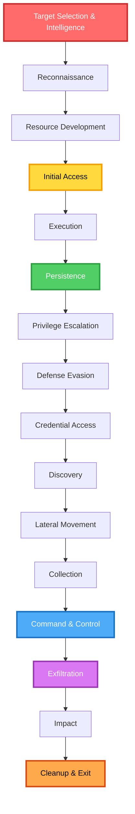
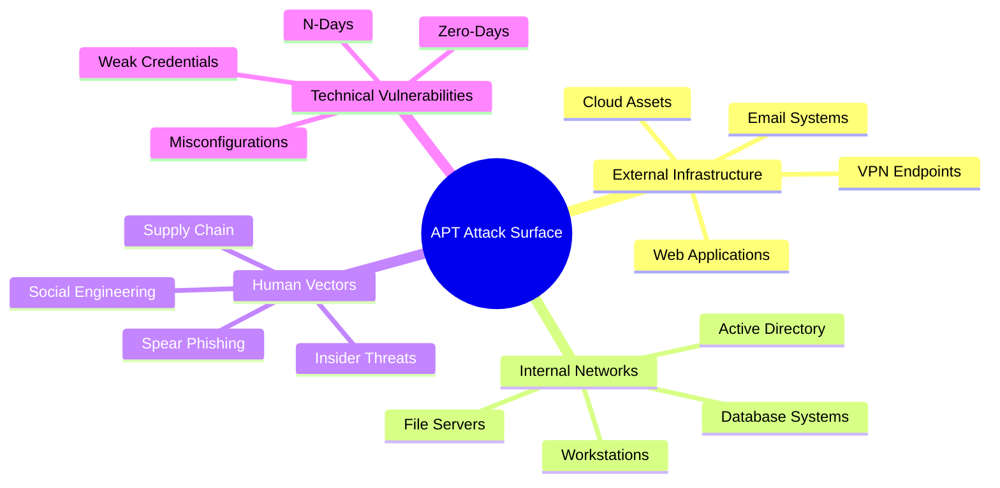
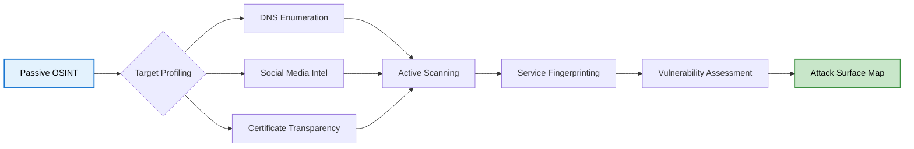
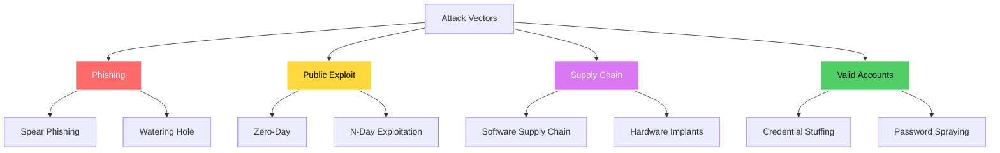
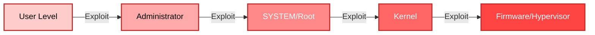
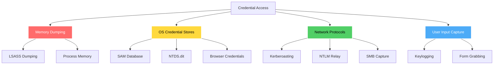
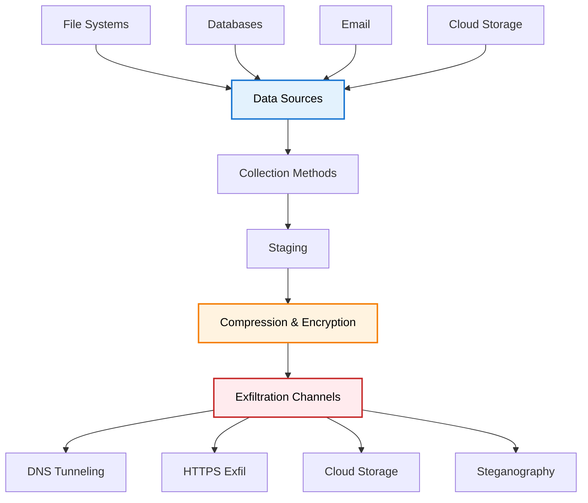
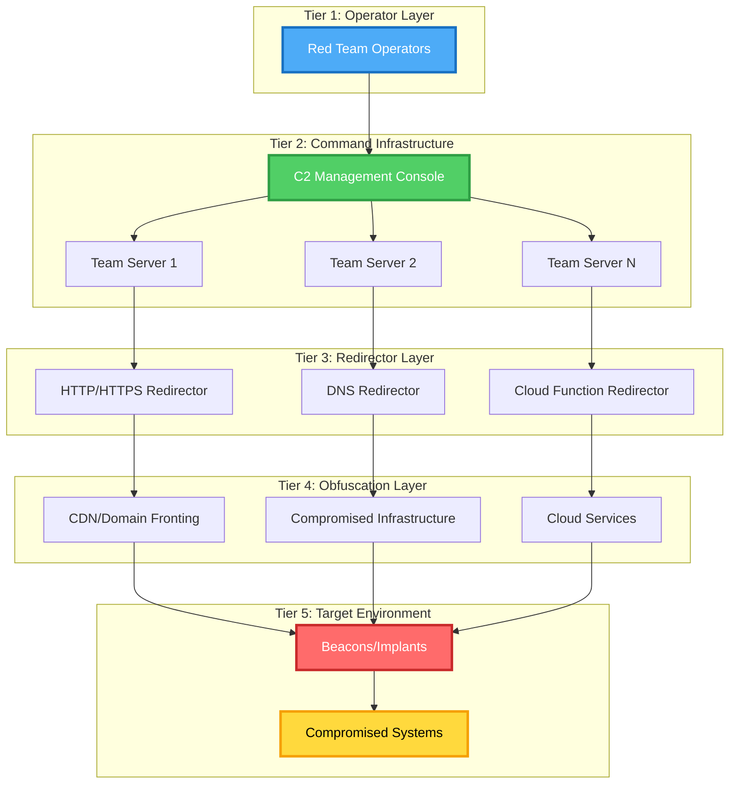

# 🎯 Advanced State-Sponsored Adversarial Operations
### Enterprise-Grade APT Techniques & Tradecraft Documentation

<div align="center">

[](LICENSE)
[](https://www.eccouncil.org/programs/certified-ethical-hacker-ceh/)
[](https://attack.mitre.org/)
[](https://www.python.org/)
[](docs/)

</div>

---

## ⚠️ CRITICAL DISCLAIMER

```
╔══════════════════════════════════════════════════════════════════════╗
║  THIS REPOSITORY IS FOR EDUCATIONAL AND AUTHORIZED TESTING ONLY     ║
║                                                                      ║
║  Unauthorized access to computer systems is ILLEGAL under:          ║
║  • Computer Fraud and Abuse Act (CFAA) - United States             ║
║  • Computer Misuse Act 1990 - United Kingdom                        ║
║  • Communications and Multimedia Act 1998 - Malaysia                ║
║  • And equivalent laws worldwide                                    ║
║                                                                      ║
║  The author assumes NO responsibility for misuse of this content.   ║
║  Always obtain explicit written authorization before testing.       ║
╚══════════════════════════════════════════════════════════════════════╝
```

---

## 🔥 Featured: Modern Cyber Warfare (2024-2025)

This repository documents unprecedented modern operations including Israeli AI-driven warfare systems, the June 2025 Iran-Israel 12-day war, sophisticated supply chain operations, and Iranian adversarial capabilities systematically underestimated in public discourse.

**Quick Navigation to Modern Operations:**
- 🤖 [Israeli AI Warfare Systems (Lavender, Gospel, Alchemist)](resources/advanced-apt-groups.md#israeli-operations) - First comprehensive public documentation
- ⚔️ [June 2025 Iran-Israel 12-Day War](resources/advanced-apt-groups.md#june-2025-iran-israel-war) - Complete analysis with sources
- 🇮🇷 [Iranian Offensive Capabilities](resources/advanced-apt-groups.md#iranian-operations) - Advanced techniques and sophistication
- 📱 [2024 Hezbollah Pager Operation](resources/advanced-apt-groups.md#hezbollah-pager-operation) - Multi-year supply chain interdiction
- 🎯 [Operation Stuxnet Technical Deep-Dive](resources/advanced-apt-groups.md#stuxnet) - Complete four zero-day analysis

**Production-Grade Tools:**
- [AI-Powered Reconnaissance System](tools/reconnaissance/ai_recon_system.py) - Gospel-inspired target intelligence
- [Quantum Cryptography Toolkit](tools/utilities/quantum_crypto_toolkit.py) - Post-quantum resistant implementations
- [Air-Gap Jumping Toolkit](tools/utilities/airgap_toolkit.py) - Four covert channel demonstrations
- [Enterprise C2 Framework](tools/c2-framework/) - Production-ready command & control
- [Complete Tool Suite](tools/) - 14 advanced operational tools

**All claims cited in [SOURCES.md](SOURCES.md)** with academic-level references.

---

## 📋 Table of Contents

- [Featured: Modern Cyber Warfare](#-featured-modern-cyber-warfare-2024-2025)
- [Executive Summary](#executive-summary)
- [APT Kill Chain Overview](#apt-kill-chain-overview)
- [Production Tools & Capabilities](#-production-tools--capabilities)
- [Repository Architecture](#repository-architecture)
- [Phase-by-Phase Breakdown](#phase-by-phase-breakdown)
- [Advanced C2 Infrastructure](#advanced-c2-infrastructure)
- [MITRE ATT&CK Mapping](#mitre-attck-mapping)
- [Real-World APT Case Studies](#real-world-apt-case-studies)
- [Detection & Defense](#detection--defense)
- [Prerequisites](#prerequisites)
- [Installation & Setup](#installation--setup)
- [Contributing](#contributing)
- [Legal & Ethical Guidelines](#legal--ethical-guidelines)

---

## 🛠️ Production Tools & Capabilities

### Reconnaissance & Intelligence

**[AI-Powered Reconnaissance System](tools/reconnaissance/ai_recon_system.py)**
Gospel-inspired target intelligence aggregation processing multi-source OSINT, demonstrating modern AI-driven targeting principles. Features automated threat scoring, graph-based relationship analysis, and intelligence dossier generation.

**[Subdomain Enumeration](tools/reconnaissance/subdomain_enum.py)**
Multi-threaded subdomain discovery with DNS brute-forcing, certificate transparency abuse, and cloud service detection.

**[DNS Reconnaissance](tools/reconnaissance/dns_recon.py)**
Advanced DNS intelligence gathering with zone transfer attempts, historical data analysis, and subdomain discovery.

**[Port Scanner](tools/reconnaissance/port_scanner.py)**
Network service discovery with SYN/ACK scanning, service fingerprinting, and evasion techniques.

### Command & Control Infrastructure

**[C2 Server](tools/c2-framework/c2_server.py)**
Enterprise-grade command and control server with AES-256 encrypted communications, RSA key exchange, multi-agent management, task queueing, heartbeat monitoring, and comprehensive audit logging.

**[Beacon/Agent](tools/c2-framework/beacon.py)**
Lightweight agent implementation with encrypted check-ins, dynamic tasking, and anti-forensics capabilities.

### Advanced Utilities

**[Quantum Cryptography Toolkit](tools/utilities/quantum_crypto_toolkit.py)**
Post-quantum cryptographic implementations including lattice-based encryption (CRYSTALS-Kyber inspired), hash-based signatures (Lamport), quantum RNG, and post-quantum key exchange resistant to quantum computer attacks.

**[Air-Gap Jumping Toolkit](tools/utilities/airgap_toolkit.py)**
Four covert channel implementations: acoustic (ultrasonic 18-22kHz), electromagnetic (TEMPEST-style), USB firmware (BadUSB), and thermal (CPU temperature modulation). Demonstrates how Stuxnet and similar operations cross air-gaps.

**[Polymorphic Generator](tools/utilities/polymorphic_generator.py)**
Dynamic payload generation creating unique signatures per execution for signature evasion.

**[Log Cleaner](tools/utilities/log_cleaner.py)**
Anti-forensics tool for Windows Event Log and Linux syslog manipulation, timestamp modification, and secure deletion.

### Exploitation & Persistence

**[Automated Exploitation](tools/exploitation/auto_exploit.py)**
CVE-based automated vulnerability exploitation framework.

**[Persistence Manager](tools/persistence/persistence_manager.py)**
Multi-method persistence framework supporting registry manipulation, service creation, scheduled tasks, and advanced techniques.
- [Repository Architecture](#repository-architecture)
- [Phase-by-Phase Breakdown](#phase-by-phase-breakdown)
- [Advanced C2 Infrastructure](#advanced-c2-infrastructure)
- [MITRE ATT&CK Mapping](#mitre-attck-mapping)
- [Real-World APT Case Studies](#real-world-apt-case-studies)
- [Detection & Defense](#detection--defense)
- [Prerequisites](#prerequisites)
- [Installation & Setup](#installation--setup)
- [Contributing](#contributing)
- [Legal & Ethical Guidelines](#legal--ethical-guidelines)

---

## 🎓 Executive Summary

This repository represents comprehensive, enterprise-grade documentation of Advanced Persistent Threat techniques, tactics, and procedures used by state-sponsored adversarial actors. Built from real-world experience with CEH v12 certification, extensive penetration testing, and deep analysis of threat intelligence from multiple nation-state actors including Russian, Chinese, North Korean, Iranian, US, and Israeli operations.

This resource serves as educational material for security researchers, a defense blueprint for blue teams, a research platform for analyzing APT group behaviors, and a red team playbook for authorized offensive security operations.

### Target Audience

This documentation is designed for security researchers understanding APT methodology and attribution, red team operators executing advanced tradecraft during authorized engagements, blue team defenders building threat models and detection engineering capabilities, incident responders analyzing APT behaviors during forensic investigations, and security leaders conducting risk assessments and strategic defense planning.

---

## 🗡️ APT Kill Chain Overview

The modern APT kill chain extends far beyond traditional cyber attacks, encompassing the complete adversarial lifecycle from initial target selection through final cleanup operations.



### Attack Surface Taxonomy



---

## 🏗️ Repository Architecture

This repository follows a modular, phase-based architecture aligned with the MITRE ATT&CK framework. The structure provides comprehensive coverage of all attack phases with working tools, detection rules, lab environments, and real-world case studies.

```
apt-adversarial-operations/
│
├── 📘 docs/                          # Phase-based documentation
│   ├── 01-reconnaissance/            # OSINT, scanning, enumeration
│   ├── 02-initial-access/            # Entry techniques
│   ├── 03-execution-persistence/     # Code exec & maintaining access
│   ├── 04-privilege-escalation/      # Elevation of privileges
│   ├── 05-defense-evasion/           # AV bypass, obfuscation
│   ├── 06-credential-access/         # Cred dumping, Kerberos attacks
│   ├── 07-discovery-lateral-movement/ # Network mapping, pivoting
│   ├── 08-collection-exfiltration/   # Data theft techniques
│   ├── 09-command-control/           # C2 infrastructure
│   └── 10-impact-cleanup/            # Final objectives, forensics
│
├── 🛠️ tools/                         # Custom tooling & frameworks
│   ├── reconnaissance/               # OSINT automation, scanners
│   ├── exploitation/                 # Exploit development
│   ├── persistence/                  # Implant & backdoor modules
│   ├── c2-framework/                 # Custom C2 implementation
│   └── utilities/                    # Helper scripts & automation
│
├── 📊 resources/                     # Reference materials
│   ├── mitre-mapping.md              # ATT&CK technique mappings
│   ├── apt-case-studies.md           # Real-world APT analysis
│   ├── detection-rules.md            # SIEM/EDR detection signatures
│   └── threat-intelligence.md        # IOCs, TTP analysis
│
└── 🧪 labs/                          # Practice environments
    └── practice-scenarios/           # Hands-on lab exercises
```

---

## 🔍 Phase-by-Phase Breakdown

### Phase 1: Reconnaissance & Intelligence Gathering
**MITRE Tactics**: Reconnaissance (TA0043)



Reconnaissance forms the foundation of every successful APT operation, involving gathering intelligence about target infrastructure, personnel, and security posture without triggering defensive systems. Professional APT actors typically spend months in reconnaissance before launching their first attack.

**Key Techniques** include passive OSINT through DNS records, WHOIS data, subdomain enumeration, and certificate transparency logs. Active scanning involves port scanning with evasion techniques, service version detection, and WAF/IDS identification. Human intelligence gathering focuses on LinkedIn scraping, email harvesting, and organizational structure mapping. Infrastructure mapping encompasses cloud asset discovery across AWS, Azure, and GCP, CDN detection, and third-party service enumeration.

**Tools Covered**: Shodan, Censys, Amass, DNSRecon, theHarvester, Maltego, SpiderFoot, and custom automation scripts.

📖 **[Read Full Documentation](docs/01-reconnaissance/README.md)**

---

### Phase 2: Initial Access
**MITRE Tactics**: Initial Access (TA0001)



Initial access represents the critical entry point into target environments. Modern APT groups employ sophisticated techniques ranging from highly targeted spear-phishing campaigns to complex supply chain compromises affecting thousands of organizations simultaneously.

**Attack Vectors** encompass phishing operations including spear-phishing campaigns, credential harvesting pages, and payload delivery mechanisms. Exploitation techniques cover remote code execution vulnerabilities, service-level exploits, and web application attacks including SQL injection and remote file inclusion. Supply chain compromise involves targeting third-party software vendors, inserting hardware implants, and compromising update mechanisms. Valid account abuse includes credential stuffing attacks using breach databases, password spraying against corporate authentication systems, and session hijacking.

📖 **[Read Full Documentation](docs/02-initial-access/README.md)**

---

### Phase 3: Execution & Persistence
**MITRE Tactics**: Execution (TA0002), Persistence (TA0003)

Execution and persistence are intertwined phases where adversaries run malicious code and establish mechanisms to maintain access across system reboots, credential changes, and security updates.

**Execution Methods** include PowerShell with AMSI bypass techniques, Windows Command Shell and batch scripts, Unix shell exploitation through bash and zsh, Visual Basic macros and VBScript, Python-based payloads, JavaScript execution, WMI event subscriptions, scheduled tasks and cron jobs, DLL injection techniques, exploitation for client execution through browser and PDF exploits, inter-process communication via COM and DDE, native API calls, software deployment tool abuse, and user execution through social engineering.

**Persistence Techniques** span registry manipulation including Run keys and WMI event subscriptions, service creation on Windows and Linux systems, DLL hijacking through search order manipulation, and advanced techniques including UEFI firmware persistence, hypervisor-level rootkits, and bootkit implants that survive disk formatting.

📖 **[Read Full Documentation](docs/03-execution-persistence/README.md)**

---

### Phase 4: Privilege Escalation
**MITRE Tactics**: Privilege Escalation (TA0004)



Privilege escalation enables adversaries to gain higher-level permissions on compromised systems, moving from standard user access to administrator, SYSTEM, root, kernel, or even firmware-level control.

**Windows Escalation Vectors** include UAC bypass techniques exploiting trusted Windows binaries, token manipulation and impersonation attacks, service exploitation through unquoted service paths and weak permissions, and kernel exploits targeting Windows privilege elevation vulnerabilities. **Linux Escalation** focuses on SUID binary exploitation, kernel vulnerabilities, container escape techniques, and sudo misconfigurations. **Network-Based Escalation** leverages Kerberos delegation attacks, NTLM relay for privilege elevation, and trust relationship exploitation across domain boundaries.

📖 **[Read Full Documentation](docs/04-privilege-escalation/README.md)**

---

### Phase 5: Defense Evasion
**MITRE Tactics**: Defense Evasion (TA0005)

Defense evasion encompasses the sophisticated techniques adversaries use to avoid detection by antivirus software, endpoint detection and response systems, security information and event management platforms, and forensic analysis.

**Anti-AV Techniques** include polymorphic and metamorphic malware that changes its code structure with each infection, in-memory execution that never touches disk, process injection methods including reflective DLL injection and process hollowing, and obfuscation through code packing and encryption. **Anti-Forensics** involves log deletion, timestomping to manipulate file modification times, fileless malware execution entirely in memory, and memory-only execution that leaves minimal forensic artifacts. **Anti-Sandbox** techniques detect virtual machine environments, implement time-based evasion delays, require user interaction before executing payloads, and detect analysis tools. **Network Evasion** utilizes domain fronting to hide C2 traffic, protocol tunneling through allowed services, encrypted C2 channels, and traffic masquerading as legitimate services.

📖 **[Read Full Documentation](docs/05-defense-evasion/README.md)**

---

### Phase 6: Credential Access
**MITRE Tactics**: Credential Access (TA0006)



Credential access represents one of the most valuable phases for APT actors, enabling lateral movement, privilege escalation, and long-term persistence through legitimate credentials.

**Advanced Techniques** encompass Kerberos attacks including Kerberoasting to extract service account credentials, AS-REP roasting targeting accounts without Kerberos pre-authentication, Golden and Silver ticket forgery, and Skeleton Key attacks. NTLM exploitation includes Pass-the-Hash attacks, Pass-the-Ticket for Kerberos authentication, and NTLM relay attacks. Credential dumping techniques involve Mimikatz for in-memory credential extraction, ProcDump combined with offline parsing, direct LSASS access through Windows APIs, and DCSync attacks against domain controllers. Network capture methods include Responder for LLMNR and NBT-NS poisoning, and SMB relay attacks.

📖 **[Read Full Documentation](docs/06-credential-access/README.md)**

---

### Phase 7: Discovery & Lateral Movement
**MITRE Tactics**: Discovery (TA0007), Lateral Movement (TA0008)

Discovery and lateral movement enable adversaries to map the network environment, identify high-value targets, and move between systems to achieve their objectives.

**Discovery Methods** include Active Directory enumeration using PowerView and BloodHound for attack path analysis, domain reconnaissance to map trust relationships and forest structures, user and group enumeration to identify privileged accounts, computer enumeration to locate domain controllers and critical servers, network service scanning to identify accessible services, and file share discovery to locate sensitive data repositories.

**Lateral Movement Techniques** encompass remote execution through PsExec, WMI, DCOM, and PowerShell Remoting, pivoting using port forwarding, SOCKS proxies, and SSH tunneling, and living off the land by abusing native Windows tools like WinRM, native Linux utilities, and administrative scripts that blend with legitimate activity.

📖 **[Read Full Documentation](docs/07-discovery-lateral-movement/README.md)**

---

### Phase 8: Collection & Exfiltration
**MITRE Tactics**: Collection (TA0009), Exfiltration (TA0010)



Collection and exfiltration represent the culmination of APT operations where adversaries gather and extract targeted data from compromised environments.

**Collection Techniques** include automated file system crawling to locate documents matching specific patterns, database querying and export, email collection from Exchange servers and mailboxes, screenshot and video capture, clipboard monitoring, browser history and credential theft, and cloud storage enumeration.

**Exfiltration Channels** encompass DNS tunneling where data is encoded in DNS queries, HTTPS exfiltration disguised as legitimate web traffic, cloud storage abuse uploading data to attacker-controlled accounts, steganography hiding data in images or other media, ICMP tunneling through ping packets, and protocol tunneling through allowed services.

📖 **[Read Full Documentation](docs/08-collection-exfiltration/README.md)**

---

### Phase 9: Command & Control
**MITRE Tactics**: Command and Control (TA0011)

Command and Control infrastructure forms the nervous system of APT operations, ensuring resilient communication, operational flexibility, and long-term access to compromised environments.


A robust C2 infrastructure provides resilience through redundant communication channels, stealth through traffic blending and encryption, flexibility for dynamic tasking and module loading, and persistence ensuring long-term access despite defensive actions.

**C2 Frameworks Covered** include commercial solutions like Cobalt Strike and Brute Ratel C4, open source options including Metasploit Framework, Empire, Covenant, Mythic, and Sliver, as well as custom implementations built from scratch in Python, Go, Rust, and C#.

**Advanced C2 Techniques** encompass sleep obfuscation with jitter to prevent pattern detection, malleable C2 profiles mimicking legitimate traffic, domain fronting and CDN abuse, DNS tunneling for covert channels, protocol tunneling through allowed services, and multi-stage C2 architectures with redundant fallback channels.

📖 **[Read Full Documentation](docs/09-command-control/README.md)**

---

### Phase 10: Impact & Cleanup
**MITRE Tactics**: Impact (TA0040)

Impact and cleanup represent the final phases where adversaries achieve their mission objectives and attempt to cover their tracks to hinder forensic investigation and attribution.

**Impact Operations** encompass data destruction through disk wiping and file encryption, service disruption via DDoS attacks and resource exhaustion, and mission-specific objectives including ransomware deployment, data manipulation, and system control for long-term intelligence gathering.

**Anti-Forensics and Cleanup** techniques include log deletion and manipulation to remove evidence of compromise, timestomping to alter file metadata, secure file deletion using military-grade overwriting, memory dumping cleanup, registry cleanup, prefetch file deletion, and complete artifact removal across system, application, and security logs.

📖 **[Read Full Documentation](docs/10-impact-cleanup/README.md)**

---

## 🏛️ Advanced C2 Infrastructure

### Multi-Tier C2 Architecture



### Infrastructure Components

Team Servers provide the primary C2 backend and task management using technologies like Cobalt Strike, Covenant, Mythic, and custom implementations. Redirectors handle traffic obfuscation and operator protection through Apache mod_rewrite, Nginx, HAProxy, and Traefik configurations. Domain Fronting hides C2 traffic behind legitimate domains using CDN services and cloud providers. DNS C2 provides alternative communication channels through custom DNS servers and recursive queries. Cloud Functions enable serverless C2 components via AWS Lambda, Azure Functions, and GCP Functions.

📖 **[Read Full C2 Infrastructure Guide](docs/09-command-control/c2-infrastructure.md)**

---

## 🎯 MITRE ATT&CK Mapping

This repository comprehensively covers fourteen MITRE ATT&CK tactics and over one hundred eighty techniques, providing complete coverage of reconnaissance, resource development, initial access, execution, persistence, privilege escalation, defense evasion, credential access, discovery, lateral movement, collection, command and control, exfiltration, and impact phases.

📊 **[View Complete MITRE Mapping](resources/mitre-mapping.md)**

---

## 🔬 Real-World APT Case Studies

The repository includes detailed technical analysis of actual state-sponsored operations from APT28 Fancy Bear targeting government and military organizations, APT29 Cozy Bear's SolarWinds supply chain attack, Lazarus Group's Sony Pictures hack and WannaCry ransomware, APT41's dual espionage and financial operations, Equation Group's advanced NSA toolset, and Unit 8200's sophisticated cyber weapons.

📖 **[Read Full Case Studies](resources/apt-case-studies.md)**

---

## 🛡️ Detection & Defense

Each phase includes comprehensive detection strategies with Sigma rules for SIEM platforms, YARA signatures for malware detection, Suricata and Snort rules for network monitoring, EDR detection logic, and threat hunting queries for proactive defense.

📖 **[Full Detection Engineering Guide](resources/detection-rules.md)**

---

## 📋 Prerequisites

Technical knowledge requirements include advanced networking understanding, expert-level operating system internals, advanced programming skills, expert security concepts, and intermediate cloud platform knowledge. Software requirements include Python 3.9+, PowerShell 7.x, Docker and Docker Compose, virtual machine software, Burp Suite Professional, Wireshark, Metasploit Framework, and Cobalt Strike or open-source alternatives.

---

## 🚀 Installation & Setup

Quick start instructions include cloning the repository, setting up a Python virtual environment, installing dependencies, running automated lab setup, and verifying the installation. Docker-based lab environments provide complete APT simulation infrastructure with Kali Linux workstations, vulnerable targets, C2 infrastructure, and SIEM dashboards.

---

## 🎯 Learning Path

The repository provides structured learning paths from beginner through expert levels, covering fundamentals of networking and protocols, basic reconnaissance techniques, understanding vulnerability exploitation, advanced enumeration and OSINT, custom exploit development, privilege escalation techniques, building custom C2 frameworks, advanced persistence mechanisms, defense evasion and anti-forensics, zero-day research and development, advanced memory manipulation, kernel-level exploitation, firmware and hardware attacks, and full-scope APT campaign simulation.

---

## 🔐 Legal & Ethical Guidelines

Explicit written authorization is required before testing any system. The repository emphasizes ethical hacking principles including obtaining proper authorization, minimizing impact, maintaining confidentiality, reporting responsibly, respecting privacy, and staying within legal boundaries.

---

## 🤝 Contributing

Contributions are welcome with guidelines requiring enterprise-grade code quality, comprehensive documentation, proper attribution, ethical adherence, and testing in isolated lab environments before submission.

---

## 📚 Additional Resources

The repository references essential books including Red Team Field Manual, The Hacker Playbook 3, Advanced Penetration Testing, and Operator Handbook. Online resources include the MITRE ATT&CK Framework, NIST Cybersecurity Framework, OWASP Testing Guide, and Red Team Development and Operations. Training platforms include HackTheBox, TryHackMe, Offensive Security Labs, PentesterLab, and SANS Cyber Ranges.

---

## 📜 License

This project is licensed under the MIT License for educational use only, with permission granted for educational, research, and authorized testing purposes.

---

## 👤 Author & Acknowledgments

**Wan Mohamad Hanis bin Wan Hassan**
- CEH v12 Certified Ethical Hacker
- 100+ Professional Certifications (Google, IBM, EC-Council, Cisco, HubSpot)
- Security Researcher | Red Team Operator | AI/ML Specialist
- OSINT & Adversarial Tradecraft Expert

Connect via LinkedIn at linkedin.com/in/wanmohamadhanis, GitHub at github.com/novusaevum, Credly at credly.com/users/triumphanthanis, and portfolio at wanmohamadhanis.my.canva.site/wmh-portfolio.

---

## ⚠️ Final Warning

```
╔══════════════════════════════════════════════════════════════════════╗
║                                                                      ║
║  This repository contains advanced adversarial techniques that      ║
║  can cause significant harm if misused.                             ║
║                                                                      ║
║  USE RESPONSIBLY. USE ETHICALLY. USE LEGALLY.                       ║
║                                                                      ║
║  "With great power comes great responsibility."                     ║
║                                                                      ║
╚══════════════════════════════════════════════════════════════════════╝
```

---

<div align="center">

**⭐ Star this repository to support continued development ⭐**

**Built with precision by security researchers, for security professionals**

</div>

---

**Last Updated**: January 2025  
**Repository Version**: 1.0.0  
**Maintained By**: Wan Mohamad Hanis bin Wan Hassan
