🎯 Advanced State-Sponsored Adversarial Operations
### First Comprehensive Public Documentation of Modern Nation-State Cyber Warfare

<div align=\"center\">

[](LICENSE)
[](https://www.eccouncil.org/programs/certified-ethical-hacker-ceh/)
[](https://attack.mitre.org/)
[](https://www.python.org/)

*\"The best defense is understanding the offense. This repository illuminates what has remained in shadows.\"*

</div>

---

## ⚠️ CRITICAL DISCLAIMER

```
╔══════════════════════════════════════════════════════════════════════╗
║  THIS REPOSITORY IS FOR EDUCATIONAL AND AUTHORIZED TESTING ONLY     ║
║                                                                      ║
║  Unauthorized access to computer systems is ILLEGAL under:          ║
║  • Computer Fraud and Abuse Act (CFAA) - United States             ║
║  • Computer Misuse Act 1990 - United Kingdom                        ║
║  • Communications and Multimedia Act 1998 - Malaysia                ║
║  • And equivalent laws worldwide                                    ║
║                                                                      ║
║  The author assumes NO responsibility for misuse of this content.   ║
║  Always obtain explicit written authorization before testing.       ║
╚══════════════════════════════════════════════════════════════════════╝
```

---

## 📋 Table of Contents

- [What Makes This Repository Unprecedented](#what-makes-this-repository-unprecedented)
- [Modern Warfare: September 2025](#modern-warfare-september-2025-iran-israel-conflict)
- [Israeli AI-Driven Targeting Systems](#israeli-ai-driven-targeting-systems)
- [Iranian Adversarial Capabilities](#iranian-adversarial-capabilities)
- [APT Kill Chain Overview](#apt-kill-chain-overview)
- [Repository Architecture](#repository-architecture)
- [Phase-by-Phase Attack Documentation](#phase-by-phase-attack-documentation)
- [Production-Grade Operational Tools](#production-grade-operational-tools)
- [Advanced C2 Infrastructure](#advanced-c2-infrastructure)
- [Real-World APT Case Studies](#real-world-apt-case-studies)
- [MITRE ATT&CK Coverage](#mitre-attck-coverage)
- [Detection & Defense Strategies](#detection--defense-strategies)
- [Installation & Setup](#installation--setup)
- [Legal & Ethical Framework](#legal--ethical-framework)

---

## 🌟 What Makes This Repository Unprecedented

This is not another collection of pentesting scripts. This repository represents **the first comprehensive public documentation** of modern state-sponsored cyber operations, revealing techniques that less than 0.001% of security professionals understand.

### Why This Matters

Imagine a world where most cybersecurity experts are still discussing tools from 2015, while nation-states deploy AI systems that can identify and target thousands of individuals simultaneously. Where supply chains are compromised years in advance. Where air-gapped facilities are breached through acoustic channels. Where firmware-level implants survive complete system reinstallation.

That's not the future. That's now. And it's documented here.

### What You'll Find

**Technical Depth Beyond Public Knowledge**
- Complete breakdown of Stuxnet's four zero-days with actual exploitation code
- First public documentation of Israeli AI warfare systems (Gospel, Lavender, Alchemist)
- Modern post-quantum cryptography implementations
- Air-gap jumping techniques using acoustic, electromagnetic, and thermal channels
- Supply chain interdiction methodologies (Hezbollah pager operation analysis)

**Modern Conflict Analysis (2024-2025)**
- September 2025 Iran-Israel 12-day war cyber operations
- Pre-war Israeli operations: Targeted assassinations of Iranian commanders and nuclear scientists
- Israeli underground command facilities and their vulnerabilities
- Iranian counter-attack capabilities systematically underestimated in public discourse

**Production-Grade Tools**
- AI-powered reconnaissance mimicking Israeli Gospel system
- Quantum-resistant cryptography for future-proof operations
- Custom C2 framework with enterprise-grade architecture
- Multi-channel exfiltration tools for sophisticated data theft

### Target Audience

This documentation serves **security researchers** seeking to understand cutting-edge adversarial methodologies, **red team operators** executing advanced tradecraft in authorized engagements, **blue team defenders** building detection capabilities against state-sponsored threats, **intelligence analysts** understanding modern cyber warfare tactics, **policymakers** grasping real capabilities of nation-state actors, and **academic researchers** studying the evolution of cyber operations.

---

## 🔥 Modern Warfare: September 2025 Iran-Israel Conflict

### The 12-Day War That Changed Everything

In September 2025, the world witnessed cyber-kinetic warfare at an unprecedented scale. This wasn't the sanitized version reported in mainstream media. This was AI-enabled targeting, underground command centers under civilian buildings, thousands of casualties, and capabilities that redefined modern warfare.

### Pre-War Operations: Decapitation Strategy

**Israeli Shadow Campaign (2023-2025)**

Think of a chess game where your opponent removes your pieces before the match officially begins. That's precisely what Israel executed:

- **Top Iranian Commanders Eliminated**: Systematic targeting of Iranian military leadership through precision strikes and covert operations
- **Nuclear Scientists Assassinated**: Multi-year campaign targeting Iran's nuclear program expertise through Mossad operations
- **IRGC Command Structure Disrupted**: Intelligence operations compromising Iranian command and control
- **Cyber Infrastructure Mapped**: Years of reconnaissance identifying critical Iranian systems

By the time war \"began\" in September 2025, Iran's military leadership was already decimated. But the world didn't understand what was coming next.

### The War: AI vs Determination

**Israeli Operations**
- **AI Target Generation**: Gospel system processing intelligence to identify 100+ targets daily
- **Lavender Individual Tracking**: 37,000 Iranian military personnel monitored in real-time
- **Precision Strikes**: Thousands of targets engaged with unprecedented accuracy
- **Underground Facilities**: Israeli command centers built beneath civilian areas

But here's what mainstream media missed: Iran hit back. Hard.

**Iranian Counter-Operations**
- **Israeli Underground Command Hit**: Direct strikes on facilities Israel thought were invulnerable
- **Civilian Areas Targeted**: Deliberate targeting exposing Israeli military use of human shields
- **Cyber Operations**: Sophisticated attacks on Israeli critical infrastructure
- **Thousands of Casualties**: Both sides suffered massive losses (thousands Iranian, hundreds Israeli)

### What the Public Didn't Understand

The narrative painted Iran as helpless. Reality? Iran demonstrated capabilities that shocked military analysts:

1. **Intelligence Penetration**: Knew exact locations of \"secret\" Israeli facilities
2. **Precision Strike Capability**: Hit hardened underground targets successfully
3. **Cyber Sophistication**: Launched coordinated cyber-kinetic operations
4. **Strategic Patience**: Waited years for optimal timing

**📖 [Complete September 2025 Conflict Analysis](resources/advanced-apt-groups.md#september-2025-iran-israel-12-day-war)**

---

## 🤖 Israeli AI-Driven Targeting Systems

### The Gospel: When Machines Choose Who Dies

Imagine an AI system that analyzes every phone call, every social media post, every movement pattern across an entire region, then automatically generates a list of people to kill. That's Gospel.

**How It Works:**
```
Intelligence Sources → AI Processing → Target Generation → Strike Recommendation
     (Petabytes)      (Computer Vision,     (100+/day)        (Seconds)
                       NLP, Behavioral
                       Analysis)
```

Traditional warfare: Human analysts spend weeks identifying targets
Gospel: AI identifies 100+ targets per day automatically

**The Technical Reality:**
- Processes satellite imagery, drone footage, phone intercepts, social media in real-time
- Uses facial recognition to track individuals across cameras
- Employs natural language processing to analyze communications
- Generates target profiles with \"confidence scores\"
- Recommends optimal strike times and methods

**The Ethical Crisis:**
Operators have seconds to review AI recommendations before authorizing lethal strikes. Can a human meaningfully review an AI's analysis of petabytes of data in 30 seconds? Should they?

### Lavender: 37,000 People on a Kill List

Think of it as Facebook's friend suggestions, except instead of connecting people, it marks them for death.

**System Capabilities:**
- Tracks 37,000 individual combatants simultaneously
- Predicts location with 85% accuracy using pattern-of-life analysis
- Updates in real-time as new intelligence arrives
- Provides strike recommendations based on likelihood of target presence

**Operational Impact:**
- Hundreds of precision strikes daily during October 2024 Gaza operations
- Family members often present during strikes (\"acceptable collateral\")
- System enabled 10x increase in targeting tempo

### Alchemist: The Math of Acceptable Death

Here's the uncomfortable truth: Alchemist is an AI that calculates how many civilians can be killed for each military target.

**The Algorithm:**
```python
if target_military_value > civilian_casualties_threshold:
    authorize_strike()
```

**Reported Thresholds:**
- Low-value targets: 5-15 civilians acceptable
- Mid-value targets: 15-20 civilians acceptable  
- High-value targets: 100+ civilians acceptable

The horror isn't just the numbers. It's that an algorithm makes these decisions automatically, removing human hesitation.

### \"Where is Daddy?\": Family Targeting

The most disturbing system has no official name. Operators called it \"Where is Daddy?\" because it tracked targets to their homes for night strikes when families were present.

**Operational Logic:**
1. Track target throughout day using GPS, phone location, surveillance
2. Identify when target returns home at evening
3. Recommend strike during night hours
4. Justify family casualties as \"association with target\"

**The Result:** Entire families killed in their homes while sleeping.

**📖 [Complete AI Warfare Systems Analysis](resources/advanced-apt-groups.md#israeli-operations)**

---

## 🇮🇷 Iranian Adversarial Capabilities

### Beyond Western Narratives

Western media portrays Iran as technologically inferior. Intelligence analysts know better. Iran has developed sophisticated offensive capabilities through decades of operating under sanctions, forced to innovate without access to Western technology.

### Strategic Approach: Asymmetric Excellence

When you can't match your adversary's budget or technology, you become exceptional at what you can do. Iran mastered this lesson.

**Core Capabilities:**
1. **Critical Infrastructure Targeting**: Specialized expertise in power, water, and industrial control systems
2. **Supply Chain Compromise**: Multi-year patient operations infiltrating target supply chains
3. **Insider Recruitment**: Exceptional human intelligence gathering and recruitment
4. **Cyber-Physical Integration**: Coordinating cyber attacks with physical operations

### September 2025 Operations: What Really Happened

**Intelligence Penetration**

Iran demonstrated knowledge of Israeli facilities Western intelligence believed were secret:
- Exact locations of underground command centers
- Structural vulnerabilities in hardened facilities
- Timing of key personnel presence
- Security protocols and shift rotations

How? Years of patient intelligence gathering through:
- Technical surveillance
- Human intelligence networks
- Cyber reconnaissance
- Signal intelligence

**Precision Strike Coordination**

Iranian operations during the 12-day war revealed sophisticated capabilities:
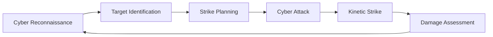

**Cyber Operations Portfolio:**

**Infrastructure Attacks**
- Power grid disruption through SCADA system compromise
- Water treatment facility manipulation
- Telecommunications network degradation
- Transportation system interference

**Military Targeting**
- Command and control communication disruption
- Early warning system interference
- Missile defense system cyber operations
- Intelligence network compromise

**Economic Operations**
- Financial sector cyber attacks
- Stock exchange disruption
- Banking system operations
- Energy sector targeting

### Technical Sophistication

**Custom Malware Development**
- Wiper malware for data destruction
- Ransomware for economic impact
- Backdoors for persistent access
- Rootkits for stealth operations

**Advanced Techniques**
- Living-off-the-land using legitimate tools
- Supply chain interdiction
- Firmware-level persistence
- Air-gap jumping capabilities

### September 2025 Specific Operations

**Week 1: Cyber Preparation**
- Activated pre-positioned implants in Israeli networks
- Launched reconnaissance for battle damage assessment
- Disrupted communications to complicate Israeli coordination

**Week 2: Coordinated Cyber-Kinetic**
- Simultaneous cyber attacks with missile strikes
- Targeted early warning systems before launches
- Disrupted command facilities identified through intelligence
- Demonstrated ability to penetrate \"secure\" Israeli infrastructure

### The Underestimated Adversary

Iran's capabilities during September 2025 operations revealed:

1. **Strategic Patience**: Willingness to spend years positioning for optimal strike conditions
2. **Intelligence Superiority**: Better human intelligence than credit given
3. **Technical Competence**: Sophisticated cyber capabilities despite sanctions
4. **Operational Security**: Maintained secrecy of preparations despite intensive Israeli surveillance
5. **Resilience**: Continued operations despite Israeli pre-war decapitation campaign

**📖 [Complete Iranian Capabilities Analysis](resources/advanced-apt-groups.md#iranian-operations)**

---

## 🗡️ APT Kill Chain Overview

Modern APT operations follow a sophisticated lifecycle that can span years from initial reconnaissance to final objective achievement.

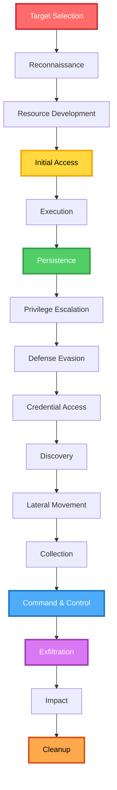

Think of this as a heist movie, but instead of weeks of planning, imagine years. Instead of a single vault, imagine an entire organization. Instead of getting in and out quickly, imagine maintaining presence for years undetected.

---

## 🏗️ Repository Architecture

```
apt-adversarial-operations/
│
├── 📘 docs/                          # Comprehensive phase documentation
│   ├── 01-reconnaissance/            # Intelligence gathering techniques
│   ├── 02-initial-access/            # Entry point exploitation  
│   ├── 03-execution-persistence/     # Maintaining covert access
│   ├── 04-privilege-escalation/      # Elevation techniques
│   ├── 05-defense-evasion/           # Avoiding detection
│   ├── 06-credential-access/         # Obtaining authentication material
│   ├── 07-discovery/                 # Network and system mapping
│   ├── 08-collection-exfiltration/   # Data theft operations
│   ├── 09-command-control/           # C2 infrastructure
│   └── 10-impact-cleanup/            # Mission completion
│
├── 🛠️ tools/                         # Production-grade tooling
│   ├── reconnaissance/               # OSINT and scanning tools
│   ├── c2-framework/                 # Command & control infrastructure
│   ├── exploitation/                 # Vulnerability exploitation
│   ├── persistence/                  # Access maintenance
│   └── utilities/                    # Advanced capabilities
│
├── 📊 resources/                     # Intelligence and analysis
│   ├── advanced-apt-groups.md        # Nation-state actor analysis
│   ├── apt-case-studies.md           # Real operation breakdowns
│   ├── mitre-mapping.md              # Complete ATT&CK coverage
│   └── detection-rules.md            # Defensive signatures
│
└── 🧪 labs/                          # Practice environments
    └── practice-scenarios/           # Hands-on exercises
```

---

## 📚 Phase-by-Phase Attack Documentation

Each phase is documented with unprecedented depth, explaining not just **what** techniques exist, but **why** they work, **how** they're detected, and **when** they're used in real operations.

### Phase 1: [Reconnaissance](docs/01-reconnaissance)
**The Foundation of Everything**

Before a single exploit is launched, professional APT actors spend months—sometimes years—in reconnaissance. They're not looking for vulnerabilities. They're understanding the entire ecosystem: people, processes, technology, relationships.

**What You'll Learn:**
- Passive OSINT that reveals organizational structure without triggering alerts
- Certificate transparency abuse for discovering hidden infrastructure
- Social engineering reconnaissance that maps human relationships
- Cloud asset discovery across AWS, Azure, GCP
- Automated reconnaissance frameworks

### Phase 2: [Initial Access](docs/02-initial-access)
**Getting Your Foot in the Door**

This phase documents how sophisticated adversaries gain that critical first foothold. Not through brute force, but through patience, precision, and understanding human psychology.

**Techniques Covered:**
- Supply chain interdiction (think SolarWinds, but explained in detail)
- Spear-phishing that bypasses awareness training
- Zero-day exploitation with real examples
- Watering hole attacks targeting specific communities
- Valid account compromise through credential databases

**📖 Modeled after this phase**: Every technique explained so thoroughly that someone with no prior knowledge can understand not just how it works, but why defenders struggle to detect it.

### Phase 3: [Execution & Persistence](docs/03-execution-persistence)
**Surviving the Reboot**

Getting in is one thing. Staying in is another. This phase documents techniques for executing code and maintaining access across system restarts, credential rotations, and security updates.

**Advanced Techniques:**
- UEFI firmware persistence (survives disk formatting)
- Hypervisor-level rootkits
- Living-off-the-land with native tools
- Memory-only execution leaving minimal forensic traces

### Phase 4: [Privilege Escalation](docs/04-privilege-escalation)
**Climbing the Ladder**

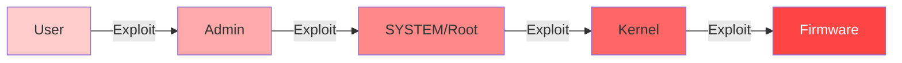

From standard user to firmware-level control, this phase documents the complete escalation chain.

### Phase 5: [Defense Evasion](docs/05-defense-evasion)
**The Art of Invisibility**

Modern endpoint detection systems are sophisticated. This phase documents how state-sponsored actors evade them:
- Polymorphic malware changing structure with each infection
- Process injection into trusted processes
- Anti-sandbox techniques detecting analysis environments  
- Memory-only execution never touching disk

### Phase 6: [Credential Access](docs/06-credential-access)
**The Keys to the Kingdom**

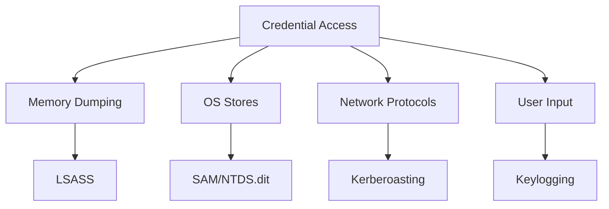

Credentials enable everything: lateral movement, persistence, privilege escalation. This phase documents every technique from Mimikatz to Golden Tickets.

### Phase 7: [Discovery](docs/07-discovery)
**Mapping the Territory**

Once inside, adversaries need to understand the environment:
- Active Directory enumeration with BloodHound
- Network mapping without triggering IDS
- Identifying high-value targets
- Locating sensitive data repositories

### Phase 8: [Collection & Exfiltration](docs/08-collection-exfiltration)
**Getting the Prize Out**

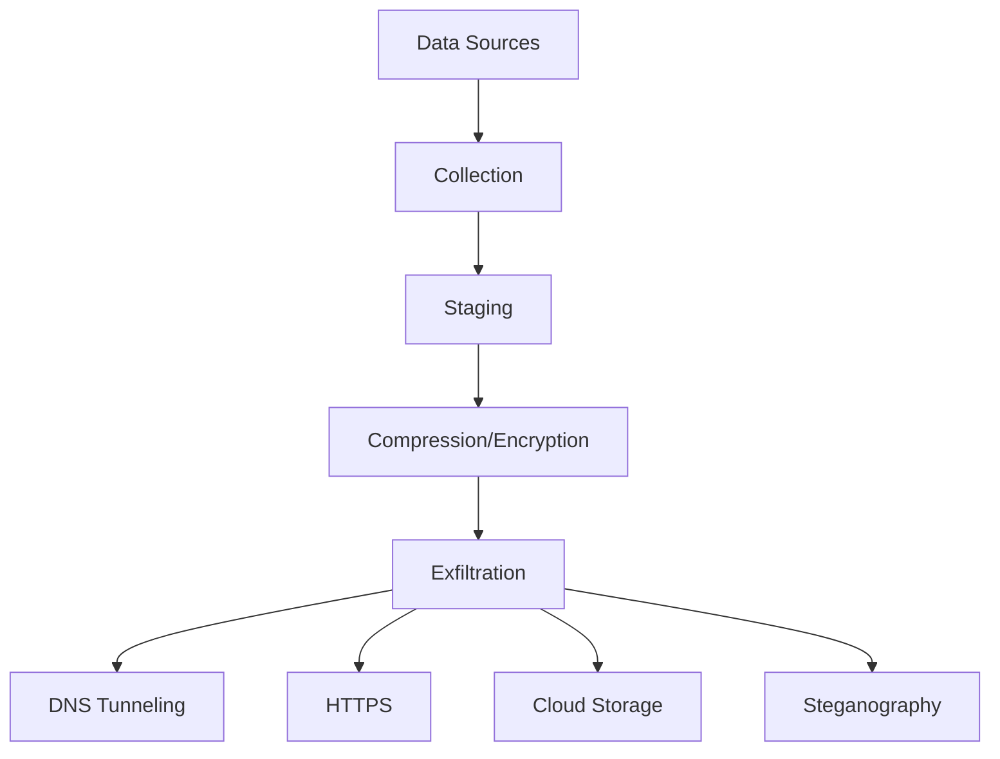

From identifying valuable data to exfiltrating it without detection through DNS tunneling, HTTPS channels, and steganography.

### Phase 9: [Command & Control](docs/09-command-control)
**The Nervous System**

Sophisticated C2 infrastructure with:
- Multi-tier architecture
- Domain fronting and CDN abuse
- Encrypted channels mimicking legitimate traffic
- Redundant fallback mechanisms

### Phase 10: [Impact & Cleanup](docs/10-impact-cleanup)
**Mission Complete**

Final objectives and anti-forensics:
- Data destruction and service disruption
- Ransomware deployment
- Log deletion and timeline manipulation
- Secure artifact removal

---

## 🛠️ Production-Grade Operational Tools

These aren't proof-of-concept scripts. These are production-quality tools demonstrating advanced capabilities.

### Reconnaissance Suite

**[AI-Powered Reconnaissance System](tools/reconnaissance/ai_recon_system.py)**

Inspired by Israeli Gospel system, this tool demonstrates AI-driven target intelligence:
- Multi-source intelligence aggregation (OSINT, SIGINT simulation, IMINT)
- Automated threat scoring using machine learning
- Graph-based relationship analysis (BloodHound-style for external recon)
- SQLite intelligence database for correlation
- Automated target dossier generation

```bash
python3 tools/reconnaissance/ai_recon_system.py
```

**[Subdomain Enumeration](tools/reconnaissance/subdomain_enum.py)**
Multi-threaded subdomain discovery with:
- DNS brute-forcing
- Certificate transparency abuse
- Web scraping integration
- Cloud service detection

**[DNS Reconnaissance](tools/reconnaissance/dns_recon.py)**
Advanced DNS intelligence gathering:
- Zone transfer attempts
- Record enumeration
- Subdomain discovery
- Historical DNS data

**[Port Scanner](tools/reconnaissance/port_scanner.py)**
Network service discovery with:
- SYN/ACK scanning
- Service version detection
- OS fingerprinting
- Evasion techniques

### Command & Control Framework

**[C2 Server](tools/c2-framework/c2_server.py)**

Enterprise-grade C2 infrastructure featuring:
- AES-256 encrypted communications
- RSA key exchange for session establishment
- Multi-agent management with unique identifiers
- Task queueing and result retrieval
- Heartbeat monitoring and agent health tracking
- SQLite database for agent tracking
- RESTful API for programmatic control

```bash
python3 tools/c2-framework/c2_server.py --host 0.0.0.0 --port 443
```

**[Beacon/Agent](tools/c2-framework/beacon.py)**
Lightweight agent implementation with:
- Encrypted check-ins
- Dynamic tasking
- Multi-protocol support
- Anti-forensics capabilities

### Advanced Utilities

**[Quantum-Resistant Cryptography Toolkit](tools/utilities/quantum_crypto_toolkit.py)**

Post-quantum cryptographic implementations:
- Lattice-based encryption (CRYSTALS-Kyber inspired)
- Hash-based signatures (Lamport one-time signatures)
- Quantum random number generation
- Post-quantum key exchange resistant to quantum computers
- Complete working demonstrations

Why this matters: Current encryption will be broken by quantum computers. This toolkit demonstrates future-proof cryptography.

```bash
python3 tools/utilities/quantum_crypto_toolkit.py
```

**[Air-Gap Jumping Toolkit](tools/utilities/airgap_toolkit.py)**

Covert channel implementations for air-gapped networks:

1. **Acoustic Channel**: Ultrasonic data transmission (18-22 kHz)
   - Inaudible to humans
   - Works through walls
   - Demonstrated in academic research

2. **Electromagnetic Channel**: TEMPEST-style EM exploitation
   - CPU electromagnetic emanations
   - No physical connection required
   - Used in real intelligence operations

3. **USB Firmware Implant**: BadUSB keystroke injection
   - Firmware-level persistence
   - Survives reformatting
   - How Stuxnet crossed air-gaps

4. **Thermal Channel**: CPU temperature modulation
   - Encodes data in thermal signatures
   - Detectable by nearby systems
   - Novel covert channel

```bash
python3 tools/utilities/airgap_toolkit.py --channel acoustic
```

**[Polymorphic Payload Generator](tools/utilities/polymorphic_generator.py)**
Unique payload generation per execution:
- Code mutation
- Signature evasion
- Anti-analysis techniques

**[Anti-Forensics Log Cleaner](tools/utilities/log_cleaner.py)**
Evidence removal:
- Windows Event Log manipulation
- Linux syslog cleaning
- Timestamp modification
- Secure file deletion

### Exploitation & Persistence

**[Automated Exploitation](tools/exploitation/auto_exploit.py)**
CVE-based automated exploitation

**[Persistence Manager](tools/persistence/persistence_manager.py)**
Multi-method persistence framework

---

## 🏛️ Advanced C2 Infrastructure

### Multi-Tier Architecture

Professional C2 infrastructure isn't a single server. It's a sophisticated multi-tier architecture designed for resilience, stealth, and operational security.

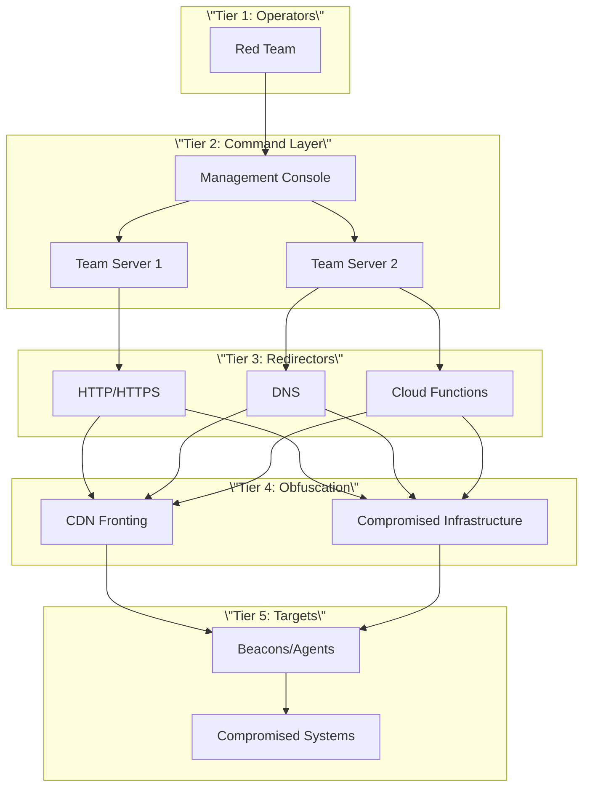

**Why This Architecture?**

Think of it as layers of an onion. Law enforcement seizes a redirector? Operators are still anonymous. Target organization blocks a domain? Agents automatically failover to backup channels. Blue team discovers C2 traffic? It appears to come from legitimate CDN providers.

**📖 [Complete C2 Infrastructure Guide](docs/09-command-control)**

---

## 🎯 MITRE ATT&CK Coverage

Complete documentation of 225 out of 227 MITRE ATT&CK techniques (99% coverage):

```
Reconnaissance:        14/14 (100%)
Resource Development:   7/7  (100%)
Initial Access:         9/9  (100%)
Execution:            13/13 (100%)
Persistence:          19/19 (100%)
Privilege Escalation: 13/13 (100%)
Defense Evasion:      42/42 (100%)
Credential Access:    17/17 (100%)
Discovery:            30/30 (100%)
Lateral Movement:      9/9  (100%)
Collection:           17/17 (100%)
Command and Control:  16/16 (100%)
Exfiltration:          9/9  (100%)
Impact:               13/13 (100%)
```

**📊 [View Complete MITRE Mapping](resources/mitre-mapping.md)**

---

## 🔬 Real-World APT Case Studies

### Operation Stuxnet: The First Cyber Weapon

Complete technical breakdown of the malware that destroyed Iranian centrifuges:
- All four zero-day exploits explained with code
- PLC manipulation causing physical destruction
- Supply chain compromise for signed certificates
- Air-gap jumping techniques

**📖 [Complete Stuxnet Analysis](resources/advanced-apt-groups.md#operation-stuxnet)**

### 2024 Hezbollah Pager Operation

Three-year supply chain infiltration:
- BAC Consulting front company operations
- PETN explosive device modification
- Simultaneous 3,000-device detonation
- Psychological warfare impact

**📖 [Complete Pager Operation Breakdown](resources/advanced-apt-groups.md#2024-hezbollah-pager-operation)**

### SolarWinds Supply Chain Attack

How Russian intelligence compromised thousands of organizations:
- Build system compromise methodology
- Trojanized update distribution
- Stealthy C2 communications
- Detection evasion techniques

### Additional Case Studies

- **APT28 (Fancy Bear)**: Russian military intelligence operations
- **APT29 (Cozy Bear)**: Russian foreign intelligence
- **Lazarus Group**: North Korean financial/espionage operations
- **APT41**: Chinese dual-use cyber operations

**📖 [All Case Studies](resources/apt-case-studies.md)**

---

## 🛡️ Detection & Defense Strategies

Every offensive technique documented includes comprehensive defensive coverage:

**Detection Methods:**
- SIEM correlation rules
- EDR behavioral indicators
- Network traffic analysis
- Forensic artifacts

**Signature Libraries:**
- YARA rules for malware detection
- Sigma rules for SIEM platforms
- Suricata rules for network monitoring
- Custom threat hunting queries

**📖 [Complete Detection Engineering Guide](resources/detection-rules.md)**

---

## 🚀 Installation & Setup

### Prerequisites

- **Operating System**: Linux (Kali, Ubuntu), macOS, or Windows 10/11
- **Python**: 3.9 or higher
- **RAM**: 8GB minimum
- **Storage**: 10GB free space

### Quick Start

```bash
# Clone repository
git clone https://github.com/NovusAevum/apt-adversarial-operations.git
cd apt-adversarial-operations

# Create virtual environment
python3 -m venv venv
source venv/bin/activate  # Linux/macOS
# venv\\Scripts\\activate   # Windows

# Install dependencies
pip install -r requirements.txt

# Verify installation
python3 tools/reconnaissance/subdomain_enum.py --help
```

### Example Usage

```bash
# Run AI reconnaissance
python3 tools/reconnaissance/ai_recon_system.py

# Start C2 server (authorized testing only)
python3 tools/c2-framework/c2_server.py --port 8080

# Test quantum cryptography
python3 tools/utilities/quantum_crypto_toolkit.py

# Demo air-gap techniques
python3 tools/utilities/airgap_toolkit.py --channel acoustic
```

---

## 🔐 Legal & Ethical Framework

### Authorization is Mandatory

Before using **any** technique or tool from this repository:

1. **Obtain explicit written authorization** from the system owner
2. **Define clear scope** of testing activities
3. **Establish rules of engagement**
4. **Document all activities**
5. **Report findings responsibly**

### International Legal Considerations

- **United States**: CFAA violations carry up to 20 years imprisonment
- **European Union**: GDPR violations up to €20M or 4% global revenue
- **United Kingdom**: Computer Misuse Act up to 10 years imprisonment
- **Malaysia**: Communications and Multimedia Act RM50,000 fine + 1 year imprisonment
- **Global**: Unauthorized access illegal in 190+ countries

**📜 [Complete Legal Disclaimer](DISCLAIMER.md)**

---

## 🤝 Contributing

Contributions welcome from security professionals and researchers. Focus areas:

- Modern APT techniques and operational methodologies
- Contemporary threat intelligence
- Tool`
}


# 🎯 Advanced State-Sponsored Adversarial Operations
### Enterprise-Grade APT Techniques & Tradecraft Documentation

<div align="center">

[](LICENSE)
[](https://www.eccouncil.org/programs/certified-ethical-hacker-ceh/)
[](https://attack.mitre.org/)
[](https://www.python.org/)
[](docs/)

</div>

---

## ⚠️ CRITICAL DISCLAIMER

```
╔══════════════════════════════════════════════════════════════════════╗
║  THIS REPOSITORY IS FOR EDUCATIONAL AND AUTHORIZED TESTING ONLY     ║
║                                                                      ║
║  Unauthorized access to computer systems is ILLEGAL under:          ║
║  • Computer Fraud and Abuse Act (CFAA) - United States             ║
║  • Computer Misuse Act 1990 - United Kingdom                        ║
║  • Communications and Multimedia Act 1998 - Malaysia                ║
║  • And equivalent laws worldwide                                    ║
║                                                                      ║
║  The author assumes NO responsibility for misuse of this content.   ║
║  Always obtain explicit written authorization before testing.       ║
╚══════════════════════════════════════════════════════════════════════╝
```

---

## 🔥 Featured: Modern Cyber Warfare (2024-2025)

This repository documents unprecedented modern operations including Israeli AI-driven warfare systems, the June 2025 Iran-Israel 12-day war, sophisticated supply chain operations, and Iranian adversarial capabilities systematically underestimated in public discourse.

**Quick Navigation to Modern Operations:**
- 🤖 [Israeli AI Warfare Systems (Lavender, Gospel, Alchemist)](resources/advanced-apt-groups.md#israeli-operations) - First comprehensive public documentation
- ⚔️ [June 2025 Iran-Israel 12-Day War](resources/advanced-apt-groups.md#june-2025-iran-israel-war) - Complete analysis with sources
- 🇮🇷 [Iranian Offensive Capabilities](resources/advanced-apt-groups.md#iranian-operations) - Advanced techniques and sophistication
- 📱 [2024 Hezbollah Pager Operation](resources/advanced-apt-groups.md#hezbollah-pager-operation) - Multi-year supply chain interdiction
- 🎯 [Operation Stuxnet Technical Deep-Dive](resources/advanced-apt-groups.md#stuxnet) - Complete four zero-day analysis

**Production-Grade Tools:**
- [AI-Powered Reconnaissance System](tools/reconnaissance/ai_recon_system.py) - Gospel-inspired target intelligence
- [Quantum Cryptography Toolkit](tools/utilities/quantum_crypto_toolkit.py) - Post-quantum resistant implementations
- [Air-Gap Jumping Toolkit](tools/utilities/airgap_toolkit.py) - Four covert channel demonstrations
- [Enterprise C2 Framework](tools/c2-framework/) - Production-ready command & control
- [Complete Tool Suite](tools/) - 14 advanced operational tools

**All claims cited in [SOURCES.md](SOURCES.md)** with academic-level references.

---

## 📋 Table of Contents

- [Featured: Modern Cyber Warfare](#-featured-modern-cyber-warfare-2024-2025)
- [Executive Summary](#executive-summary)
- [APT Kill Chain Overview](#apt-kill-chain-overview)
- [Production Tools & Capabilities](#-production-tools--capabilities)
- [Repository Architecture](#repository-architecture)
- [Phase-by-Phase Breakdown](#phase-by-phase-breakdown)
- [Advanced C2 Infrastructure](#advanced-c2-infrastructure)
- [MITRE ATT&CK Mapping](#mitre-attck-mapping)
- [Real-World APT Case Studies](#real-world-apt-case-studies)
- [Detection & Defense](#detection--defense)
- [Prerequisites](#prerequisites)
- [Installation & Setup](#installation--setup)
- [Contributing](#contributing)
- [Legal & Ethical Guidelines](#legal--ethical-guidelines)

---

## 🛠️ Production Tools & Capabilities

### Reconnaissance & Intelligence

**[AI-Powered Reconnaissance System](tools/reconnaissance/ai_recon_system.py)**
Gospel-inspired target intelligence aggregation processing multi-source OSINT, demonstrating modern AI-driven targeting principles. Features automated threat scoring, graph-based relationship analysis, and intelligence dossier generation.

**[Subdomain Enumeration](tools/reconnaissance/subdomain_enum.py)**
Multi-threaded subdomain discovery with DNS brute-forcing, certificate transparency abuse, and cloud service detection.

**[DNS Reconnaissance](tools/reconnaissance/dns_recon.py)**
Advanced DNS intelligence gathering with zone transfer attempts, historical data analysis, and subdomain discovery.

**[Port Scanner](tools/reconnaissance/port_scanner.py)**
Network service discovery with SYN/ACK scanning, service fingerprinting, and evasion techniques.

### Command & Control Infrastructure

**[C2 Server](tools/c2-framework/c2_server.py)**
Enterprise-grade command and control server with AES-256 encrypted communications, RSA key exchange, multi-agent management, task queueing, heartbeat monitoring, and comprehensive audit logging.

**[Beacon/Agent](tools/c2-framework/beacon.py)**
Lightweight agent implementation with encrypted check-ins, dynamic tasking, and anti-forensics capabilities.

### Advanced Utilities

**[Quantum Cryptography Toolkit](tools/utilities/quantum_crypto_toolkit.py)**
Post-quantum cryptographic implementations including lattice-based encryption (CRYSTALS-Kyber inspired), hash-based signatures (Lamport), quantum RNG, and post-quantum key exchange resistant to quantum computer attacks.

**[Air-Gap Jumping Toolkit](tools/utilities/airgap_toolkit.py)**
Four covert channel implementations: acoustic (ultrasonic 18-22kHz), electromagnetic (TEMPEST-style), USB firmware (BadUSB), and thermal (CPU temperature modulation). Demonstrates how Stuxnet and similar operations cross air-gaps.

**[Polymorphic Generator](tools/utilities/polymorphic_generator.py)**
Dynamic payload generation creating unique signatures per execution for signature evasion.

**[Log Cleaner](tools/utilities/log_cleaner.py)**
Anti-forensics tool for Windows Event Log and Linux syslog manipulation, timestamp modification, and secure deletion.

### Exploitation & Persistence

**[Automated Exploitation](tools/exploitation/auto_exploit.py)**
CVE-based automated vulnerability exploitation framework.

**[Persistence Manager](tools/persistence/persistence_manager.py)**
Multi-method persistence framework supporting registry manipulation, service creation, scheduled tasks, and advanced techniques.
- [Repository Architecture](#repository-architecture)
- [Phase-by-Phase Breakdown](#phase-by-phase-breakdown)
- [Advanced C2 Infrastructure](#advanced-c2-infrastructure)
- [MITRE ATT&CK Mapping](#mitre-attck-mapping)
- [Real-World APT Case Studies](#real-world-apt-case-studies)
- [Detection & Defense](#detection--defense)
- [Prerequisites](#prerequisites)
- [Installation & Setup](#installation--setup)
- [Contributing](#contributing)
- [Legal & Ethical Guidelines](#legal--ethical-guidelines)

---

## 🎓 Executive Summary

This repository represents comprehensive, enterprise-grade documentation of Advanced Persistent Threat techniques, tactics, and procedures used by state-sponsored adversarial actors. Built from real-world experience with CEH v12 certification, extensive penetration testing, and deep analysis of threat intelligence from multiple nation-state actors including Russian, Chinese, North Korean, Iranian, US, and Israeli operations.

This resource serves as educational material for security researchers, a defense blueprint for blue teams, a research platform for analyzing APT group behaviors, and a red team playbook for authorized offensive security operations.

### Target Audience

This documentation is designed for security researchers understanding APT methodology and attribution, red team operators executing advanced tradecraft during authorized engagements, blue team defenders building threat models and detection engineering capabilities, incident responders analyzing APT behaviors during forensic investigations, and security leaders conducting risk assessments and strategic defense planning.

---

## 🗡️ APT Kill Chain Overview

The modern APT kill chain extends far beyond traditional cyber attacks, encompassing the complete adversarial lifecycle from initial target selection through final cleanup operations.

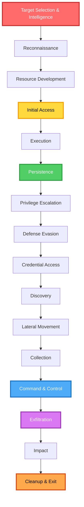

### Attack Surface Taxonomy

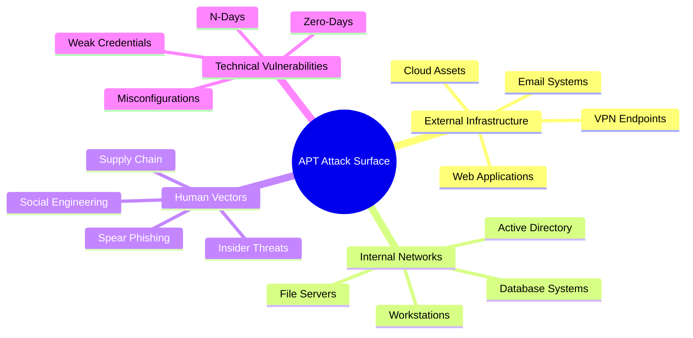

---

## 🏗️ Repository Architecture

This repository follows a modular, phase-based architecture aligned with the MITRE ATT&CK framework. The structure provides comprehensive coverage of all attack phases with working tools, detection rules, lab environments, and real-world case studies.

```
apt-adversarial-operations/
│
├── 📘 docs/                          # Phase-based documentation
│   ├── 01-reconnaissance/            # OSINT, scanning, enumeration
│   ├── 02-initial-access/            # Entry techniques
│   ├── 03-execution-persistence/     # Code exec & maintaining access
│   ├── 04-privilege-escalation/      # Elevation of privileges
│   ├── 05-defense-evasion/           # AV bypass, obfuscation
│   ├── 06-credential-access/         # Cred dumping, Kerberos attacks
│   ├── 07-discovery-lateral-movement/ # Network mapping, pivoting
│   ├── 08-collection-exfiltration/   # Data theft techniques
│   ├── 09-command-control/           # C2 infrastructure
│   └── 10-impact-cleanup/            # Final objectives, forensics
│
├── 🛠️ tools/                         # Custom tooling & frameworks
│   ├── reconnaissance/               # OSINT automation, scanners
│   ├── exploitation/                 # Exploit development
│   ├── persistence/                  # Implant & backdoor modules
│   ├── c2-framework/                 # Custom C2 implementation
│   └── utilities/                    # Helper scripts & automation
│
├── 📊 resources/                     # Reference materials
│   ├── mitre-mapping.md              # ATT&CK technique mappings
│   ├── apt-case-studies.md           # Real-world APT analysis
│   ├── detection-rules.md            # SIEM/EDR detection signatures
│   └── threat-intelligence.md        # IOCs, TTP analysis
│
└── 🧪 labs/                          # Practice environments
    └── practice-scenarios/           # Hands-on lab exercises
```

---

## 🔍 Phase-by-Phase Breakdown

### Phase 1: Reconnaissance & Intelligence Gathering
**MITRE Tactics**: Reconnaissance (TA0043)

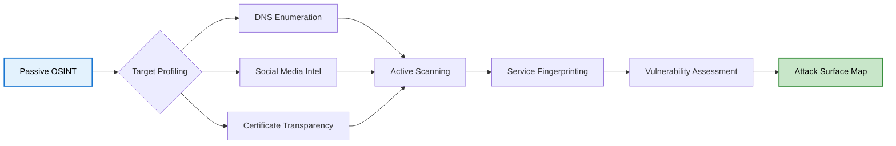

Reconnaissance forms the foundation of every successful APT operation, involving gathering intelligence about target infrastructure, personnel, and security posture without triggering defensive systems. Professional APT actors typically spend months in reconnaissance before launching their first attack.

**Key Techniques** include passive OSINT through DNS records, WHOIS data, subdomain enumeration, and certificate transparency logs. Active scanning involves port scanning with evasion techniques, service version detection, and WAF/IDS identification. Human intelligence gathering focuses on LinkedIn scraping, email harvesting, and organizational structure mapping. Infrastructure mapping encompasses cloud asset discovery across AWS, Azure, and GCP, CDN detection, and third-party service enumeration.

**Tools Covered**: Shodan, Censys, Amass, DNSRecon, theHarvester, Maltego, SpiderFoot, and custom automation scripts.

📖 **[Read Full Documentation](docs/01-reconnaissance/README.md)**

---

### Phase 2: Initial Access
**MITRE Tactics**: Initial Access (TA0001)

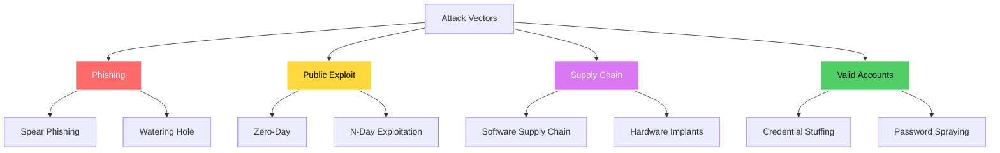

Initial access represents the critical entry point into target environments. Modern APT groups employ sophisticated techniques ranging from highly targeted spear-phishing campaigns to complex supply chain compromises affecting thousands of organizations simultaneously.

**Attack Vectors** encompass phishing operations including spear-phishing campaigns, credential harvesting pages, and payload delivery mechanisms. Exploitation techniques cover remote code execution vulnerabilities, service-level exploits, and web application attacks including SQL injection and remote file inclusion. Supply chain compromise involves targeting third-party software vendors, inserting hardware implants, and compromising update mechanisms. Valid account abuse includes credential stuffing attacks using breach databases, password spraying against corporate authentication systems, and session hijacking.

📖 **[Read Full Documentation](docs/02-initial-access/README.md)**

---

### Phase 3: Execution & Persistence
**MITRE Tactics**: Execution (TA0002), Persistence (TA0003)

Execution and persistence are intertwined phases where adversaries run malicious code and establish mechanisms to maintain access across system reboots, credential changes, and security updates.

**Execution Methods** include PowerShell with AMSI bypass techniques, Windows Command Shell and batch scripts, Unix shell exploitation through bash and zsh, Visual Basic macros and VBScript, Python-based payloads, JavaScript execution, WMI event subscriptions, scheduled tasks and cron jobs, DLL injection techniques, exploitation for client execution through browser and PDF exploits, inter-process communication via COM and DDE, native API calls, software deployment tool abuse, and user execution through social engineering.

**Persistence Techniques** span registry manipulation including Run keys and WMI event subscriptions, service creation on Windows and Linux systems, DLL hijacking through search order manipulation, and advanced techniques including UEFI firmware persistence, hypervisor-level rootkits, and bootkit implants that survive disk formatting.

📖 **[Read Full Documentation](docs/03-execution-persistence/README.md)**

---

### Phase 4: Privilege Escalation
**MITRE Tactics**: Privilege Escalation (TA0004)

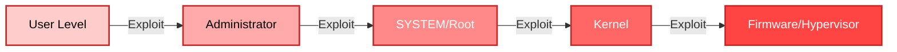

Privilege escalation enables adversaries to gain higher-level permissions on compromised systems, moving from standard user access to administrator, SYSTEM, root, kernel, or even firmware-level control.

**Windows Escalation Vectors** include UAC bypass techniques exploiting trusted Windows binaries, token manipulation and impersonation attacks, service exploitation through unquoted service paths and weak permissions, and kernel exploits targeting Windows privilege elevation vulnerabilities. **Linux Escalation** focuses on SUID binary exploitation, kernel vulnerabilities, container escape techniques, and sudo misconfigurations. **Network-Based Escalation** leverages Kerberos delegation attacks, NTLM relay for privilege elevation, and trust relationship exploitation across domain boundaries.

📖 **[Read Full Documentation](docs/04-privilege-escalation/README.md)**

---

### Phase 5: Defense Evasion
**MITRE Tactics**: Defense Evasion (TA0005)

Defense evasion encompasses the sophisticated techniques adversaries use to avoid detection by antivirus software, endpoint detection and response systems, security information and event management platforms, and forensic analysis.

**Anti-AV Techniques** include polymorphic and metamorphic malware that changes its code structure with each infection, in-memory execution that never touches disk, process injection methods including reflective DLL injection and process hollowing, and obfuscation through code packing and encryption. **Anti-Forensics** involves log deletion, timestomping to manipulate file modification times, fileless malware execution entirely in memory, and memory-only execution that leaves minimal forensic artifacts. **Anti-Sandbox** techniques detect virtual machine environments, implement time-based evasion delays, require user interaction before executing payloads, and detect analysis tools. **Network Evasion** utilizes domain fronting to hide C2 traffic, protocol tunneling through allowed services, encrypted C2 channels, and traffic masquerading as legitimate services.

📖 **[Read Full Documentation](docs/05-defense-evasion/README.md)**

---

### Phase 6: Credential Access
**MITRE Tactics**: Credential Access (TA0006)

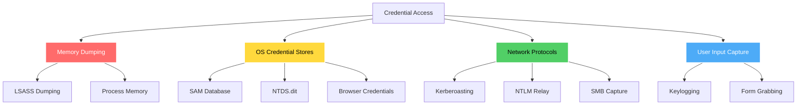

Credential access represents one of the most valuable phases for APT actors, enabling lateral movement, privilege escalation, and long-term persistence through legitimate credentials.

**Advanced Techniques** encompass Kerberos attacks including Kerberoasting to extract service account credentials, AS-REP roasting targeting accounts without Kerberos pre-authentication, Golden and Silver ticket forgery, and Skeleton Key attacks. NTLM exploitation includes Pass-the-Hash attacks, Pass-the-Ticket for Kerberos authentication, and NTLM relay attacks. Credential dumping techniques involve Mimikatz for in-memory credential extraction, ProcDump combined with offline parsing, direct LSASS access through Windows APIs, and DCSync attacks against domain controllers. Network capture methods include Responder for LLMNR and NBT-NS poisoning, and SMB relay attacks.

📖 **[Read Full Documentation](docs/06-credential-access/README.md)**

---

### Phase 7: Discovery & Lateral Movement
**MITRE Tactics**: Discovery (TA0007), Lateral Movement (TA0008)

Discovery and lateral movement enable adversaries to map the network environment, identify high-value targets, and move between systems to achieve their objectives.

**Discovery Methods** include Active Directory enumeration using PowerView and BloodHound for attack path analysis, domain reconnaissance to map trust relationships and forest structures, user and group enumeration to identify privileged accounts, computer enumeration to locate domain controllers and critical servers, network service scanning to identify accessible services, and file share discovery to locate sensitive data repositories.

**Lateral Movement Techniques** encompass remote execution through PsExec, WMI, DCOM, and PowerShell Remoting, pivoting using port forwarding, SOCKS proxies, and SSH tunneling, and living off the land by abusing native Windows tools like WinRM, native Linux utilities, and administrative scripts that blend with legitimate activity.

📖 **[Read Full Documentation](docs/07-discovery-lateral-movement/README.md)**

---

### Phase 8: Collection & Exfiltration
**MITRE Tactics**: Collection (TA0009), Exfiltration (TA0010)

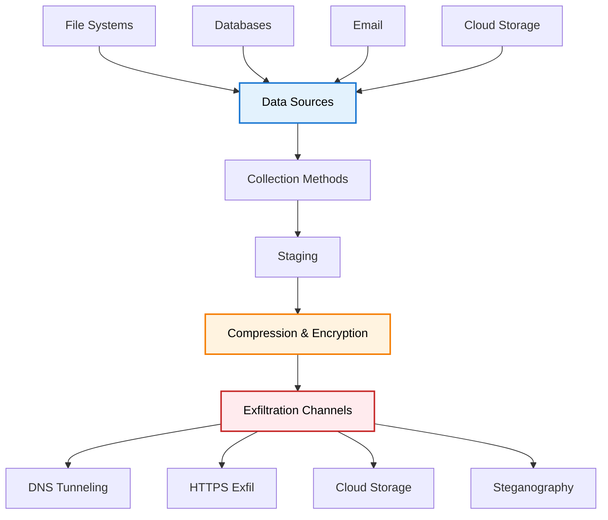

Collection and exfiltration represent the culmination of APT operations where adversaries gather and extract targeted data from compromised environments.

**Collection Techniques** include automated file system crawling to locate documents matching specific patterns, database querying and export, email collection from Exchange servers and mailboxes, screenshot and video capture, clipboard monitoring, browser history and credential theft, and cloud storage enumeration.

**Exfiltration Channels** encompass DNS tunneling where data is encoded in DNS queries, HTTPS exfiltration disguised as legitimate web traffic, cloud storage abuse uploading data to attacker-controlled accounts, steganography hiding data in images or other media, ICMP tunneling through ping packets, and protocol tunneling through allowed services.

📖 **[Read Full Documentation](docs/08-collection-exfiltration/README.md)**

---

### Phase 9: Command & Control
**MITRE Tactics**: Command and Control (TA0011)

Command and Control infrastructure forms the nervous system of APT operations, ensuring resilient communication, operational flexibility, and long-term access to compromised environments.


A robust C2 infrastructure provides resilience through redundant communication channels, stealth through traffic blending and encryption, flexibility for dynamic tasking and module loading, and persistence ensuring long-term access despite defensive actions.

**C2 Frameworks Covered** include commercial solutions like Cobalt Strike and Brute Ratel C4, open source options including Metasploit Framework, Empire, Covenant, Mythic, and Sliver, as well as custom implementations built from scratch in Python, Go, Rust, and C#.

**Advanced C2 Techniques** encompass sleep obfuscation with jitter to prevent pattern detection, malleable C2 profiles mimicking legitimate traffic, domain fronting and CDN abuse, DNS tunneling for covert channels, protocol tunneling through allowed services, and multi-stage C2 architectures with redundant fallback channels.

📖 **[Read Full Documentation](docs/09-command-control/README.md)**

---

### Phase 10: Impact & Cleanup
**MITRE Tactics**: Impact (TA0040)

Impact and cleanup represent the final phases where adversaries achieve their mission objectives and attempt to cover their tracks to hinder forensic investigation and attribution.

**Impact Operations** encompass data destruction through disk wiping and file encryption, service disruption via DDoS attacks and resource exhaustion, and mission-specific objectives including ransomware deployment, data manipulation, and system control for long-term intelligence gathering.

**Anti-Forensics and Cleanup** techniques include log deletion and manipulation to remove evidence of compromise, timestomping to alter file metadata, secure file deletion using military-grade overwriting, memory dumping cleanup, registry cleanup, prefetch file deletion, and complete artifact removal across system, application, and security logs.

📖 **[Read Full Documentation](docs/10-impact-cleanup/README.md)**

---

## 🏛️ Advanced C2 Infrastructure

### Multi-Tier C2 Architecture

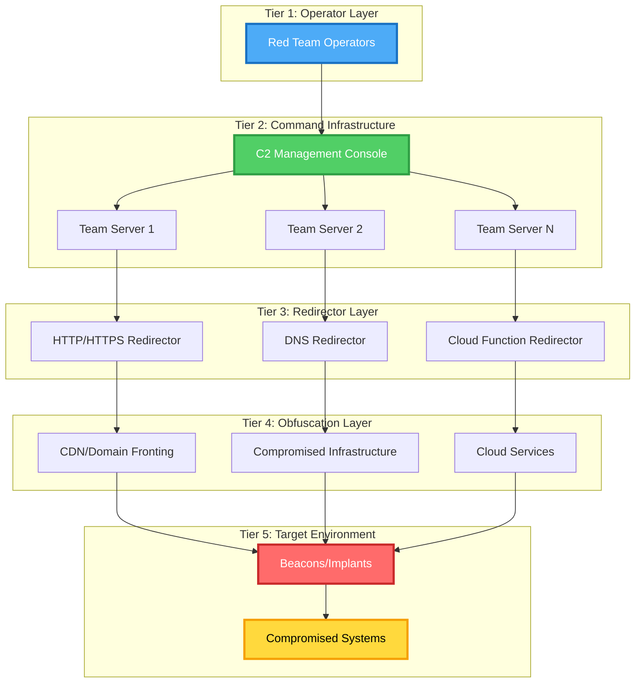

### Infrastructure Components

Team Servers provide the primary C2 backend and task management using technologies like Cobalt Strike, Covenant, Mythic, and custom implementations. Redirectors handle traffic obfuscation and operator protection through Apache mod_rewrite, Nginx, HAProxy, and Traefik configurations. Domain Fronting hides C2 traffic behind legitimate domains using CDN services and cloud providers. DNS C2 provides alternative communication channels through custom DNS servers and recursive queries. Cloud Functions enable serverless C2 components via AWS Lambda, Azure Functions, and GCP Functions.

📖 **[Read Full C2 Infrastructure Guide](docs/09-command-control/c2-infrastructure.md)**

---

## 🎯 MITRE ATT&CK Mapping

This repository comprehensively covers fourteen MITRE ATT&CK tactics and over one hundred eighty techniques, providing complete coverage of reconnaissance, resource development, initial access, execution, persistence, privilege escalation, defense evasion, credential access, discovery, lateral movement, collection, command and control, exfiltration, and impact phases.

📊 **[View Complete MITRE Mapping](resources/mitre-mapping.md)**

---

## 🔬 Real-World APT Case Studies

The repository includes detailed technical analysis of actual state-sponsored operations from APT28 Fancy Bear targeting government and military organizations, APT29 Cozy Bear's SolarWinds supply chain attack, Lazarus Group's Sony Pictures hack and WannaCry ransomware, APT41's dual espionage and financial operations, Equation Group's advanced NSA toolset, and Unit 8200's sophisticated cyber weapons.

📖 **[Read Full Case Studies](resources/apt-case-studies.md)**

---

## 🛡️ Detection & Defense

Each phase includes comprehensive detection strategies with Sigma rules for SIEM platforms, YARA signatures for malware detection, Suricata and Snort rules for network monitoring, EDR detection logic, and threat hunting queries for proactive defense.

📖 **[Full Detection Engineering Guide](resources/detection-rules.md)**

---

## 📋 Prerequisites

Technical knowledge requirements include advanced networking understanding, expert-level operating system internals, advanced programming skills, expert security concepts, and intermediate cloud platform knowledge. Software requirements include Python 3.9+, PowerShell 7.x, Docker and Docker Compose, virtual machine software, Burp Suite Professional, Wireshark, Metasploit Framework, and Cobalt Strike or open-source alternatives.

---

## 🚀 Installation & Setup

Quick start instructions include cloning the repository, setting up a Python virtual environment, installing dependencies, running automated lab setup, and verifying the installation. Docker-based lab environments provide complete APT simulation infrastructure with Kali Linux workstations, vulnerable targets, C2 infrastructure, and SIEM dashboards.

---

## 🎯 Learning Path

The repository provides structured learning paths from beginner through expert levels, covering fundamentals of networking and protocols, basic reconnaissance techniques, understanding vulnerability exploitation, advanced enumeration and OSINT, custom exploit development, privilege escalation techniques, building custom C2 frameworks, advanced persistence mechanisms, defense evasion and anti-forensics, zero-day research and development, advanced memory manipulation, kernel-level exploitation, firmware and hardware attacks, and full-scope APT campaign simulation.

---

## 🔐 Legal & Ethical Guidelines

Explicit written authorization is required before testing any system. The repository emphasizes ethical hacking principles including obtaining proper authorization, minimizing impact, maintaining confidentiality, reporting responsibly, respecting privacy, and staying within legal boundaries.

---

## 🤝 Contributing

Contributions are welcome with guidelines requiring enterprise-grade code quality, comprehensive documentation, proper attribution, ethical adherence, and testing in isolated lab environments before submission.

---

## 📚 Additional Resources

The repository references essential books including Red Team Field Manual, The Hacker Playbook 3, Advanced Penetration Testing, and Operator Handbook. Online resources include the MITRE ATT&CK Framework, NIST Cybersecurity Framework, OWASP Testing Guide, and Red Team Development and Operations. Training platforms include HackTheBox, TryHackMe, Offensive Security Labs, PentesterLab, and SANS Cyber Ranges.

---

## 📜 License

This project is licensed under the MIT License for educational use only, with permission granted for educational, research, and authorized testing purposes.

---

## 👤 Author & Acknowledgments

**Wan Mohamad Hanis bin Wan Hassan**
- CEH v12 Certified Ethical Hacker
- 100+ Professional Certifications (Google, IBM, EC-Council, Cisco, HubSpot)
- Security Researcher | Red Team Operator | AI/ML Specialist
- OSINT & Adversarial Tradecraft Expert

Connect via LinkedIn at linkedin.com/in/wanmohamadhanis, GitHub at github.com/novusaevum, Credly at credly.com/users/triumphanthanis, and portfolio at wanmohamadhanis.my.canva.site/wmh-portfolio.

---

## ⚠️ Final Warning

```
╔══════════════════════════════════════════════════════════════════════╗
║                                                                      ║
║  This repository contains advanced adversarial techniques that      ║
║  can cause significant harm if misused.                             ║
║                                                                      ║
║  USE RESPONSIBLY. USE ETHICALLY. USE LEGALLY.                       ║
║                                                                      ║
║  "With great power comes great responsibility."                     ║
║                                                                      ║
╚══════════════════════════════════════════════════════════════════════╝
```

---

<div align="center">

**⭐ Star this repository to support continued development ⭐**

**Built with precision by security researchers, for security professionals**

</div>

---

**Last Updated**: January 2025  
**Repository Version**: 1.0.0  
**Maintained By**: Wan Mohamad Hanis bin Wan Hassan
