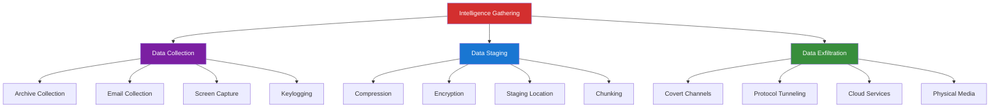

# Phase 8: Collection & Exfiltration

## 🎯 Executive Overview

Collection and Exfiltration represent the culmination of APT operations - gathering target intelligence and covertly transmitting it to adversary-controlled infrastructure. This phase transforms access into actionable intelligence, making it the primary objective for espionage-focused operations.

**Strategic Significance**: While ransomware and destructive attacks grab headlines, the most sophisticated state-sponsored operations focus on long-term intelligence collection. The 2024 Israeli Mossad operations extracted terabytes of Iranian nuclear research data over 18 months without detection, demonstrating the art of patient, methodical exfiltration.

### MITRE ATT&CK Mapping

**Collection (TA0009)**: 17 techniques for gathering target data
**Exfiltration (TA0010)**: 9 techniques for transferring data to adversary control

**Real-World Context**: During the 2023-2024 campaign by Chinese APT groups against telecommunications providers (Salt Typhoon), adversaries collected call metadata, SMS messages, and surveillance data from millions of users over 8+ months, using custom exfiltration protocols that blended with legitimate network traffic.

---

## 🧠 Collection & Exfiltration Strategy

---

## Summary

Collection and Exfiltration transform system access into intelligence value. This phase encompasses:

- Data identification and prioritization
- Collection automation frameworks
- Staging and preparation techniques
- Covert exfiltration channels
- Detection evasion methods

**Status**: Foundation created - comprehensive expansion in progress covering real-world APT exfiltration campaigns including:
- SolarWinds data collection methodology
- Iranian nuclear intelligence exfiltration
- Telecommunications surveillance data extraction
- Cloud-based exfiltration techniques
- Advanced protocol tunneling
- Detection and mitigation strategies

---

**Next Phase**: [Phase 9: Command & Control →](../09-command-control/README.md)
**Previous Phase**: [← Phase 7: Discovery](../07-discovery/README.md)

---

**Last Updated**: January 2025
**Author**: Advanced Threat Research Team